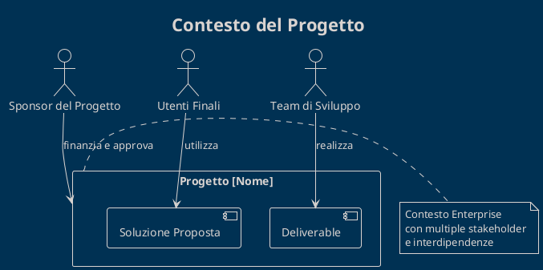

# Definizione del Progetto [Nome Progetto]

## Introduzione

[Inserire una breve introduzione che riassuma il contenuto di questa sezione e come si collega al resto della documentazione. Spiegare l'importanza di una chiara definizione del progetto come fondamento per il successo dell'implementazione.]

## Contenuti della Sezione

Questa sezione include la documentazione fondamentale che definisce e contestualizza il progetto [Nome Progetto]:

- **Descrizione del Progetto**: Panoramica generale, problema affrontato e soluzione proposta
- **Analisi degli Stakeholder**: Identificazione e mappatura di tutti i soggetti coinvolti
- **Obiettivi di Progetto**: Target SMART e metriche di successo definite
- **Ambito del Progetto**: Perimetro chiaro di ciò che è incluso ed escluso
- **Registro dei Rischi**: Identificazione e piano di gestione dei potenziali rischi

## Contesto Aziendale/Organizzativo

[Descrivere il contesto aziendale o organizzativo in cui si inserisce il progetto. Includere informazioni su fattori di mercato, tendenze del settore o requisiti normativi che influenzano il progetto.]

### Diagramma di Contesto

Il seguente diagramma illustra il contesto del progetto e le sue relazioni principali:

## Riepilogo Esecutivo

### Problema
[Sintesi concisa del problema principale che il progetto intende risolvere]

### Soluzione
[Sintesi dell'approccio di soluzione scelto e dei suoi punti di forza]

### Valore Atteso
[Riepilogo dei principali benefici e del ritorno sull'investimento previsto]

## Approvazioni

La definizione del progetto è stata esaminata e approvata dai seguenti stakeholder:

| Nome | Ruolo | Data | Firma |
|------|-------|------|-------|
| [Nome] | [Ruolo] | [Data] | |
| [Nome] | [Ruolo] | [Data] | |
| [Nome] | [Ruolo] | [Data] | |

## Documenti Correlati

| ID | Titolo Documento | Versione | Descrizione |
|----|------------------|----------|-------------|
| [ID-DOC] | [Titolo] | [Versione] | [Breve descrizione] |
| [ID-DOC] | [Titolo] | [Versione] | [Breve descrizione] |
| [ID-DOC] | [Titolo] | [Versione] | [Breve descrizione] |

## Glossario dei Termini

| Termine | Definizione |
|---------|-------------|
| [Termine] | [Definizione] |
| [Termine] | [Definizione] |
| [Termine] | [Definizione] |

## Riepilogo della Sezione

[Fornire un breve paragrafo di chiusura che riassuma i punti chiave di questa sezione e introduca il passaggio alla sezione successiva della documentazione.]

---

*Definizione del Progetto [Nome Progetto] - v[Versione]*
