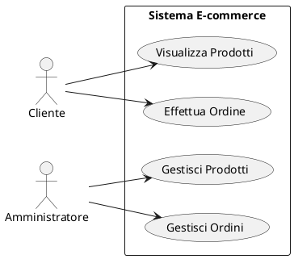

# Diagrammi dei Casi d'Uso

## Panoramica

Questa sezione contiene i diagrammi dei casi d'uso (Use Case Diagrams) per il sistema, che illustrano le interazioni tra gli attori (utenti o sistemi esterni) e le funzionalità principali del sistema.

## Diagramma Generale

[Inserire qui il diagramma generale dei casi d'uso, che mostra una visione d'insieme di tutti gli attori e i principali casi d'uso.]

## Casi d'Uso Dettagliati

Per una descrizione dettagliata di ogni caso d'uso, fare riferimento alla documentazione dei requisiti funzionali nella sezione Requisiti.
