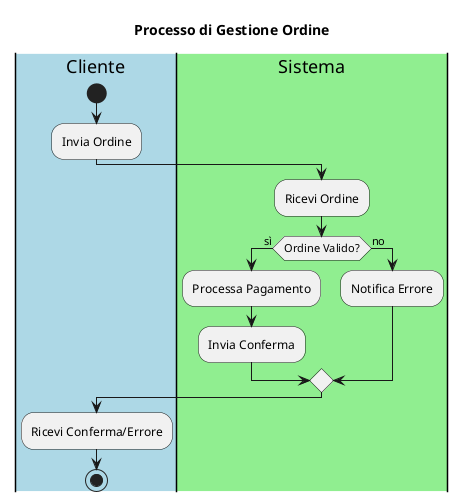

# Diagrammi delle Attività - [Nome Progetto]

## Panoramica

Questa sezione contiene i diagrammi delle attività (Activity Diagrams) per il sistema, che descrivono i flussi di lavoro e i processi di business.

## Diagramma: [Nome Processo]

[Inserire qui il diagramma di attività per un processo specifico.]

## Processi Dettagliati

Per una descrizione dettagliata di ogni processo, fare riferimento alla documentazione dei requisiti funzionali nella sezione `02-requirements`.
