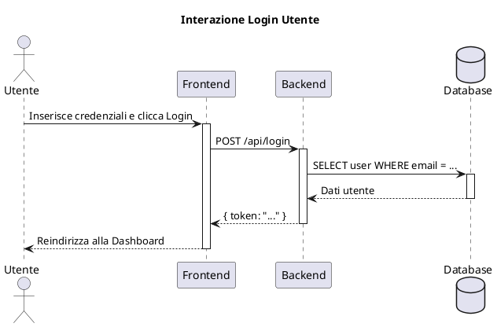

# Diagrammi di Sequenza - [Nome Progetto]

## Panoramica

Questa sezione contiene i diagrammi di sequenza (Sequence Diagrams) per il sistema, che illustrano le interazioni tra i componenti del sistema nel tempo.

## Diagramma: [Nome Interazione]

[Inserire qui il diagramma di sequenza per un'interazione specifica.]

## Interazioni Dettagliate

Per una descrizione dettagliata di ogni interazione, fare riferimento alla documentazione dei requisiti funzionali e dei casi d'uso nelle sezioni precedenti.
