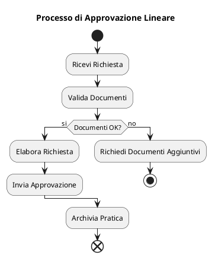
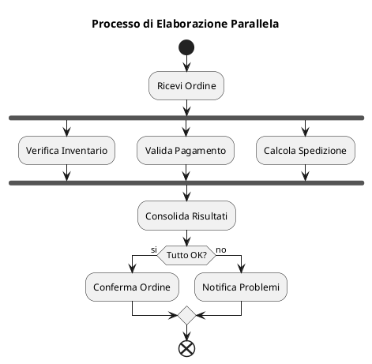
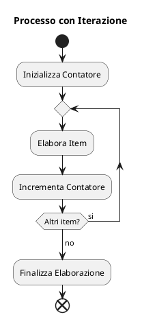
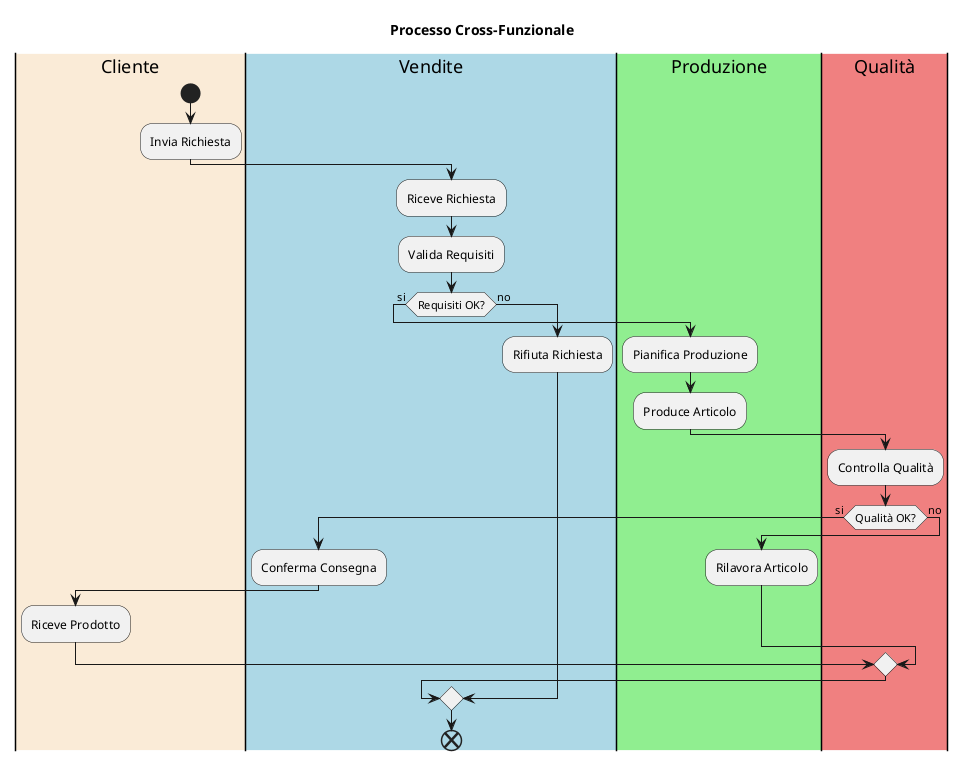
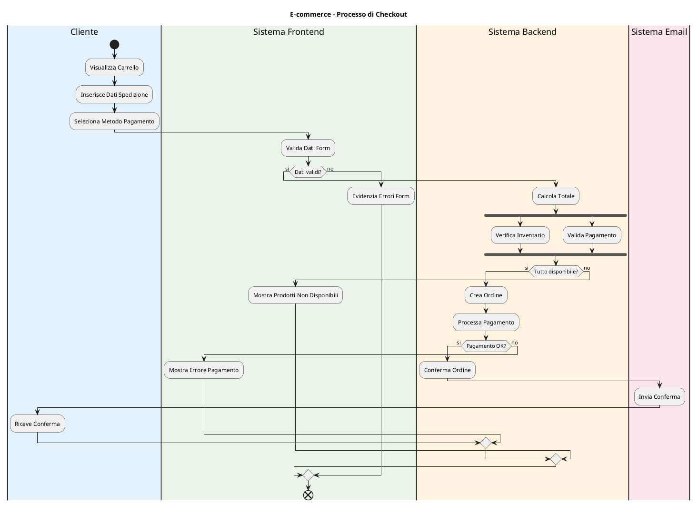
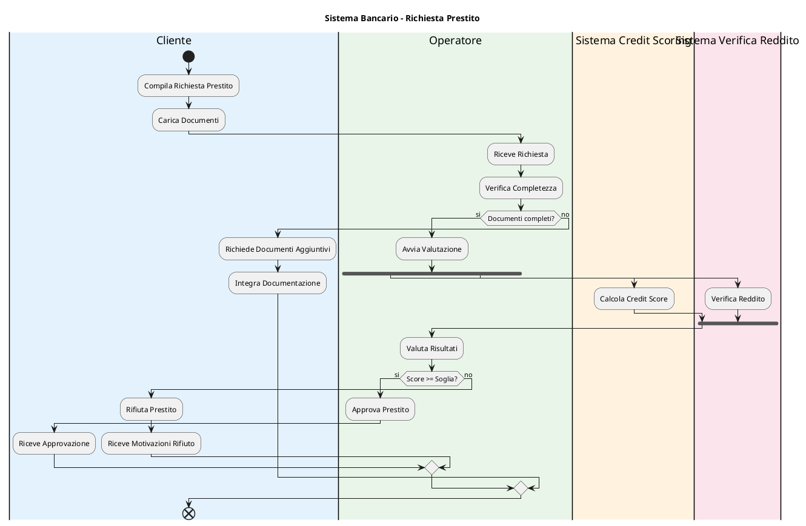
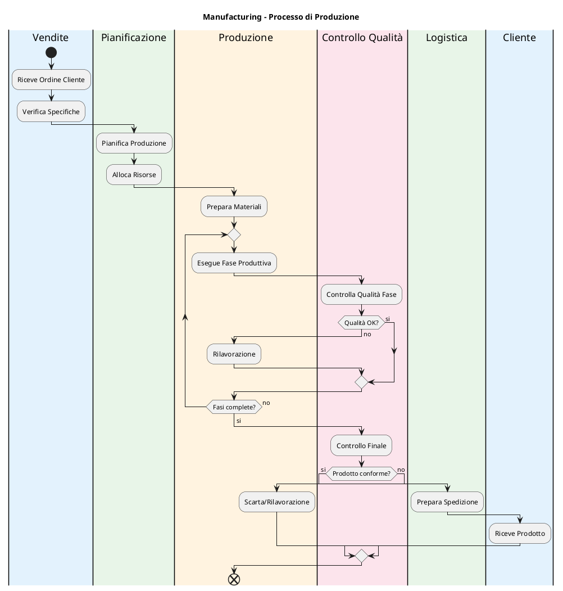

# Istruzioni per i Diagrammi delle Attività

Questo documento contiene le linee guida e le best practices per la creazione dei diagrammi delle attività (Activity Diagrams) all'interno del progetto.

## Scopo dei Diagrammi di Attività

I diagrammi delle attività servono a:
- Modellare processi business e workflow operativi
- Documentare algoritmi e logica di controllo complessa
- Illustrare flussi di lavoro attraverso diverse entità/sistemi
- Visualizzare parallelismo e sincronizzazione
- Supportare l'analisi dei requisiti funzionali

## Convenzioni di Modellazione

### Struttura di Base

- **Start Point**: Ogni diagramma deve iniziare con un singolo nodo iniziale
- **End Points**: Possono esistere multipli punti di terminazione che rappresentano diversi risultati
- **Activity Nodes**: Devono contenere verbi attivi che descrivono azioni concrete
- **Decision Nodes**: Devono includere condizioni espresse come domande
- **Granularità**: Mantenere un livello di dettaglio consistente all'interno dello stesso diagramma

### Swimlanes

- **Utilizzo**: Sempre consigliato per separare le responsabilità tra attori/sistemi
- **Orientamento**: Preferire verticale per processi con molti attori, orizzontale per pochi attori con processi lunghi
- **Naming**: I nomi delle corsie devono corrispondere ad attori dei casi d'uso o componenti del sistema

### Elementi Avanzati

- **Object Nodes**: Da utilizzare per mostrare oggetti/dati in transizione tra attività
- **Signals**: Per eventi e comunicazioni asincrone tra processi
- **Time Events**: Per attività temporizzate o con timeout
- **Expansion Regions**: Per iterazioni e operazioni su collezioni di elementi

## Template e Pattern

### Pattern di Base

- **Sequenza Lineare**: Per processi semplici e lineari
- **Decisione Binaria/Multipla**: Per flussi condizionali
- **Parallelismo**: Per attività concorrenti
- **Transazione**: Per operazioni che richiedono commit o rollback

### Notazione per Eccezioni

```plantuml
|Sistema|
:Operazione Critica;
note right: Possibile errore
if (Errore?) then (si)
  :Gestione Eccezione;
  :Log Error;
  stop
else (no)
  :Continua Processo;
  stop
endif
```

## Esempi per Domini Applicativi

### E-commerce

- Processi: Checkout, Elaborazione Ordine, Gestione Resi
- Attori: Cliente, Sistema Ordini, Sistema Pagamenti, Sistema Magazzino

### Banking

- Processi: Apertura Conto, Bonifico, Approvazione Prestito
- Attori: Cliente, Consulente, Sistema Core Banking, Sistema Compliance

### Healthcare

- Processi: Prenotazione Visita, Triage, Dimissioni
- Attori: Paziente, Medico, Infermiere, Sistema Gestione Ospedaliera

## Tracciabilità e Validazione

- Ogni diagramma di attività deve essere collegato a uno o più casi d'uso (UC-XXX)
- Per processi complessi, inserire riferimenti ai requisiti funzionali implementati
- Verificare la completezza (tutti i percorsi possibili sono modellati)
- Validare la consistenza con gli altri diagrammi comportamentali

## Procedura Operativa

1. Identificare il processo/algoritmo da modellare
2. Determinare gli attori coinvolti e creare le swimlanes
3. Definire punto iniziale e possibili punti finali
4. Delineare il flusso principale (happy path)
5. Aggiungere punti decisionali e flussi alternativi
6. Identificare operazioni parallele e punti di sincronizzazione
7. Documentare condizioni di errore e loro gestione
8. Validare con stakeholder tecnici e business

## Common Mistakes da Evitare

- Diagrammi troppo dettagliati (troppi passi)
- Mancanza di punti decisionali chiari
- Corsie non allineate con responsabilità reali
- Flussi infiniti o senza punti di uscita
- Condizioni di guardia ambigue o mancanti

## Riferimenti

- UML 2.5 Specification
- Business Process Model and Notation (BPMN)
- White, S.A. "Process Modeling Notations and Workflow Patterns"
- Eriksson, H. "UML 2 Toolkit"

### Note e Commenti

```plantuml
:Attività Importante;
note right: Questa attività richiede\nvalidazione speciale
```

## Come Utilizzare il Template

### Identifica il Processo

```plantuml
title Processo di Gestione Ordini

start
:Cliente effettua ordine;
```

### Definisci le Swimlanes

```plantuml
|#AntiqueWhite|Cliente|
|#LightBlue|Frontend|
|#LightGreen|Backend|
|#LightCoral|Database|
```

### Modella il Flusso

```plantuml
|Cliente|
start
:Seleziona prodotti;
:Procede al checkout;

|Frontend|
:Valida form;
if (Dati validi?) then (si)
  |Backend|
  :Elabora ordine;
else (no)
  |Frontend|
  :Mostra errori;
  stop
endif
```

## Pattern Comuni

### Pattern Processo Lineare



### Pattern con Parallelismo


### Pattern con Loop



### Pattern Multi-Swimlane



## Best Practices

### Struttura e Flusso

- **Start/End chiari**: Ogni diagramma deve avere inizio e fine definiti
- **Flusso logico**: Le attività devono seguire sequenza logica
- **Decisioni binarie**: Use if-then-else per decision points
- **Parallelismo appropriato**: Fork/join solo quando necessario

### Naming e Descrizioni

```plantuml
:Valida Credenziali Utente;
:Genera Report Vendite;
:Invia Notifica Email;

:Elaborazione;
:Controllo;
:Gestione;
```

### Livello di Dettaglio

```plantuml
:Elabora Ordine Cliente;
:Verifica Disponibilità Prodotto;
:Calcola Totale con Tasse;

:Esegui Query SQL;
:Deserializza JSON;
:Chiama API REST;
```

### Gestione Errori

```plantuml
:Elabora Pagamento;
if (Pagamento riuscito?) then (si)
  :Conferma Transazione;
else (no)
  :Log Errore;
  :Notifica Fallimento;
  :Rollback Transazione;
endif
```

## Styling e Layout

### Colori per Swimlanes

```plantuml
!define CLIENTE_COLOR #E3F2FD
!define SISTEMA_COLOR #E8F5E8
!define DATABASE_COLOR #FFF3E0
!define EXTERNAL_COLOR #FCE4EC

|CLIENTE_COLOR|Cliente|
|SISTEMA_COLOR|Sistema|
|DATABASE_COLOR|Database|
|EXTERNAL_COLOR|Servizio Esterno|
```

### Styling Attività

```plantuml
skinparam activity {
  BackgroundColor #E1F5FE
  BorderColor #0277BD
  FontSize 11
}

skinparam decision {
  BackgroundColor #FFF9C4
  BorderColor #F57F17
}
```

### Layout Direction

```plantuml
' Layout verticale (default)
top to bottom direction

' Layout orizzontale
left to right direction
```

## Esempi per Dominio

### E-commerce: Processo Checkout



### Banking: Processo Prestito



### Manufacturing: Processo Produzione



## Activity vs Altri Diagrammi

### Activity vs Sequence

```yaml
Activity Diagrams:
  - Focus: Workflow e processi
  - Prospettiva: Controllo e flusso dati
  - Quando: Processi business complessi
  - Dettaglio: Algoritmi e logica

Sequence Diagrams:
  - Focus: Interazioni tra oggetti
  - Prospettiva: Comunicazione e messaggi
  - Quando: Collaborazioni specifiche
  - Dettaglio: Protocolli e interfacce
```

### Activity vs Use Case

```yaml
Activity Diagrams:
  - Cosa mostra: Come fare
  - Livello: Implementazione processo
  - Scope: Workflow interno
  - Target: Team development

Use Case Diagrams:
  - Cosa mostra: Cosa fare
  - Livello: Requisiti funzionali
  - Scope: Interazioni esterne
  - Target: Stakeholder business
```

## Tracciabilità

### Collegamento con Use Cases

```plantuml
title Implementazione Use Case "Elabora Ordine"
note right
  Traccia a Use Case UC-002
  User Story US-005
end note

start
:Ricevi Richiesta Ordine;
' ... resto del processo
```

### Collegamento con Requirements

```yaml
Activity: "Processo Approvazione Credito"
Use Cases: UC-003 "Richiedi Prestito"
User Stories:
  - US-008: Valutazione automatica credito
  - US-009: Notifica esito valutazione
Requirements:
  - REQ-F-015: Sistema scoring automatico
  - REQ-NF-008: Tempo valutazione < 24h
```

## Testing degli Activity Diagrams

### Scenari di Test

```plantuml
' Test Happy Path
start
:Input valido;
:Elaborazione normale;
:Output atteso;
end

' Test Error Path
start
:Input non valido;
:Gestione errore;
:Messaggio errore;
end
```

### Coverage dei Percorsi

- **Path Coverage**: Tutti i percorsi possibili
- **Branch Coverage**: Tutte le decisioni
- **Condition Coverage**: Tutte le condizioni
- **Loop Coverage**: Iterazioni min/max/tipiche

## Tools Avanzati

### PlantUML Advanced Features

```plantuml
@startuml
' Partition per raggruppamento
start

partition "Fase Preparazione" {
  :Setup Ambiente;
  :Carica Dati;
}

partition "Fase Elaborazione" {
  :Processa Dati;
  :Genera Output;
}

' Loop con retry
repeat
  :Attività con Possibile Errore;
repeat while (Errore rilevato?) is (sì) not (no)

end
@enduml
```

### Integration con Modeling Tools

- **Enterprise Architect**: Import/export UML
- **Visual Paradigm**: PlantUML integration
- **Lucidchart**: PlantUML support
- **Draw.io**: PlantUML plugin

## Risorse e References

### UML Standards

- **UML 2.5 Activity Diagrams**: Specification completa
- **BPMN vs UML Activity**: Differenze e quando usare
- **Workflow Patterns**: Catalog pattern comuni

### Template Correlati

- `../use-case-diagrams/`: Use cases implementati
- `../sequence-diagrams/`: Interazioni dettagliate
- `../../02-requirements/`: Requirements correlati

## Supporto

Per domande sugli Activity Diagrams:

- **Business Process Analyst**: [Responsabile processi business]
- **Solution Architect**: [Responsabile design soluzione]
- **Technical Lead**: [Responsabile implementazione]
- **Quality Assurance**: [Responsabile test processi]

---

*Gli Activity Diagrams trasformano i processi business in blueprint implementabili. Usali per bridging tra business e tecnologia.*
