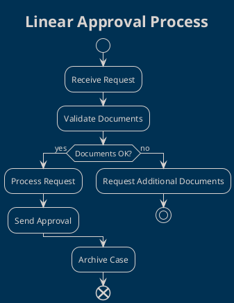
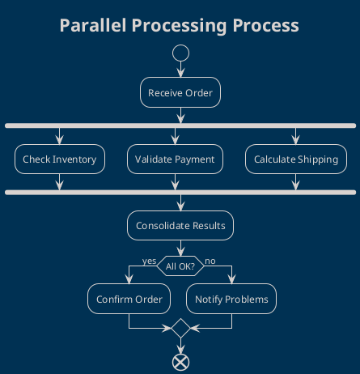
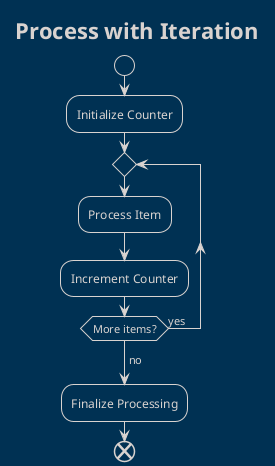
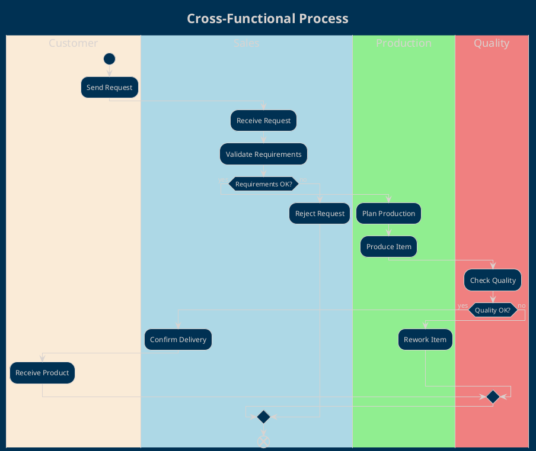
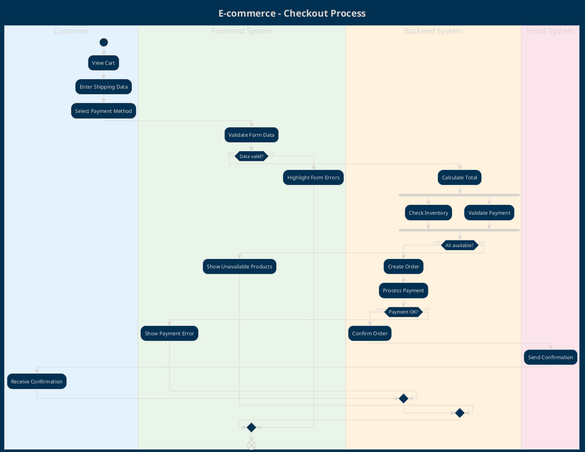

# Activity Diagrams

Activity diagrams show the workflows, business processes, and control logic of the system.

## 🎯 Purpose of Activity Diagrams

**Activity Diagrams** are used to:
- Model business processes and workflows
- Show control and data flows
- Document complex algorithms and logic
- Analyze parallelism and synchronization

## 📋 Diagram Elements

### Control Nodes

#### Start/End Nodes
```plantuml
start
stop
end
```

#### Activity Nodes
```plantuml
:Simple Activity;
:Activity with
Multiple Description;
```

#### Decision Nodes
```plantuml
if (Condition?) then (yes)
  :Action A;
else (no)
  :Action B;
endif
```

#### Fork/Join (Parallelism)
```plantuml
fork
  :Process A;
fork again
  :Process B;
end fork
```

### Swimlanes
```plantuml
|Customer|
start
:Make Request;

|System|
:Process Request;

|Database|
:Save Data;
stop
```

### Notes and Comments
```plantuml
:Important Activity;
note right: This activity requires\nspecial validation
```

## 📝 How to Use the Template

### 1. Identify the Process
```plantuml
title Order Management Process

start
:Customer places order;
```

### 2. Define Swimlanes
```plantuml
|#AntiqueWhite|Customer|
|#LightBlue|Frontend|
|#LightGreen|Backend|
|#LightCoral|Database|
```

### 3. Model the Flow
```plantuml
|Customer|
start
:Select products;
:Proceed to checkout;

|Frontend|
:Validate form;
if (Data valid?) then (yes)
  |Backend|
  :Process order;
else (no)
  |Frontend|
  :Show errors;
  stop
endif
```

## 🏗️ Common Patterns

### Linear Process Pattern


### Parallelism Pattern


### Loop Pattern


### Multi-Swimlane Pattern


## 📊 Best Practices

### ✅ Structure and Flow
- **Clear Start/End**: Every diagram must have a defined beginning and end
- **Logical Flow**: Activities must follow a logical sequence
- **Binary Decisions**: Use if-then-else for decision points
- **Appropriate Parallelism**: Fork/join only when necessary

### ✅ Naming and Descriptions
```plantuml
' ✅ Clear action verbs
:Validate User Credentials;
:Generate Sales Report;
:Send Email Notification;

' ❌ Vague names
:Processing;
:Control;
:Management;
```

### ✅ Level of Detail
```plantuml
' ✅ Business process level
:Process Customer Order;
:Check Product Availability;
:Calculate Total with Taxes;

' ❌ Too technical
:Execute SQL Query;
:Deserialize JSON;
:Call REST API;
```

### ✅ Error Handling
```plantuml
:Process Payment;
if (Payment successful?) then (yes)
  :Confirm Transaction;
else (no)
  :Log Error;
  :Notify Failure;
  :Rollback Transaction;
endif
```

## 🎨 Styling and Layout

### Swimlane Colors
```plantuml
!define CUSTOMER_COLOR #E3F2FD
!define SYSTEM_COLOR #E8F5E8
!define DATABASE_COLOR #FFF3E0
!define EXTERNAL_COLOR #FCE4EC

|CUSTOMER_COLOR|Customer|
|SYSTEM_COLOR|System|
|DATABASE_COLOR|Database|
|EXTERNAL_COLOR|External Service|
```

### Activity Styling
```plantuml
skinparam activity {
  BackgroundColor #E1F5FE
  BorderColor #0277BD
  FontSize 11
}

skinparam decision {
  BackgroundColor #FFF9C4
  BorderColor #F57F17
}
```

### Layout Direction
```plantuml
' Vertical layout (default)
top to bottom direction

' Horizontal layout
left to right direction
```

## 🧪 Examples by Domain

### E-commerce: Checkout Process


### Banking: Loan Process
```plantuml
@startuml
!theme blueprint
title Banking System - Loan Request

|#E3F2FD|Customer|
start
:Fill Loan Application;
:Upload Documents;

|#E8F5E8|Operator|
:Receive Application;
:Check Completeness;
if (Documents complete?) then (yes)
  :Start Evaluation;

  fork
    |#FFF3E0|Credit Scoring System|
    :Calculate Credit Score;
  fork again
    |#FCE4EC|Income Verification System|
    :Verify Income;
  end fork

  |#E8F5E8|Operator|
  :Evaluate Results;
  if (Score >= Threshold?) then (yes)
    :Approve Loan;
    |#E3F2FD|Customer|
    :Receive Approval;
  else (no)
    :Reject Loan;
    |#E3F2FD|Customer|
    :Receive Rejection Reasons;
  endif
else (no)
  :Request Additional Documents;
  |#E3F2FD|Customer|
  :Integrate Documentation;
endif
end
@enduml
```

### Manufacturing: Production Process
```plantuml
@startuml
!theme blueprint
title Manufacturing - Production Process

|#E3F2FD|Sales|
start
:Receive Customer Order;
:Verify Specifications;

|#E8F5E8|Planning|
:Plan Production;
:Allocate Resources;

|#FFF3E0|Production|
:Prepare Materials;
repeat
  :Execute Production Phase;
  |#FCE4EC|Quality Control|
  :Check Phase Quality;
  if (Quality OK?) then (yes)
    |#FFF3E0|Production|
  else (no)
    :Rework;
  endif
repeat while (Phases complete?) is (no)
->yes;

|#FCE4EC|Quality Control|
:Final Inspection;
if (Product compliant?) then (yes)
  |#E8F5E8|Logistics|
  :Prepare Shipment;
  |#E3F2FD|Customer|
  :Receive Product;
else (no)
  |#FFF3E0|Production|
  :Scrap/Rework;
endif
end
@enduml
```

## 🔄 Activity vs Other Diagrams

### Activity vs Sequence
```yaml
Activity Diagrams:
  - Focus: Workflows and processes
  - Perspective: Control and data flow
  - When: Complex business processes
  - Detail: Algorithms and logic

Sequence Diagrams:
  - Focus: Interactions between objects
  - Perspective: Communication and messages
  - When: Specific collaborations
  - Detail: Protocols and interfaces
```

### Activity vs Use Case
```yaml
Activity Diagrams:
  - What it shows: How to do it
  - Level: Process implementation
  - Scope: Internal workflow
  - Target: Development team

Use Case Diagrams:
  - What it shows: What to do
  - Level: Functional requirements
  - Scope: External interactions
  - Target: Business stakeholders
```

## 🔍 Traceability

### Link with Use Cases
```plantuml
title Implementation of Use Case "Process Order"
note top : Traces to Use Case UC-002\nUser Story US-005

start
:Receive Order Request;
' ... rest of the process
```

### Link with Requirements
```yaml
Activity: "Credit Approval Process"
Use Cases: UC-003 "Request Loan"
User Stories:
  - US-008: Automatic credit evaluation
  - US-009: Notification of evaluation outcome
Requirements:
  - REQ-F-015: Automatic scoring system
  - REQ-NF-008: Evaluation time < 24h
```

## 🧪 Testing Activity Diagrams

### Test Scenarios
```plantuml
' Test Happy Path
start
:Valid input;
:Normal processing;
:Expected output;
end

' Test Error Path
start
:Invalid input;
:Error handling;
:Error message;
end
```

### Path Coverage
- **Path Coverage**: All possible paths
- **Branch Coverage**: All decisions
- **Condition Coverage**: All conditions
- **Loop Coverage**: Min/max/typical iterations

## 🔧 Advanced Tools

### PlantUML Advanced Features
```plantuml
' Partition for grouping
partition "Preparation Phase" {
  :Setup Environment;
  :Load Data;
}

partition "Processing Phase" {
  :Process Data;
  :Generate Output;
}

' Backward arrow
:Activity A;
-> Error;
:Error Handling;
<-- Retry;
:Activity A;
```

### Integration with Modeling Tools
- **Enterprise Architect**: Import/export UML
- **Visual Paradigm**: PlantUML integration
- **Lucidchart**: PlantUML support
- **Draw.io**: PlantUML plugin

## 📚 Resources and References

### UML Standards
- **UML 2.5 Activity Diagrams**: Complete specification
- **BPMN vs UML Activity**: Differences and when to use
- **Workflow Patterns**: Common pattern catalog

### Related Templates
- `../use-case-diagrams/`: Implemented use cases
- `../sequence-diagrams/`: Detailed interactions
- `../../02-requirements/`: Related requirements

## 📞 Support

For questions about Activity Diagrams:

- **Business Process Analyst**: [Responsible for business processes]
- **Solution Architect**: [Responsible for solution design]
- **Technical Lead**: [Responsible for implementation]
- **Quality Assurance**: [Responsible for process testing]

---

*Activity Diagrams transform business processes into implementable blueprints. Use them to bridge the gap between business and technology.*
