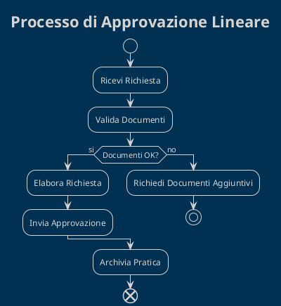
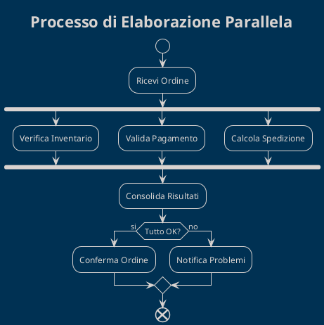
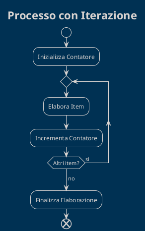
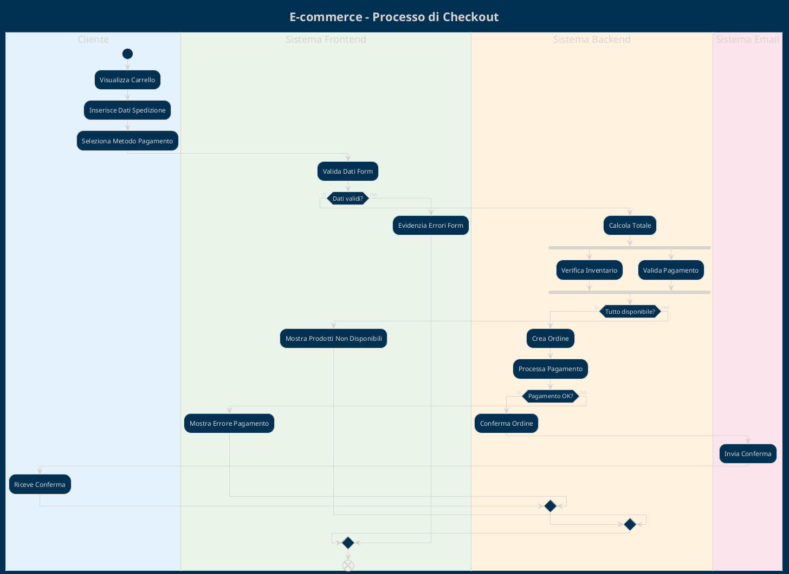

# Activity Diagrams

I diagrammi delle attività mostrano i flussi di lavoro, i processi business e la logica di controllo del sistema.

## 🎯 Scopo degli Activity Diagrams

Gli **Activity Diagrams** servono per:
- Modellare processi business e workflow
- Mostrare flussi di controllo e dati
- Documentare algoritmi e logica complessa
- Analizzare parallelismo e sincronizzazione

## 📋 Elementi del Diagramma

### Nodi di Controllo

#### Start/End Nodes
```plantuml
start
stop
end
```

#### Activity Nodes
```plantuml
:Attività Semplice;
:Attività con
Descrizione Multipla;
```

#### Decision Nodes
```plantuml
if (Condizione?) then (si)
  :Azione A;
else (no)
  :Azione B;
endif
```

#### Fork/Join (Parallelismo)
```plantuml
fork
  :Processo A;
fork again
  :Processo B;
end fork
```

### Swimlanes (Corsie)
```plantuml
|Cliente|
start
:Effettua Richiesta;

|Sistema|
:Elabora Richiesta;

|Database|
:Salva Dati;
stop
```

### Note e Commenti
```plantuml
:Attività Importante;
note right: Questa attività richiede\nvalidazione speciale
```

## 📝 Come Utilizzare il Template

### 1. Identifica il Processo
```plantuml
title Processo di Gestione Ordini

start
:Cliente effettua ordine;
```

### 2. Definisci le Swimlanes
```plantuml
|#AntiqueWhite|Cliente|
|#LightBlue|Frontend|
|#LightGreen|Backend|
|#LightCoral|Database|
```

### 3. Modella il Flusso
```plantuml
|Cliente|
start
:Seleziona prodotti;
:Procede al checkout;

|Frontend|
:Valida form;
if (Dati validi?) then (si)
  |Backend|
  :Elabora ordine;
else (no)
  |Frontend|
  :Mostra errori;
  stop
endif
```

## 🏗️ Pattern Comuni

### Pattern Processo Lineare


### Pattern con Parallelismo


### Pattern con Loop


### Pattern Multi-Swimlane

```plantuml
@startuml
!theme blueprint
title Processo Cross-Funzionale

|#AntiqueWhite|Cliente|
start
:Invia Richiesta;

|#LightBlue|Vendite|
:Riceve Richiesta;
:Valida Requisiti;
if (Requisiti OK?) then (si)
  |#LightGreen|Produzione|
  :Pianifica Produzione;
  :Produce Articolo;
  |#LightCoral|Qualità|
  :Controlla Qualità;
  if (Qualità OK?) then (si)
    |#LightBlue|Vendite|
    :Conferma Consegna;
    |#AntiqueWhite|Cliente|
    :Riceve Prodotto;
  else (no)
    |#LightGreen|Produzione|
    :Rilavora Articolo;
  endif
else (no)
  |#LightBlue|Vendite|
  :Rifiuta Richiesta;
endif
end
@enduml
```


## 📊 Best Practices

### ✅ Struttura e Flusso
- **Start/End chiari**: Ogni diagramma deve avere inizio e fine definiti
- **Flusso logico**: Le attività devono seguire sequenza logica
- **Decisioni binarie**: Use if-then-else per decision points
- **Parallelismo appropriato**: Fork/join solo quando necessario

### ✅ Naming e Descrizioni
```plantuml
' ✅ Verbi d'azione chiari
:Valida Credenziali Utente;
:Genera Report Vendite;
:Invia Notifica Email;

' ❌ Nomi vaghi
:Elaborazione;
:Controllo;
:Gestione;
```

### ✅ Livello di Dettaglio
```plantuml
' ✅ Livello business process
:Elabora Ordine Cliente;
:Verifica Disponibilità Prodotto;
:Calcola Totale con Tasse;

' ❌ Troppo tecnico
:Esegui Query SQL;
:Deserializza JSON;
:Chiama API REST;
```

### ✅ Gestione Errori
```plantuml
:Elabora Pagamento;
if (Pagamento riuscito?) then (si)
  :Conferma Transazione;
else (no)
  :Log Errore;
  :Notifica Fallimento;
  :Rollback Transazione;
endif
```

## 🎨 Styling e Layout

### Colori per Swimlanes
```plantuml
!define CLIENTE_COLOR #E3F2FD
!define SISTEMA_COLOR #E8F5E8  
!define DATABASE_COLOR #FFF3E0
!define EXTERNAL_COLOR #FCE4EC

|CLIENTE_COLOR|Cliente|
|SISTEMA_COLOR|Sistema|
|DATABASE_COLOR|Database|
|EXTERNAL_COLOR|Servizio Esterno|
```

### Styling Attività
```plantuml
skinparam activity {
  BackgroundColor #E1F5FE
  BorderColor #0277BD
  FontSize 11
}

skinparam decision {
  BackgroundColor #FFF9C4
  BorderColor #F57F17
}
```

### Layout Direction
```plantuml
' Layout verticale (default)
top to bottom direction

' Layout orizzontale
left to right direction
```

## 🧪 Esempi per Dominio

### E-commerce: Processo Checkout


### Banking: Processo Prestito
```plantuml
@startuml
!theme blueprint
title Sistema Bancario - Richiesta Prestito

|#E3F2FD|Cliente|
start
:Compila Richiesta Prestito;
:Carica Documenti;

|#E8F5E8|Operatore|
:Riceve Richiesta;
:Verifica Completezza;
if (Documenti completi?) then (si)
  :Avvia Valutazione;
  
  fork
    |#FFF3E0|Sistema Credit Scoring|
    :Calcola Credit Score;
  fork again
    |#FCE4EC|Sistema Verifica Reddito|
    :Verifica Reddito;
  end fork
  
  |#E8F5E8|Operatore|
  :Valuta Risultati;
  if (Score >= Soglia?) then (si)
    :Approva Prestito;
    |#E3F2FD|Cliente|
    :Riceve Approvazione;
  else (no)
    :Rifiuta Prestito;
    |#E3F2FD|Cliente|
    :Riceve Motivazioni Rifiuto;
  endif
else (no)
  :Richiede Documenti Aggiuntivi;
  |#E3F2FD|Cliente|
  :Integra Documentazione;
endif
end
@enduml
```

### Manufacturing: Processo Produzione
```plantuml
@startuml
!theme blueprint
title Manufacturing - Processo di Produzione

|#E3F2FD|Vendite|
start
:Riceve Ordine Cliente;
:Verifica Specifiche;

|#E8F5E8|Pianificazione|
:Pianifica Produzione;
:Alloca Risorse;

|#FFF3E0|Produzione|
:Prepara Materiali;
repeat
  :Esegue Fase Produttiva;
  |#FCE4EC|Controllo Qualità|
  :Controlla Qualità Fase;
  if (Qualità OK?) then (si)
    |#FFF3E0|Produzione|
  else (no)
    :Rilavorazione;
  endif
repeat while (Fasi complete?) is (no)
->si;

|#FCE4EC|Controllo Qualità|
:Controllo Finale;
if (Prodotto conforme?) then (si)
  |#E8F5E8|Logistica|
  :Prepara Spedizione;
  |#E3F2FD|Cliente|
  :Riceve Prodotto;
else (no)
  |#FFF3E0|Produzione|
  :Scarta/Rilavorazione;
endif
end
@enduml
```

## 🔄 Activity vs Altri Diagrammi

### Activity vs Sequence
```yaml
Activity Diagrams:
  - Focus: Workflow e processi
  - Prospettiva: Controllo e flusso dati
  - Quando: Processi business complessi
  - Dettaglio: Algoritmi e logica

Sequence Diagrams:
  - Focus: Interazioni tra oggetti
  - Prospettiva: Comunicazione e messaggi
  - Quando: Collaborazioni specifiche
  - Dettaglio: Protocolli e interfacce
```

### Activity vs Use Case
```yaml
Activity Diagrams:
  - Cosa mostra: Come fare
  - Livello: Implementazione processo
  - Scope: Workflow interno
  - Target: Team development

Use Case Diagrams:
  - Cosa mostra: Cosa fare
  - Livello: Requisiti funzionali
  - Scope: Interazioni esterne
  - Target: Stakeholder business
```

## 🔍 Tracciabilità

### Collegamento con Use Cases
```plantuml
title Implementazione Use Case "Elabora Ordine"
note top : Traccia a Use Case UC-002\nUser Story US-005

start
:Ricevi Richiesta Ordine;
' ... resto del processo
```

### Collegamento con Requirements
```yaml
Activity: "Processo Approvazione Credito"
Use Cases: UC-003 "Richiedi Prestito"
User Stories: 
  - US-008: Valutazione automatica credito
  - US-009: Notifica esito valutazione
Requirements:
  - REQ-F-015: Sistema scoring automatico
  - REQ-NF-008: Tempo valutazione < 24h
```

## 🧪 Testing degli Activity Diagrams

### Scenari di Test
```plantuml
' Test Happy Path
start
:Input valido;
:Elaborazione normale;
:Output atteso;
end

' Test Error Path  
start
:Input non valido;
:Gestione errore;
:Messaggio errore;
end
```

### Coverage dei Percorsi
- **Path Coverage**: Tutti i percorsi possibili
- **Branch Coverage**: Tutte le decisioni
- **Condition Coverage**: Tutte le condizioni
- **Loop Coverage**: Iterazioni min/max/tipiche

## 🔧 Tools Avanzati

### PlantUML Advanced Features
```plantuml
' Partition per raggruppamento
partition "Fase Preparazione" {
  :Setup Ambiente;
  :Carica Dati;
}

partition "Fase Elaborazione" {
  :Processa Dati;
  :Genera Output;
}

' Backward arrow
:Attività A;
-> Errore;
:Gestione Errore;
<-- Retry;
:Attività A;
```

### Integration con Modeling Tools
- **Enterprise Architect**: Import/export UML
- **Visual Paradigm**: PlantUML integration
- **Lucidchart**: PlantUML support
- **Draw.io**: PlantUML plugin

## 📚 Risorse e References

### UML Standards
- **UML 2.5 Activity Diagrams**: Specification completa
- **BPMN vs UML Activity**: Differenze e quando usare
- **Workflow Patterns**: Catalog pattern comuni

### Template Correlati
- `../use-case-diagrams/`: Use cases implementati
- `../sequence-diagrams/`: Interazioni dettagliate
- `../../02-requirements/`: Requirements correlati

## 📞 Supporto

Per domande sugli Activity Diagrams:

- **Business Process Analyst**: [Responsabile processi business]
- **Solution Architect**: [Responsabile design soluzione]
- **Technical Lead**: [Responsabile implementazione]
- **Quality Assurance**: [Responsabile test processi]

---

*Gli Activity Diagrams trasformano i processi business in blueprint implementabili. Usali per bridging tra business e tecnologia.*
