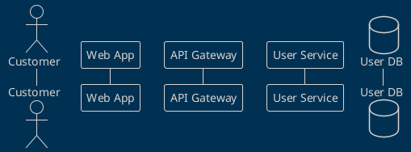
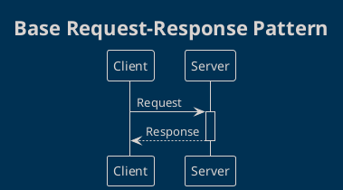
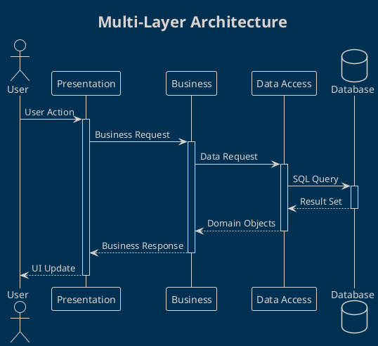
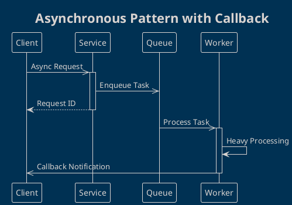
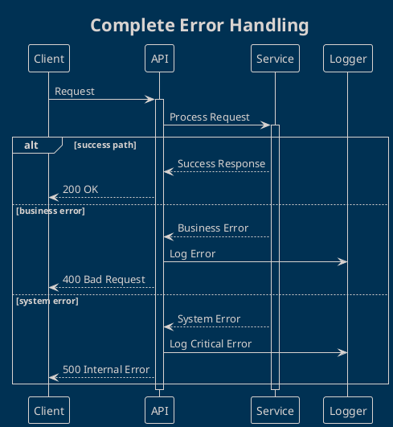

# Sequence Diagrams

Sequence diagrams show interactions between objects in temporal order, highlighting the exchange of messages.

## 🎯 Purpose of Sequence Diagrams

**Sequence Diagrams** are used to:
- Model interactions between objects/systems
- Show the temporal order of messages
- Document communication protocols
- Analyze object lifecycles

## 📋 Diagram Elements

### Participants
```plantuml
participant "Participant Name" as P1
actor "Actor" as A1
boundary "Interface" as I1
control "Controller" as C1
entity "Entity" as E1
database "Database" as DB1
```

### Lifelines
```plantuml
participant A
participant B

A -> B: Message
activate B
B --> A: Response
deactivate B
```

### Messages

#### Synchronous Messages
```plantuml
A -> B: Synchronous call
A <-- B: Response
```

#### Asynchronous Messages
```plantuml
A ->> B: Asynchronous message
A -->> B: Asynchronous response
```

#### Self-Messages
```plantuml
A -> A: Self-call
```

### Activation and Destruction
```plantuml
participant A
participant B

A -> B: create
activate B
B --> A: success
A -> B: process
A -> B: destroy
destroy B
```

### Alternatives and Loops
```plantuml
alt condition true
  A -> B: Message A
else condition false
  A -> C: Message B
end

loop 5 times
  A -> B: Iteration
end
```

## 📝 How to Use the Template

### 1. Identify Participants


### 2. Model the Interaction
```plantuml
C -> W: Login Request
activate W
W -> G: POST /auth/login
activate G
G -> U: validateCredentials()
activate U
U -> DB: SELECT user
activate DB
DB --> U: user data
deactivate DB
U --> G: authentication result
deactivate U
G --> W: JWT token
deactivate G
W --> C: Login Success
deactivate W
```

### 3. Manage Alternative Scenarios
```plantuml
alt valid credentials
  U --> G: success + user_data
else invalid credentials
  U --> G: error: invalid_credentials
else user blocked
  U --> G: error: account_locked
end
```

## 🏗️ Common Patterns

### Simple Request-Response Pattern


### Multi-Layer Pattern


### Async with Callback Pattern


### Error Handling Pattern


### Microservices Pattern
```plantuml
@startuml
!theme blueprint
title Microservices Communication

actor "User" as U
participant "API Gateway" as G
participant "Auth Service" as A
participant "Order Service" as O
participant "Payment Service" as P
participant "Inventory Service" as I

U -> G: Create Order
activate G

G -> A: Validate Token
activate A
A --> G: User Valid
deactivate A

G -> O: Process Order
activate O

par parallel calls
  O -> P: Reserve Payment
  activate P
and
  O -> I: Check Inventory
  activate I
end

alt all services OK
  P --> O: Payment Reserved
  deactivate P
  I --> O: Items Available
  deactivate I
  O --> G: Order Created
else any service fails
  O -> P: Cancel Payment
  O -> I: Release Inventory
  O --> G: Order Failed
end

deactivate O
G --> U: Response
deactivate G
@enduml
```

## 📊 Best Practices

### ✅ Messages and Naming
```plantuml
' ✅ Descriptive names and clear actions
User -> AuthService: authenticateUser(username, password)
AuthService -> Database: findUserByUsername(username)

' ❌ Vague names
User -> System: doStuff()
System -> DB: getData()
```

### ✅ Level of Abstraction
```plantuml
' ✅ Focus on business logic
Client -> OrderService: createOrder(orderData)
OrderService -> PaymentService: processPayment(amount)

' ❌ Too technical
Client -> Controller: HTTP POST /orders
Controller -> Repository: executeSQL(query)
```

### ✅ Activation Management
```plantuml
' ✅ Correct activations
A -> B: request
activate B
B -> C: delegate
activate C
C --> B: result
deactivate C
B --> A: response
deactivate B

' ❌ Missing or wrong activations - avoid
```

### ✅ Return Messages
```plantuml
' ✅ Explicit return for clarity
A -> B: getData()
activate B
B -> DB: query
activate DB
DB --> B: resultSet
deactivate DB
B --> A: processedData
deactivate B

' ✅ Implicit for simplicity when obvious
A -> B: simpleRequest
B --> A: simpleResponse
```

## 🎨 Styling and Customization

### Stereotypes and Colors
```plantuml
!define ACTOR_COLOR #E8F5E8
!define BOUNDARY_COLOR #E3F2FD
!define CONTROL_COLOR #FFF9C4
!define ENTITY_COLOR #FCE4EC
!define DATABASE_COLOR #F3E5F5

participant "User" as U <<actor>> ACTOR_COLOR
participant "UI" as UI <<boundary>> BOUNDARY_COLOR
participant "Controller" as C <<control>> CONTROL_COLOR
participant "Service" as S <<entity>> ENTITY_COLOR
database "DB" as DB DATABASE_COLOR
```

### Grouping and Separators
```plantuml
== Authentication Phase ==
User -> System: login()

== Business Logic Phase ==
System -> Service: processRequest()

== Data Persistence Phase ==
Service -> Database: saveData()

...

== Cleanup Phase ==
System -> System: cleanup()
```

### Notes and Comments
```plantuml
User -> System: request
note right: This message includes\nparameter validation

System -> Database: query
note over Database: Query optimized\nwith appropriate indexes
```

## 🧪 Examples by Domain

### E-commerce: Checkout Process
```plantuml
@startuml
!theme blueprint
title E-commerce - Checkout Process

actor "Customer" as C
participant "Web App" as W
participant "Cart Service" as CS
participant "Payment Service" as PS
participant "Order Service" as OS
participant "Inventory Service" as IS
database "Orders DB" as ODB

C -> W: Proceed to Checkout
activate W

W -> CS: getCartItems(userId)
activate CS
CS --> W: cartItems[]
deactivate CS

W -> W: calculateTotal()
W --> C: Show Checkout Form

C -> W: submitPayment(paymentInfo)
W -> PS: processPayment(amount, paymentInfo)
activate PS

alt payment successful
  PS --> W: paymentConfirmed(transactionId)
  deactivate PS

  W -> OS: createOrder(cartItems, transactionId)
  activate OS

  loop for each item
    OS -> IS: reserveItem(itemId, quantity)
    activate IS
    IS --> OS: reserved
    deactivate IS
  end

  OS -> ODB: saveOrder(orderData)
  activate ODB
  ODB --> OS: orderId
  deactivate ODB

  OS --> W: orderCreated(orderId)
  deactivate OS

  W -> CS: clearCart(userId)
  activate CS
  CS --> W: cartCleared
  deactivate CS

  W --> C: Order Confirmation

else payment failed
  PS --> W: paymentFailed(reason)
  deactivate PS
  W --> C: Payment Error
end

deactivate W
@enduml
```

### Banking System: Fund Transfer
```plantuml
@startuml
!theme blueprint
title Banking - Fund Transfer

actor "Customer" as C
participant "Banking App" as B
participant "Auth Service" as A
participant "Account Service" as AS
participant "Transaction Service" as TS
participant "Notification Service" as NS
database "Accounts DB" as ADB

C -> B: Transfer Request
activate B

B -> A: validateSession(token)
activate A
A --> B: sessionValid
deactivate A

B -> AS: getAccountBalance(fromAccount)
activate AS
AS -> ADB: SELECT balance FROM accounts
activate ADB
ADB --> AS: currentBalance
deactivate ADB
AS --> B: balance
deactivate AS

alt sufficient funds
  B -> TS: initiateTransfer(fromAccount, toAccount, amount)
  activate TS

  TS -> AS: debitAccount(fromAccount, amount)
  activate AS
  AS -> ADB: UPDATE accounts SET balance = balance - amount
  AS --> TS: debitSuccess
  deactivate AS

  TS -> AS: creditAccount(toAccount, amount)
  activate AS
  AS -> ADB: UPDATE accounts SET balance = balance + amount
  AS --> TS: creditSuccess
  deactivate AS

  TS -> TS: logTransaction()
  TS --> B: transferComplete(transactionId)
  deactivate TS

  B -> NS: sendConfirmation(customer, transactionDetails)
  activate NS
  NS --> B: notificationSent
  deactivate NS

  B --> C: Transfer Successful

else insufficient funds
  B --> C: Insufficient Funds Error
end

deactivate B
@enduml
```

### IoT System: Device Management
```plantuml
@startuml
!theme blueprint
title IoT Device Management

participant "IoT Device" as D
participant "Edge Gateway" as G
participant "Cloud Platform" as P
participant "Device Manager" as DM
participant "Analytics Service" as AS
database "Time Series DB" as TDB

== Device Registration ==
D -> G: deviceHeartbeat(deviceId, status)
activate G
G -> P: registerDevice(deviceData)
activate P
P -> DM: validateDevice(deviceId)
activate DM
DM --> P: deviceValid
deactivate DM
P --> G: registrationSuccess
deactivate P
G --> D: ackRegistration
deactivate G

== Data Collection ==
loop every 30 seconds
  D ->> G: sensorData(temperature, humidity, timestamp)
  activate G
  G -> G: validateData()
  G ->> P: forwardSensorData(deviceId, data)
  activate P
  P ->> AS: processData(sensorData)
  P -> TDB: storeSensorData(data)
  activate TDB
  TDB --> P: stored
  deactivate TDB
  deactivate P
  deactivate G
end

== Alert Processing ==
AS -> AS: analyzeData()
alt anomaly detected
  AS ->> DM: triggerAlert(deviceId, anomalyType)
  activate DM
  DM ->> P: sendAlert(alertData)
  P ->> G: deviceCommand(deviceId, "investigate")
  G ->> D: executeCommand("investigate")
  deactivate DM
end
@enduml
```

## 🔄 Sequence vs Other Diagrams

### Sequence vs Activity
```yaml
Sequence Diagrams:
  - Focus: Interactions between objects
  - Time axis: Vertical, explicit
  - Perspective: Collaboration
  - Detail: Messages and protocols

Activity Diagrams:
  - Focus: Workflows and processes
  - Control flow: Decisions and parallelism
  - Perspective: Business process
  - Detail: Activities and states
```

### Sequence vs Communication
```yaml
Sequence Diagrams:
  - Layout: Vertical, temporal
  - Emphasis: Order of messages
  - Complexity: Good for many messages
  - Use case: Detailed protocols

Communication Diagrams:
  - Layout: Graph, spatial
  - Emphasis: Relationships between objects
  - Complexity: Good for few objects
  - Use case: Architectural overview
```

## 🔍 Traceability and Documentation

### Link with Use Cases
```plantuml
title Sequence for Use Case "UC-001: User Login"
note over User, Database: Implements User Story US-001\nRequirements: REQ-F-001, REQ-NF-003

User -> System: login(username, password)
```

### Mapping with API Documentation
```plantuml
note right of API: POST /api/v1/auth/login\nContent-Type: application/json\n{\n  "username": "string",\n  "password": "string"\n}

User -> API: login request
API --> User: 200 OK + JWT token
```

### Error Scenario Documentation
```plantuml
== Happy Path ==
User -> System: validRequest()
System --> User: success

== Error Scenarios ==
User -> System: invalidRequest()
System --> User: 400 Bad Request

User -> System: unauthorizedRequest()
System --> User: 401 Unauthorized
```

## 🧪 Testing Sequence Diagrams

### Test Scenario Mapping
```yaml
Sequence: "User Authentication"
Test Cases:
  - TC-001: Valid credentials
  - TC-002: Invalid password
  - TC-003: Non-existent user
  - TC-004: System unavailable
  - TC-005: Database timeout
```

### Mock Objects
```plantuml
participant "Real Client" as C
participant "System Under Test" as S
participant "Mock Database" as MD

C -> S: request
S -> MD: query
note right of MD: Mock returns\npredefined response
MD --> S: mock_data
S --> C: processed_response
```

## 🔧 Tools and Integration

### PlantUML Advanced Features
```plantuml
' Autonumbering
autonumber

' Reference messages
ref over A, B: Complex Interaction\n(see separate diagram)

' Delay
A -> B: request
...5 minutes later...
B --> A: response

' Space management
|||
A -> B: after space
```

### Integration with IDEs
- **VS Code**: PlantUML extension + live preview
- **IntelliJ**: PlantUML plugin + syntax highlighting
- **Eclipse**: PlantUML plugin
- **Vim/Emacs**: PlantUML syntax support

### API Documentation Integration
```yaml
# OpenAPI + PlantUML
paths:
  /api/users:
    post:
      x-sequence-diagram: |
        @startuml
        Client -> API: POST /api/users
        API -> Database: INSERT user
        Database --> API: user_id
        API --> Client: 201 Created
        @enduml
```

## 📚 Advanced Patterns

### Saga Pattern (Distributed Transactions)
```plantuml
@startuml
title Saga Pattern - Order Processing

participant "Order Service" as O
participant "Payment Service" as P
participant "Inventory Service" as I
participant "Shipping Service" as S

O -> P: reservePayment()
activate P
P --> O: paymentReserved
deactivate P

O -> I: reserveInventory()
activate I
I --> O: inventoryReserved
deactivate I

O -> S: scheduleShipping()
activate S

alt shipping successful
  S --> O: shippingScheduled
  deactivate S
  O -> P: confirmPayment()
  O -> I: confirmReservation()
else shipping failed
  S --> O: shippingFailed
  deactivate S
  O -> P: cancelPayment()
  O -> I: cancelReservation()
end
@enduml
```

### Circuit Breaker Pattern
```plantuml
@startuml
title Circuit Breaker Pattern

participant "Client" as C
participant "Circuit Breaker" as CB
participant "Service" as S

C -> CB: request
activate CB

alt circuit closed
  CB -> S: forward request
  activate S
  S --> CB: response
  deactivate S
  CB --> C: response
else circuit open
  CB --> C: fallback response
else circuit half-open
  CB -> S: test request
  activate S
  alt service recovered
    S --> CB: success
    deactivate S
    CB -> CB: close circuit
    CB --> C: response
  else service still failing
    S --> CB: failure
    deactivate S
    CB -> CB: open circuit
    CB --> C: fallback response
  end
end
deactivate CB
@enduml
```

## 📞 Support

For questions about Sequence Diagrams:

- **Software Architect**: [Responsible for interaction design]
- **API Designer**: [Responsible for interface design]
- **Integration Specialist**: [Responsible for integrations]
- **Technical Lead**: [Responsible for implementation]

---

*Sequence Diagrams are the DNA of software interactions. Use them to document how components collaborate to achieve functionalities.*
