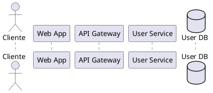
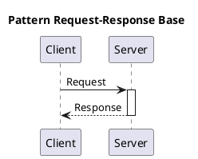
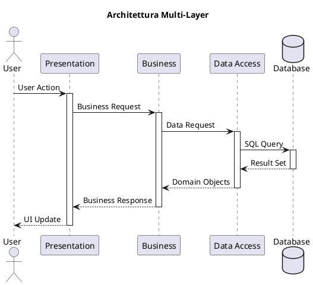
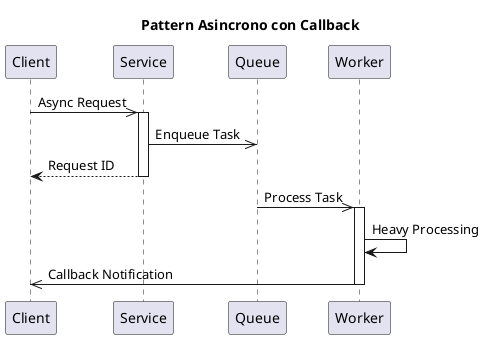
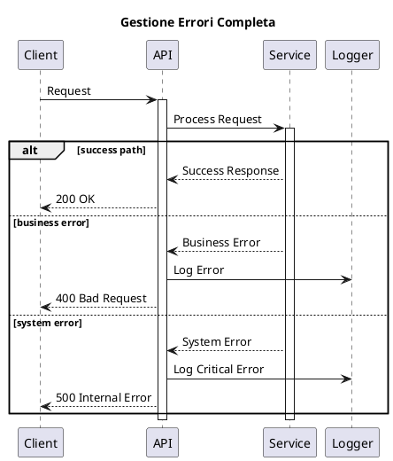
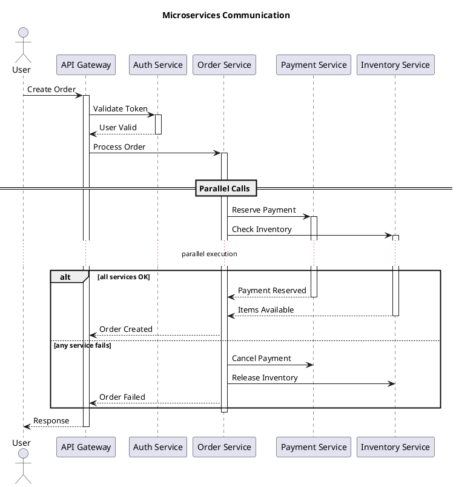
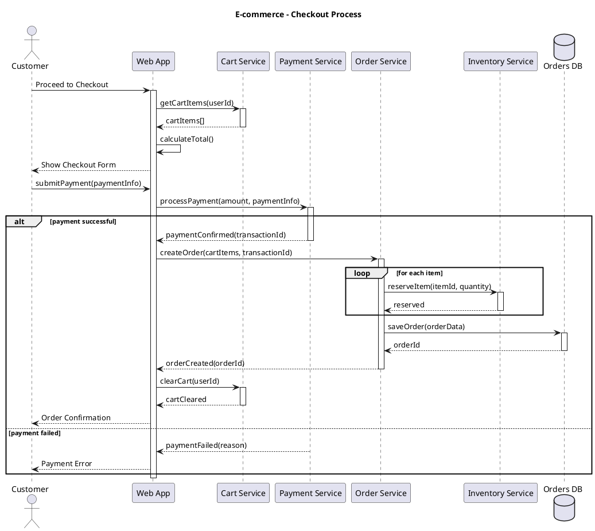
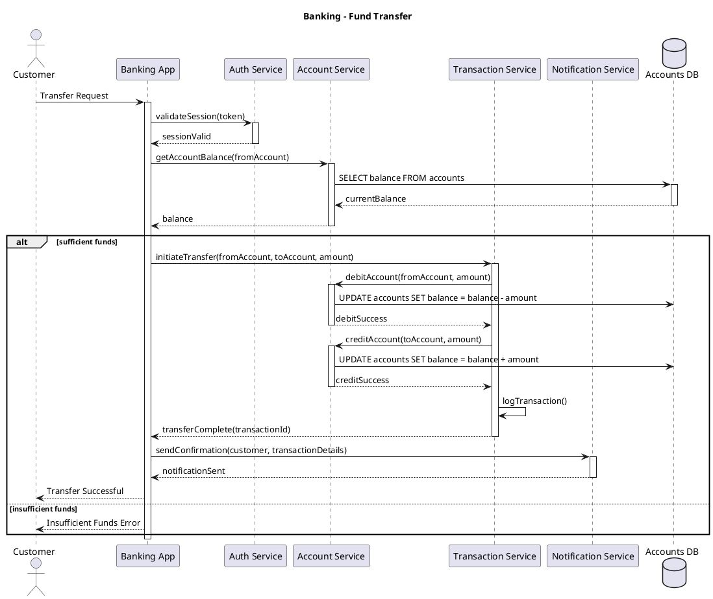
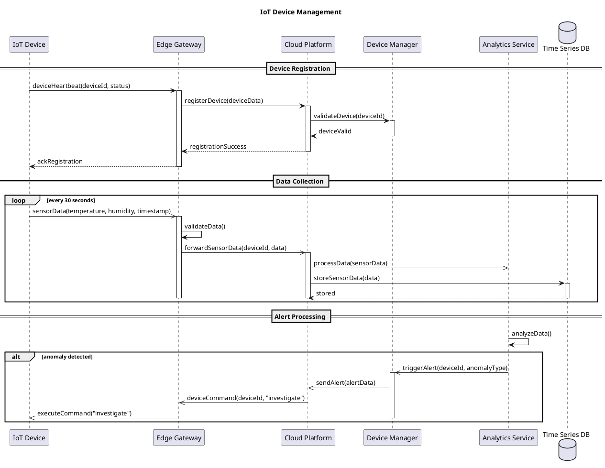

# 3.4 Diagrammi di Sequenza

## 3.4.1 Panoramica

[Breve introduzione alle interazioni principali tra componenti del sistema]

Questa sezione descrive le interazioni tra i componenti di [nome del sistema] attraverso diagrammi di sequenza, mostrando lo scambio di messaggi in ordine temporale.

## 3.4.2 Interazione: [Nome Interazione 1]

### Descrizione

[Descrizione dettagliata dello scenario di interazione, contesto e risultato atteso]

### Componenti Coinvolti

- **[Componente1]**: [Ruolo nell'interazione]
- **[Componente2]**: [Ruolo nell'interazione]
- **[Componente3]**: [Ruolo nell'interazione]

### Flusso dei Messaggi

1. **[Messaggio1]**: Da [Componente A] a [Componente B]
   - Parametri: [Descrizione parametri]
   - Risposta: [Descrizione risposta]
   
2. **[Messaggio2]**: Da [Componente B] a [Componente C]
   - Parametri: [Descrizione parametri]
   - Risposta: [Descrizione risposta]

3. **[Messaggio3]**: Da [Componente C] a [Componente B]
   - Parametri: [Descrizione parametri]
   - Risposta: [Descrizione risposta]

### Scenari Alternativi

- **[Condizione Alternativa 1]**: [Descrizione del flusso alternativo]
- **[Condizione Alternativa 2]**: [Descrizione del flusso alternativo]

### Diagramma

[Riferimento al diagramma di sequenza]

### Casi d'Uso Correlati

- [ID Caso d'Uso]: [Nome Caso d'Uso]

## 3.4.3 Interazione: [Nome Interazione 2]

### Descrizione

[Descrizione dettagliata dello scenario di interazione, contesto e risultato atteso]

### Componenti Coinvolti

- **[Componente1]**: [Ruolo nell'interazione]
- **[Componente2]**: [Ruolo nell'interazione]
- **[Componente3]**: [Ruolo nell'interazione]

### Flusso dei Messaggi

1. **[Messaggio1]**: Da [Componente A] a [Componente B]
   - Parametri: [Descrizione parametri]
   - Risposta: [Descrizione risposta]
   
2. **[Messaggio2]**: Da [Componente B] a [Componente C]
   - Parametri: [Descrizione parametri]
   - Risposta: [Descrizione risposta]

### Diagramma

[Riferimento al diagramma di sequenza]

### Casi d'Uso Correlati

- [ID Caso d'Uso]: [Nome Caso d'Uso]

## 3.4.4 Comunicazioni Asincrone

[Descrizione delle interazioni che utilizzano pattern di messaggistica asincrona]

### Interazione: [Nome Interazione Asincrona]

- **Publisher**: [Componente che pubblica]
- **Subscriber**: [Componenti che sottoscrivono]
- **Eventi**: [Tipi di eventi/messaggi scambiati]
- **Modalità di Processing**: [Descrizione di come vengono gestiti i messaggi]

### Diagramma

[Riferimento al diagramma che mostra interazioni asincrone]

## 3.4.5 Gestione Errori

[Descrizione generale dell'approccio alla gestione degli errori nelle interazioni principali]

### Scenari di Errore

- **[Scenario Errore 1]**: [Descrizione dell'errore e della gestione]
- **[Scenario Errore 2]**: [Descrizione dell'errore e della gestione]

### Pattern di Resilienza

[Descrizione dei pattern utilizzati per garantire resilienza nelle comunicazioni]

## 3.4.6 Tracciabilità

| Interazione | Componenti | Casi d'Uso Correlati | Requisiti Implementati |
|-------------|------------|----------------------|------------------------|
| [Nome 1]    | [Elenco]   | [UC-IDs]             | [REQ-IDs]              |
| [Nome 2]    | [Elenco]   | [UC-IDs]             | [REQ-IDs]              |

```plantuml
participant A
participant B

A -> B: create
activate B
B --> A: success
A -> B: process
A -> B: destroy
destroy B
```

### Alternative e Loop

```plantuml
alt condizione true
  A -> B: Messaggio A
else condizione false
  A -> C: Messaggio B
end

loop 5 times
  A -> B: Iterazione
end
```

## Come Utilizzare il Template

### Identifica i Partecipanti



### Modella l'Interazione

```plantuml
C -> W: Login Request
activate W
W -> G: POST /auth/login
activate G
G -> U: validateCredentials()
activate U
U -> DB: SELECT user
activate DB
DB --> U: user data
deactivate DB
U --> G: authentication result
deactivate U
G --> W: JWT token
deactivate G
W --> C: Login Success
deactivate W
```

### Gestisci Scenari Alternativi

```plantuml
alt credenziali valide
  U --> G: success + user_data
else credenziali non valide
  U --> G: error: invalid_credentials
else utente bloccato
  U --> G: error: account_locked
end
```

## Pattern Comuni

### Pattern Request-Response Semplice



### Pattern Multi-Layer



### Pattern Async con Callback



### Pattern Error Handling



### Pattern Microservices



## Best Practices

### Messaggi e Naming

```plantuml
User -> AuthService: authenticateUser(username, password)
AuthService -> Database: findUserByUsername(username)

User -> System: doStuff()
System -> DB: getData()
```

### Livello di Astrazione

```plantuml
Client -> OrderService: createOrder(orderData)
OrderService -> PaymentService: processPayment(amount)

Client -> Controller: HTTP POST /orders
Controller -> Repository: executeSQL(query)
```

### Gestione Activation

```plantuml
A -> B: request
activate B
B -> C: delegate
activate C
C --> B: result
deactivate C
B --> A: response
deactivate B

```

### Return Messages

```plantuml
A -> B: getData()
activate B
B -> DB: query
activate DB
DB --> B: resultSet
deactivate DB
B --> A: processedData
deactivate B

 ' Implicita per semplicità quando ovvia
A -> B: simpleRequest
B --> A: simpleResponse
```

## Styling e Personalizzazione

### Stereotipi e Colori

```plantuml
!define ACTOR_COLOR #E8F5E8
!define BOUNDARY_COLOR #E3F2FD
!define CONTROL_COLOR #FFF9C4
!define ENTITY_COLOR #FCE4EC
!define DATABASE_COLOR #F3E5F5

participant "User" as U <<actor>> ACTOR_COLOR
participant "UI" as UI <<boundary>> BOUNDARY_COLOR
participant "Controller" as C <<control>> CONTROL_COLOR
participant "Service" as S <<entity>> ENTITY_COLOR
database "DB" as DB DATABASE_COLOR
```

### Grouping e Separatori

```plantuml
== Authentication Phase ==
User -> System: login()

== Business Logic Phase ==
System -> Service: processRequest()

== Data Persistence Phase ==
Service -> Database: saveData()

...

== Cleanup Phase ==
System -> System: cleanup()
```

### Note e Commenti

```plantuml
User -> System: request
note right: Questo messaggio include\nvalidazione dei parametri

System -> Database: query
note over Database: Query ottimizzata\ncon indici appropriati
```

## Esempi per Dominio

### E-commerce: Processo di Checkout



### Sistema Bancario: Trasferimento Fondi



### Sistema IoT: Device Management



## Sequence vs Altri Diagrammi

### Sequence vs Activity

```yaml
Sequence Diagrams:
  - Focus: Interazioni tra oggetti
  - Asse temporale: Verticale, esplicito
  - Prospettiva: Collaborazione
  - Dettaglio: Messaggi e protocolli

Activity Diagrams:
  - Focus: Workflow e processi
  - Controllo di flusso: Decisioni e parallelismo
  - Prospettiva: Processo business
  - Dettaglio: Attività e stati
```

### Sequence vs Communication

```yaml
Sequence Diagrams:
  - Layout: Verticale, temporale
  - Enfasi: Ordine dei messaggi
  - Complessità: Buono per molti messaggi
  - Use case: Protocolli dettagliati

Communication Diagrams:
  - Layout: Grafo, spaziale
  - Enfasi: Relazioni tra oggetti
  - Complessità: Buono per pochi oggetti
  - Use case: Overview architetturale
```

## Tracciabilità e Documentazione

### Collegamento con Use Cases

```plantuml
title Sequence per Use Case "UC-001: User Login"
note over User, Database: Implementa User Story US-001\nRequisiti: REQ-F-001, REQ-NF-003

User -> System: login(username, password)
```

### Mapping con API Documentation

```plantuml
note right of API: POST /api/v1/auth/login\nContent-Type: application/json\n{\n  "username": "string",\n  "password": "string"\n}

User -> API: login request
API --> User: 200 OK + JWT token
```

### Error Scenario Documentation

```plantuml
== Happy Path ==
User -> System: validRequest()
System --> User: success

== Error Scenarios ==
User -> System: invalidRequest()
System --> User: 400 Bad Request

User -> System: unauthorizedRequest()
System --> User: 401 Unauthorized
```

## Testing dei Sequence Diagrams

### Test Scenario Mapping

```yaml
Sequence: "User Authentication"
Test Cases:
  - TC-001: Valid credentials
  - TC-002: Invalid password
  - TC-003: Non-existent user
  - TC-004: System unavailable
  - TC-005: Database timeout
```

### Mock Objects

```plantuml
participant "Real Client" as C
participant "System Under Test" as S
participant "Mock Database" as MD

C -> S: request
S -> MD: query
note right of MD: Mock returns\npredefined response
MD --> S: mock_data
S --> C: processed_response
```

## Tools e Integration

### PlantUML Advanced Features

```plantuml
' Autonumbering
autonumber

' Reference messages
ref over A, B: Complex Interaction\n(see separate diagram)

' Delay
A -> B: request
...5 minutes later...
B --> A: response

' Space management
|||
A -> B: after space
```

### Integration con IDE

- **VS Code**: PlantUML extension + live preview
- **IntelliJ**: PlantUML plugin + syntax highlighting
- **Eclipse**: PlantUML plugin
- **Vim/Emacs**: PlantUML syntax support

### API Documentation Integration

```yaml
# OpenAPI + PlantUML
paths:
  /api/users:
    post:
      x-sequence-diagram: |
        @startuml
        Client -> API: POST /api/users
        API -> Database: INSERT user
        Database --> API: user_id
        API --> Client: 201 Created
        @enduml
```

## Advanced Patterns

### Saga Pattern (Distributed Transactions)

```plantuml
@startuml
title Saga Pattern - Order Processing

participant "Order Service" as O
participant "Payment Service" as P
participant "Inventory Service" as I
participant "Shipping Service" as S

O -> P: reservePayment()
activate P
P --> O: paymentReserved
deactivate P

O -> I: reserveInventory()
activate I
I --> O: inventoryReserved
deactivate I

O -> S: scheduleShipping()
activate S

alt shipping successful
  S --> O: shippingScheduled
  deactivate S
  O -> P: confirmPayment()
  O -> I: confirmReservation()
else shipping failed
  S --> O: shippingFailed
  deactivate S
  O -> P: cancelPayment()
  O -> I: cancelReservation()
end
@enduml
```

### Circuit Breaker Pattern

```plantuml
@startuml
title Circuit Breaker Pattern

participant "Client" as C
participant "Circuit Breaker" as CB
participant "Service" as S

C -> CB: request
activate CB

alt circuit closed
  CB -> S: forward request
  activate S
  S --> CB: response
  deactivate S
  CB --> C: response
else circuit open
  CB --> C: fallback response
else circuit half-open
  CB -> S: test request
  activate S
  alt service recovered
    S --> CB: success
    deactivate S
    CB -> CB: close circuit
    CB --> C: response
  else service still failing
    S --> CB: failure
    deactivate S
    CB -> CB: open circuit
    CB --> C: fallback response
  end
end
deactivate CB
@enduml
```

## Supporto

Per domande sui Sequence Diagrams:

- **Software Architect**: [Responsabile design interazioni]
- **API Designer**: [Responsabile design interfacce]
- **Integration Specialist**: [Responsabile integrazioni]
- **Technical Lead**: [Responsabile implementazione]

---

*I Sequence Diagrams sono il DNA delle interazioni software. Usali per documentare come i componenti collaborano per realizzare le funzionalità.*
