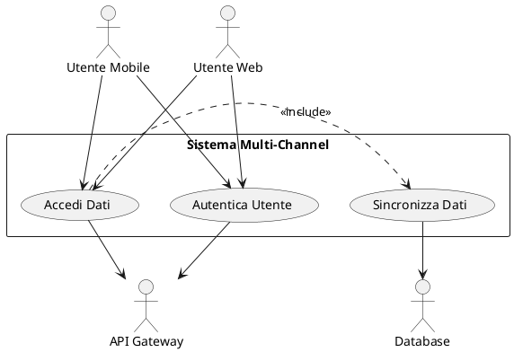
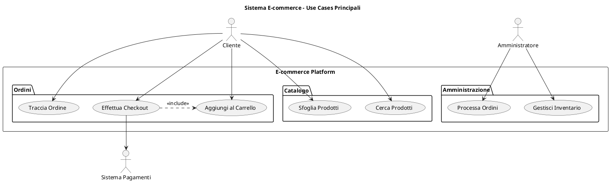
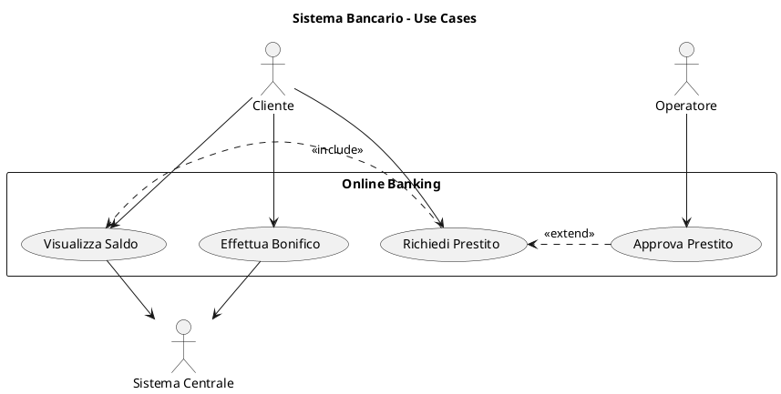
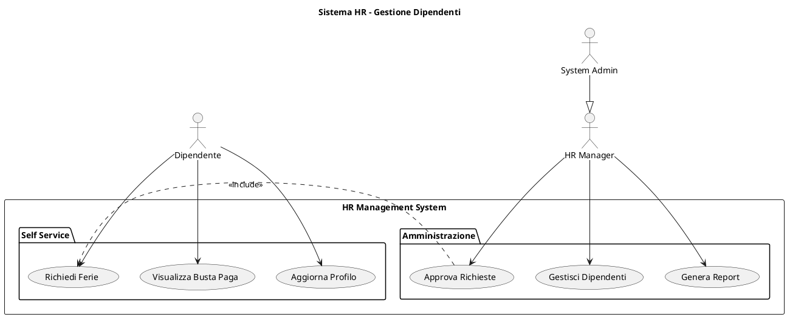

# Istruzioni per i Diagrammi dei Casi d'Uso

Questo documento contiene le linee guida e le best practices per la creazione dei diagrammi dei casi d'uso (Use Case Diagrams) all'interno del progetto.

## Scopo dei Use Case Diagrams

I diagrammi dei casi d'uso servono a:
- Identificare gli attori del sistema (persone o sistemi esterni)
- Definire le funzionalità offerte dal sistema
- Stabilire i confini del sistema (system boundary)
- Documentare le relazioni tra attori e funzionalità

## Convenzioni di Modellazione

### Attori

- **Posizionamento**: Attori primari a sinistra, attori secondari/sistemi a destra
- **Naming**: Nomi significativi in formato PascalCase (es. "ClienteRegistrato")
- **Generalizzazione**: Utilizzare solo quando un attore specializzato eredita tutte le associazioni dell'attore generale
- **Stereotipi**: Utilizzare stereotipi come <<system>>, <<human>>, <<device>> quando appropriato

### Casi d'Uso

- **Naming**: Verbo + Oggetto (es. "EffettuaOrdine", "VisualizzaCatalogo")
- **Granularità**: Mantenere un livello di dettaglio consistente all'interno dello stesso diagramma
- **Descrizione**: Ogni caso d'uso deve avere una breve descrizione testuale associata
- **ID**: Assegnare ID univoci (UC-XXX) per tracciabilità

### Relazioni

- **Association**: Da usare per collegare attori e casi d'uso (freccia semplice)
- **Include**: Da usare quando un caso d'uso incorpora obbligatoriamente un altro (dipendenza funzionale)
- **Extend**: Da usare per varianti opzionali o condizionali di un caso d'uso base
- **Generalization**: Da usare con parsimonia solo per casi d'uso che specializzano un comportamento generale

## Template e Pattern

### System Boundary

Utilizzare sempre un rettangolo per definire il boundary del sistema:

```plantuml
rectangle "Nome Sistema" {
  ' casi d'uso interni al sistema
}
```

### Package per Raggruppamento

Raggruppare i casi d'uso correlati utilizzando il costrutto package:

```plantuml
package "Area Funzionale" {
  usecase UC1
  usecase UC2
}
```

## Esempi per Domini Applicativi

### E-commerce

- Attori: Cliente, ClienteRegistrato, SistemaAutorizzazione, SistemaPagamenti
- Casi d'uso: SfogliaCatalogo, EffettuaOrdine, TracciaSpedizione, GestisceCarrello

### Banking

- Attori: Correntista, ConsulenteBancario, SistemaInterbancario
- Casi d'uso: EffettuaPrelievo, DisponiBonifico, ApriConto, RichiediPrestito

### Healthcare

- Attori: Paziente, Medico, Infermiere, SistemaAssicurativo
- Casi d'uso: PrenotaVisita, ConsultaCartellaClinica, PrescriveMedicinale

## Tracciabilità e Validazione

- Ogni diagramma di caso d'uso deve essere collegato ai requisiti funzionali (REQ-F-XXX)
- Ogni caso d'uso deve essere collegato alle user stories correlate (US-XXX)
- Verificare la copertura completa dei requisiti funzionali primari

## Procedura Operativa

1. Iniziare identificando tutti gli attori esterni al sistema
2. Per ogni attore, identificare i casi d'uso con cui interagisce
3. Definire le relazioni tra i casi d'uso (include, extend)
4. Raggruppare i casi d'uso correlati utilizzando package
5. Validare il diagramma rispetto ai requisiti
6. Documentare eventuali assumptions o decisioni di modellazione

## Common Mistakes da Evitare

- Casi d'uso troppo generici (es. "UsaSistema")
- Casi d'uso che rappresentano funzioni tecniche interne
- Relazioni dirette tra attori
- Troppi casi d'uso in un unico diagramma (max 15-20)
- Uso eccessivo di relazioni extend/include che complica la leggibilità

## Riferimenti

- UML 2.5 Specification
- Fowler, M. "UML Distilled"
- Cockburn, A. "Writing Effective Use Cases"

### Pattern con Sistema Esterno



## Best Practices per Use Cases

### Naming Conventions

- **Use Cases**: Verbo + Oggetto ("Effettua Ordine", "Gestisci Profilo")
- **Attori**: Nomi o ruoli chiari ("Cliente", "Amministratore Sistema")
- **Packages**: Raggruppamenti logici ("Gestione Ordini", "Sicurezza")

### Livelli di Dettaglio

```plantuml
' Troppo dettagliato
usecase "Clicca Bottone Login"

' Livello appropriato
usecase "Effettua Login"

' Troppo generico
usecase "Gestisci Sistema"

' Specifico ma completo
usecase "Gestisci Configurazione Utenti"
```

### Relazioni Significative

```plantuml
' Include per funzionalità sempre richieste
(Effettua Ordine) .> (Valida Pagamento) : <<include>>

' Extend per variazioni opzionali
(Applica Sconto) .> (Effettua Ordine) : <<extend>>

' Generalizzazione per specializzazioni
(Login OAuth) --|> (Effettua Login)
```

### Anti-Patterns da Evitare

- **Troppi Use Cases**: Max 7-9 per diagramma
- **Use Cases Implementativi**: Focus su business value
- **Attori Tecnici**: Evita "Database", "Server" come attori
- **Flussi Sequenziali**: Non mostrare sequenze temporali

## Tracciabilità

### Collegamento con User Stories

```plantuml
' Use Case: UC-001 "Effettua Ordine"
' User Stories: US-001, US-002, US-003
' Requirements: REQ-F-001, REQ-F-002

note right of UC1 : Traccia a:\nUS-001: Ordine Cliente\nREQ-F-001: Processo Ordini
```

### Collegamento con Requirements

```yaml
Use Case ID: UC-001
Name: Effettua Ordine
User Stories:
  - US-001: Come cliente, voglio ordinare prodotti
  - US-002: Come cliente, voglio scegliere pagamento
Functional Requirements:
  - REQ-F-001: Sistema deve validare ordini
  - REQ-F-002: Sistema deve processare pagamenti
Non-Functional Requirements:
  - REQ-NF-001: Tempo risposta < 3 secondi
```

## Styling e Presentazione

### Theme e Colori

```plantuml
!theme blueprint
!define BUSINESS_COLOR #E1F5FE
!define SYSTEM_COLOR #F3E5F5
!define ACTOR_COLOR #E8F5E8

skinparam actor {
  BackgroundColor ACTOR_COLOR
  BorderColor #2E7D32
}

skinparam usecase {
  BackgroundColor BUSINESS_COLOR
  BorderColor #0277BD
}
```

### Layout e Organizzazione

```plantuml
' Attori primari a sinistra
left to right direction

' Attori secondari a destra
actor "Sistema Esterno" as Ext

' Raggruppamento logico
package "Modulo Core" as Core {
  usecase "Use Case Principale" as Main
}

package "Modulo Supporto" as Support {
  usecase "Use Case Supporto" as Help
}
```

## Esempi per Dominio

### E-commerce



### Sistema Bancario



### Sistema HR



## Tools e Integrazione

### PlantUML Extensions

- **VS Code**: PlantUML extension per preview
- **IntelliJ**: PlantUML integration plugin
- **Confluence**: PlantUML macro per documentation
- **GitHub**: PlantUML rendering in README

### Export e Condivisione

```bash
# Export PNG
plantuml -tpng diagram.puml

# Export SVG
plantuml -tsvg diagram.puml

# Export PDF
plantuml -tpdf diagram.puml
```

### Integrazione CI/CD

```yaml
# GitHub Actions example
- name: Generate PlantUML Diagrams
  uses: cloudbees/plantuml-github-action@master
  with:
    args: -v -tsvg **/*.puml
```

## Risorse Aggiuntive

### UML Standards

- **UML 2.5 Specification**: Standard OMG ufficiale
- **PlantUML Language Reference**: Sintassi completa
- **Use Case Best Practices**: Cockburn, Fowler guidelines

### Template Correlati

- `../activity-diagrams/`: Dettaglio flussi use case
- `../sequence-diagrams/`: Interazioni specifiche
- `../../02-requirements/user-stories/`: User stories collegate

## Supporto

Per domande sui Use Case Diagrams:

- **Business Analyst**: [Responsabile requirements]
- **Solution Architect**: [Responsabile system design]
- **Product Owner**: [Responsabile product vision]
- **Technical Writer**: [Responsabile documentation]

---

*I Use Case Diagrams sono il ponte tra il business e la tecnologia. Usali per catturare il "cosa" prima di passare al "come".*
