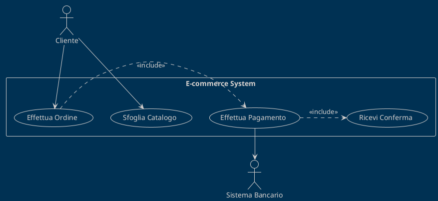
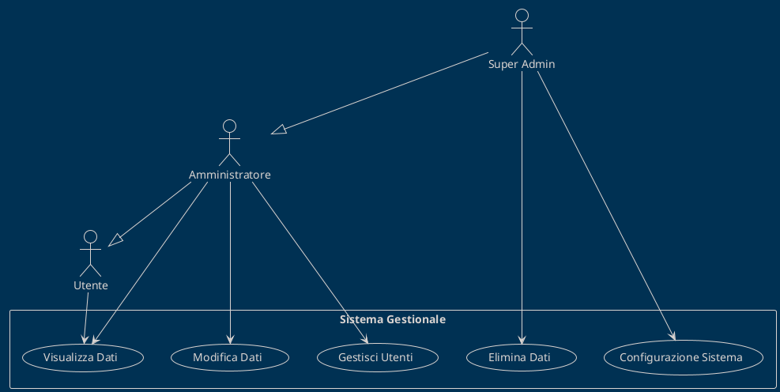
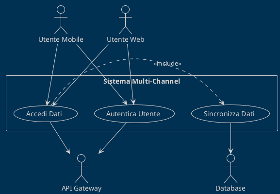
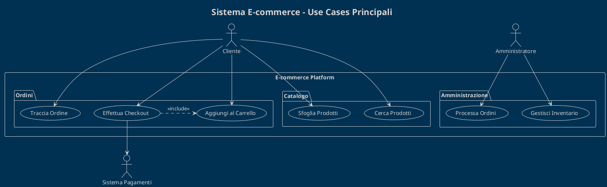
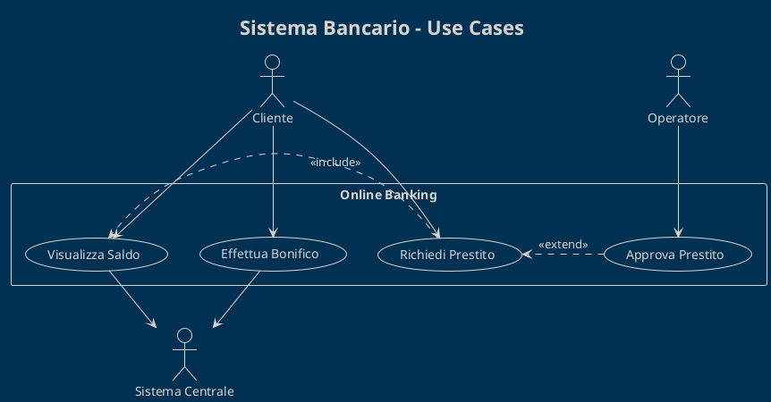

# Use Case Diagrams

I diagrammi dei casi d'uso mostrano le funzionalità del sistema dal punto di vista degli utenti e degli attori esterni.

## Scopo dei Use Case Diagrams

I **Use Case Diagrams** servono per:
- Identificare gli attori del sistema
- Definire i casi d'uso principali
- Mostrare le relazioni tra attori e casi d'uso
- Stabilire i confini del sistema (system boundary)

## Elementi del Diagramma

### Attori (Actors)
```plantuml
actor "Nome Attore" as ActorAlias
actor :Nome Attore: as ActorAlias2
```

**Tipologie di Attori:**
- **Attori Primari**: Utenti principali che iniziano i casi d'uso
- **Attori Secondari**: Sistemi esterni che supportano i casi d'uso
- **Attori di Sistema**: Altri sistemi che interagiscono

### Casi d'Uso (Use Cases)
```plantuml
usecase "Nome Use Case" as UC1
usecase (Nome Use Case) as UC2
```

**Livelli di Granularità:**
- **High-Level**: Processi business completi
- **User-Level**: Interazioni singole utente
- **Sub-Function**: Sotto-funzionalità specifiche

### System Boundary
```plantuml
rectangle "Nome Sistema" {
  usecase "Use Case 1" as UC1
  usecase "Use Case 2" as UC2
}
```

### Relazioni

#### Association (Associazione)
```plantuml
Actor --> (Use Case)
```

#### Include (Inclusione)
```plantuml
(Use Case Base) .> (Use Case Incluso) : <<include>>
```

#### Extend (Estensione)
```plantuml
(Use Case Esteso) .> (Use Case Base) : <<extend>>
```

#### Generalization (Generalizzazione)
```plantuml
(Use Case Specifico) --|> (Use Case Generale)
Actor1 --|> Actor2
```

## Come Utilizzare il Template

### 1. Identifica gli Attori
```plantuml
' Attori Primari (esterni, a sinistra)
actor "Cliente" as Customer
actor "Amministratore" as Admin

' Attori Secondari (sistemi, a destra)  
actor "Sistema Pagamenti" as PaymentSys
actor "Sistema Email" as EmailSys
```

### 2. Definisci i Casi d'Uso
```plantuml
' Casi d'uso raggruppati logicamente
package "Gestione Ordini" {
  usecase "Effettua Ordine" as UC1
  usecase "Modifica Ordine" as UC2
  usecase "Cancella Ordine" as UC3
}

package "Gestione Account" {
  usecase "Registra Account" as UC4
  usecase "Login" as UC5
  usecase "Recupera Password" as UC6
}
```

### 3. Stabilisci le Relazioni
```plantuml
' Associazioni dirette
Customer --> UC1
Customer --> UC2
Admin --> UC3

' Relazioni include/extend
UC1 .> UC5 : <<include>>
UC6 .> UC5 : <<extend>>
```

## Pattern Comuni

### Pattern Cliente-Sistema


### Pattern Amministrativo


### Pattern con Sistema Esterno


## Best Practices per Use Cases

### Naming Conventions
- **Use Cases**: Verbo + Oggetto ("Effettua Ordine", "Gestisci Profilo")
- **Attori**: Nomi o ruoli chiari ("Cliente", "Amministratore Sistema")
- **Packages**: Raggruppamenti logici ("Gestione Ordini", "Sicurezza")

### Livelli di Dettaglio
```plantuml
' Troppo dettagliato
usecase "Clicca Bottone Login"

' Livello appropriato  
usecase "Effettua Login"

' Troppo generico
usecase "Gestisci Sistema"

' Specifico ma completo
usecase "Gestisci Configurazione Utenti"
```

### Relazioni Significative
```plantuml
' Include per funzionalità sempre richieste
(Effettua Ordine) .> (Valida Pagamento) : <<include>>

' Extend per variazioni opzionali
(Applica Sconto) .> (Effettua Ordine) : <<extend>>

' Generalizzazione per specializzazioni
(Login OAuth) --|> (Effettua Login)
```

### Anti-Patterns da Evitare
- **Troppi Use Cases**: Max 7-9 per diagramma
- **Use Cases Implementativi**: Focus su business value
- **Attori Tecnici**: Evita "Database", "Server" come attori
- **Flussi Sequenziali**: Non mostrare sequenze temporali

## Tracciabilità

### Collegamento con User Stories
```plantuml
' Use Case: UC-001 "Effettua Ordine"
' User Stories: US-001, US-002, US-003
' Requirements: REQ-F-001, REQ-F-002

note top of UC1 : Traccia a:\nUS-001: Ordine Cliente\nREQ-F-001: Processo Ordini
```

### Collegamento con Requirements
```yaml
Use Case ID: UC-001
Name: Effettua Ordine
User Stories: 
  - US-001: Come cliente, voglio ordinare prodotti
  - US-002: Come cliente, voglio scegliere pagamento
Functional Requirements:
  - REQ-F-001: Sistema deve validare ordini
  - REQ-F-002: Sistema deve processare pagamenti
Non-Functional Requirements:
  - REQ-NF-001: Tempo risposta < 3 secondi
```

## Styling e Presentazione

### Theme e Colori
```plantuml
!theme blueprint
!define BUSINESS_COLOR #E1F5FE
!define SYSTEM_COLOR #F3E5F5
!define ACTOR_COLOR #E8F5E8

skinparam actor {
  BackgroundColor ACTOR_COLOR
  BorderColor #2E7D32
}

skinparam usecase {
  BackgroundColor BUSINESS_COLOR
  BorderColor #0277BD
}
```

### Layout e Organizzazione
```plantuml
' Attori primari a sinistra
left to right direction

' Attori secondari a destra  
actor "Sistema Esterno" as Ext

' Raggruppamento logico
package "Modulo Core" as Core {
  usecase "Use Case Principale" as Main
}

package "Modulo Supporto" as Support {
  usecase "Use Case Supporto" as Help
}
```

## Esempi per Dominio

### E-commerce


### Sistema Bancario


### Sistema HR
```plantuml
@startuml
!theme blueprint
title Sistema HR - Gestione Dipendenti

actor "Dipendente" as D
actor "HR Manager" as HR
actor "System Admin" as SA

rectangle "HR Management System" {
  package "Self Service" {
    usecase "Visualizza Busta Paga" as UC1
    usecase "Richiedi Ferie" as UC2
    usecase "Aggiorna Profilo" as UC3
  }
  
  package "Amministrazione" {
    usecase "Gestisci Dipendenti" as UC4
    usecase "Approva Richieste" as UC5
    usecase "Genera Report" as UC6
  }
}

D --> UC1
D --> UC2
D --> UC3

HR --> UC4
HR --> UC5
HR --> UC6

SA --|> HR
UC5 .> UC2 : <<include>>
@enduml
```

## Tools e Integrazione

### PlantUML Extensions
- **VS Code**: PlantUML extension per preview
- **IntelliJ**: PlantUML integration plugin
- **Confluence**: PlantUML macro per documentation
- **GitHub**: PlantUML rendering in README

### Export e Condivisione
```bash
# Export PNG
plantuml -tpng diagram.puml

# Export SVG  
plantuml -tsvg diagram.puml

# Export PDF
plantuml -tpdf diagram.puml
```

### Integrazione CI/CD
```yaml
# GitHub Actions example
- name: Generate PlantUML Diagrams
  uses: cloudbees/plantuml-github-action@master
  with:
    args: -v -tsvg **/*.puml
```

## Risorse Aggiuntive

### UML Standards
- **UML 2.5 Specification**: Standard OMG ufficiale
- **PlantUML Language Reference**: Sintassi completa
- **Use Case Best Practices**: Cockburn, Fowler guidelines

### Template Correlati
- `../activity-diagrams/`: Dettaglio flussi use case
- `../sequence-diagrams/`: Interazioni specifiche
- `../../02-requirements/user-stories/`: User stories collegate

## Supporto

Per domande sui Use Case Diagrams:

- **Business Analyst**: [Responsabile requirements]
- **Solution Architect**: [Responsabile system design]  
- **Product Owner**: [Responsabile product vision]
- **Technical Writer**: [Responsabile documentation]

---

*I Use Case Diagrams sono il ponte tra il business e la tecnologia. Usali per catturare il "cosa" prima di passare al "come".*
