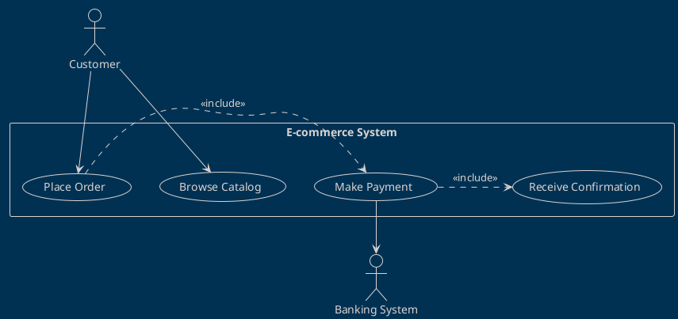
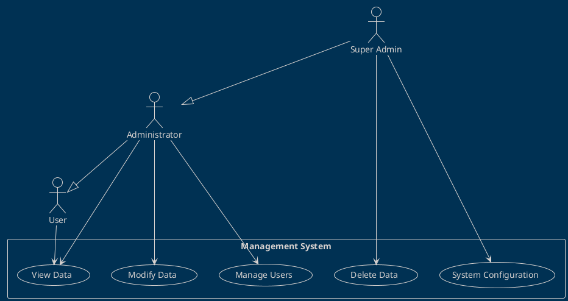
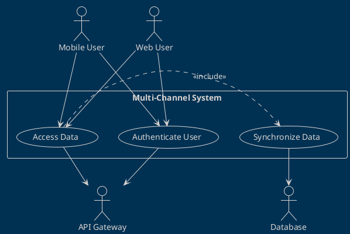
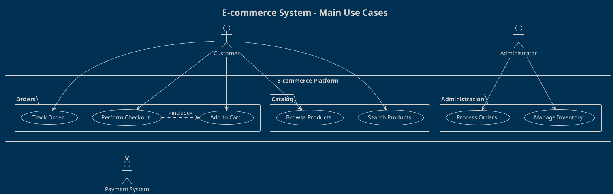
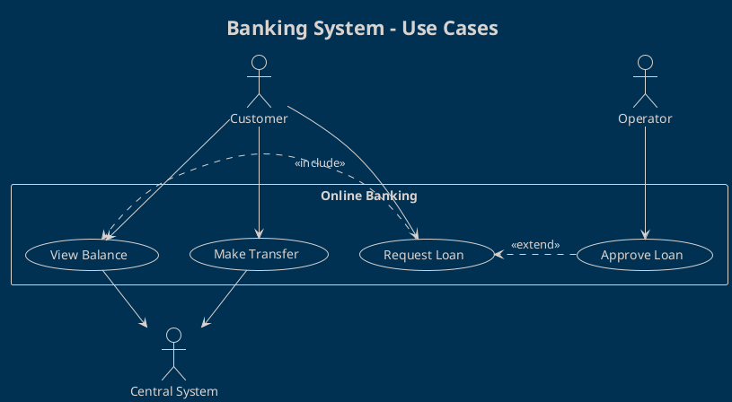

# Use Case Diagrams

Use case diagrams show the functionality of the system from the perspective of users and external actors.

## 🎯 Purpose of Use Case Diagrams

**Use Case Diagrams** are used to:
- Identify the system's actors
- Define the main use cases
- Show the relationships between actors and use cases
- Establish the system boundaries

## 📋 Diagram Elements

### Actors
```plantuml
actor "Actor Name" as ActorAlias
actor :Actor Name: as ActorAlias2
```

**Types of Actors:**
- **Primary Actors**: Main users who initiate use cases
- **Secondary Actors**: External systems that support use cases
- **System Actors**: Other interacting systems

### Use Cases
```plantuml
usecase "Use Case Name" as UC1
usecase (Use Case Name) as UC2
```

**Levels of Granularity:**
- **High-Level**: Complete business processes
- **User-Level**: Single user interactions
- **Sub-Function**: Specific sub-functionalities

### System Boundary
```plantuml
rectangle "System Name" {
  usecase "Use Case 1" as UC1
  usecase "Use Case 2" as UC2
}
```

### Relationships

#### Association
```plantuml
Actor --> (Use Case)
```

#### Include
```plantuml
(Base Use Case) .> (Included Use Case) : <<include>>
```

#### Extend
```plantuml
(Extended Use Case) .> (Base Use Case) : <<extend>>
```

#### Generalization
```plantuml
(Specific Use Case) --|> (General Use Case)
Actor1 --|> Actor2
```

## 📝 How to Use the Template

### 1. Identify the Actors
```plantuml
' Primary Actors (external, on the left)
actor "Customer" as Customer
actor "Administrator" as Admin

' Secondary Actors (systems, on the right)
actor "Payment System" as PaymentSys
actor "Email System" as EmailSys
```

### 2. Define the Use Cases
```plantuml
' Logically grouped use cases
package "Order Management" {
  usecase "Place Order" as UC1
  usecase "Modify Order" as UC2
  usecase "Cancel Order" as UC3
}

package "Account Management" {
  usecase "Register Account" as UC4
  usecase "Login" as UC5
  usecase "Recover Password" as UC6
}
```

### 3. Establish Relationships
```plantuml
' Direct associations
Customer --> UC1
Customer --> UC2
Admin --> UC3

' Include/extend relationships
UC1 .> UC5 : <<include>>
UC6 .> UC5 : <<extend>>
```

## 🏗️ Common Patterns

### Customer-System Pattern


### Administrative Pattern


### External System Pattern


## 📊 Best Practices for Use Cases

### ✅ Naming Conventions
- **Use Cases**: Verb + Object ("Place Order", "Manage Profile")
- **Actors**: Clear names or roles ("Customer", "System Administrator")
- **Packages**: Logical groupings ("Order Management", "Security")

### ✅ Levels of Detail
```plantuml
' ❌ Too detailed
usecase "Click Login Button"

' ✅ Appropriate level
usecase "Perform Login"

' ❌ Too generic
usecase "Manage System"

' ✅ Specific but complete
usecase "Manage User Configuration"
```

### ✅ Meaningful Relationships
```plantuml
' ✅ Include for always required functionality
(Place Order) .> (Validate Payment) : <<include>>

' ✅ Extend for optional variations
(Apply Discount) .> (Place Order) : <<extend>>

' ✅ Generalization for specializations
(OAuth Login) --|> (Perform Login)
```

### ❌ Anti-Patterns to Avoid
- **Too many Use Cases**: Max 7-9 per diagram
- **Implementation-focused Use Cases**: Focus on business value
- **Technical Actors**: Avoid "Database", "Server" as actors
- **Sequential Flows**: Do not show temporal sequences

## 🔍 Traceability

### Link with User Stories
```plantuml
' Use Case: UC-001 "Place Order"
' User Stories: US-001, US-002, US-003
' Requirements: REQ-F-001, REQ-F-002

note top of UC1 : Traces to:\nUS-001: Customer Order\nREQ-F-001: Order Process
```

### Link with Requirements
```yaml
Use Case ID: UC-001
Name: Place Order
User Stories:
  - US-001: As a customer, I want to order products
  - US-002: As a customer, I want to choose a payment method
Functional Requirements:
  - REQ-F-001: System must validate orders
  - REQ-F-002: System must process payments
Non-Functional Requirements:
  - REQ-NF-001: Response time < 3 seconds
```

## 🎨 Styling and Presentation

### Theme and Colors
```plantuml
!theme blueprint
!define BUSINESS_COLOR #E1F5FE
!define SYSTEM_COLOR #F3E5F5
!define ACTOR_COLOR #E8F5E8

skinparam actor {
  BackgroundColor ACTOR_COLOR
  BorderColor #2E7D32
}

skinparam usecase {
  BackgroundColor BUSINESS_COLOR
  BorderColor #0277BD
}
```

### Layout and Organization
```plantuml
' Primary actors on the left
left to right direction

' Secondary actors on the right
actor "External System" as Ext

' Logical grouping
package "Core Module" as Core {
  usecase "Main Use Case" as Main
}

package "Support Module" as Support {
  usecase "Support Use Case" as Help
}
```

## 🧪 Examples by Domain

### E-commerce


### Banking System


### HR System
```plantuml
@startuml
!theme blueprint
title HR System - Employee Management

actor "Employee" as D
actor "HR Manager" as HR
actor "System Admin" as SA

rectangle "HR Management System" {
  package "Self Service" {
    usecase "View Payslip" as UC1
    usecase "Request Leave" as UC2
    usecase "Update Profile" as UC3
  }

  package "Administration" {
    usecase "Manage Employees" as UC4
    usecase "Approve Requests" as UC5
    usecase "Generate Reports" as UC6
  }
}

D --> UC1
D --> UC2
D --> UC3

HR --> UC4
HR --> UC5
HR --> UC6

SA --|> HR
UC5 .> UC2 : <<include>>
@enduml
```

## 🔧 Tools and Integration

### PlantUML Extensions
- **VS Code**: PlantUML extension for preview
- **IntelliJ**: PlantUML integration plugin
- **Confluence**: PlantUML macro for documentation
- **GitHub**: PlantUML rendering in README

### Export and Sharing
```bash
# Export PNG
plantuml -tpng diagram.puml

# Export SVG
plantuml -tsvg diagram.puml

# Export PDF
plantuml -tpdf diagram.puml
```

### CI/CD Integration
```yaml
# GitHub Actions example
- name: Generate PlantUML Diagrams
  uses: cloudbees/plantuml-github-action@master
  with:
    args: -v -tsvg **/*.puml
```

## 📚 Additional Resources

### UML Standards
- **UML 2.5 Specification**: Official OMG standard
- **PlantUML Language Reference**: Complete syntax
- **Use Case Best Practices**: Cockburn, Fowler guidelines

### Related Templates
- `../activity-diagrams/`: Detailed use case flows
- `../sequence-diagrams/`: Specific interactions
- `../../02-requirements/user-stories/`: Linked user stories

## 📞 Support

For questions about Use Case Diagrams:

- **Business Analyst**: [Responsible for requirements]
- **Solution Architect**: [Responsible for system design]
- **Product Owner**: [Responsible for product vision]
- **Technical Writer**: [Responsible for documentation]

---

*Use Case Diagrams are the bridge between business and technology. Use them to capture the "what" before moving on to the "how."*
