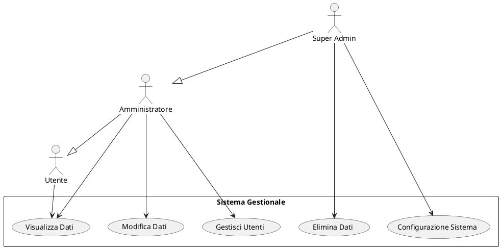
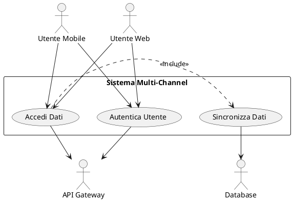
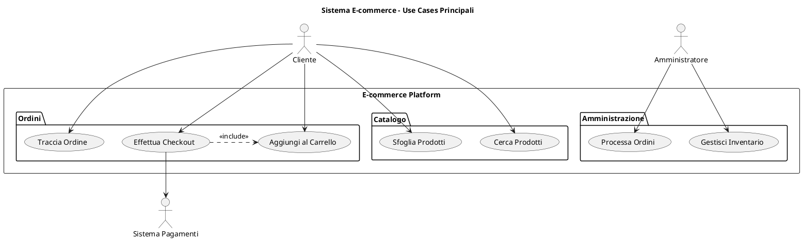
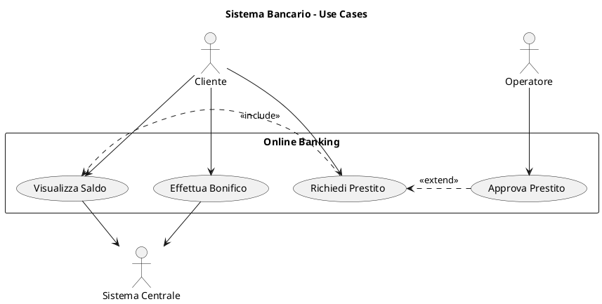
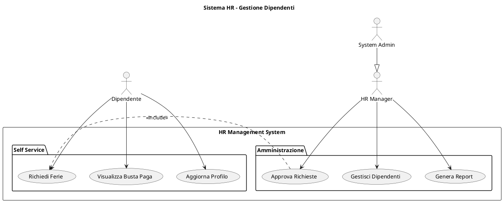

# 3.2 Diagrammi dei Casi d'Uso

## 3.2.1 Panoramica

[Breve introduzione ai casi d'uso del sistema, includendo informazioni sul contesto d'uso e sugli utenti principali]

Il sistema [nome del sistema] interagisce con diversi attori esterni e offre le seguenti funzionalità principali.

## 3.2.2 Attori del Sistema

I seguenti attori interagiscono con il sistema:

- **[NomeAttore1]**: [Breve descrizione del ruolo e responsabilità]
- **[NomeAttore2]**: [Breve descrizione del ruolo e responsabilità]
- **[NomeAttore3]**: [Breve descrizione del ruolo e responsabilità]

## 3.2.3 Casi d'Uso Principali

### UC-001: [Nome Caso d'Uso]

**Descrizione**: [Breve descrizione dello scopo e del risultato del caso d'uso]

**Attori**: [Attori coinvolti]

**Pre-condizioni**: [Condizioni che devono essere vere prima dell'esecuzione]

**Post-condizioni**: [Stato del sistema dopo l'esecuzione con successo]

**Flusso Principale**:
1. [Passo 1]
2. [Passo 2]
3. [Passo 3]

**Flussi Alternativi**:
- [Descrizione flusso alternativo 1]
- [Descrizione flusso alternativo 2]

**Requisiti correlati**: [IDs dei requisiti funzionali implementati]

### UC-002: [Nome Caso d'Uso]

**Descrizione**: [Breve descrizione dello scopo e del risultato del caso d'uso]

**Attori**: [Attori coinvolti]

**Pre-condizioni**: [Condizioni che devono essere vere prima dell'esecuzione]

**Post-condizioni**: [Stato del sistema dopo l'esecuzione con successo]

**Flusso Principale**:
1. [Passo 1]
2. [Passo 2]
3. [Passo 3]

**Flussi Alternativi**:
- [Descrizione flusso alternativo 1]
- [Descrizione flusso alternativo 2]

**Requisiti correlati**: [IDs dei requisiti funzionali implementati]

## 3.2.4 Diagrammi

### Diagramma Generale dei Casi d'Uso

[Inserire riferimento al diagramma generale dei casi d'uso]

### Diagramma [Area Funzionale 1]

[Inserire riferimento al diagramma dei casi d'uso specifici per l'area funzionale]

### Diagramma [Area Funzionale 2]

[Inserire riferimento al diagramma dei casi d'uso specifici per l'area funzionale]

## 3.2.5 Relazioni tra Casi d'Uso

### Relazioni di Inclusione (<<include>>)

- **[Caso d'uso base]** include **[Caso d'uso incluso]**: [Spiegazione della relazione]
- **[Caso d'uso base]** include **[Caso d'uso incluso]**: [Spiegazione della relazione]

### Relazioni di Estensione (<<extend>>)

- **[Caso d'uso esteso]** estende **[Caso d'uso base]**: [Spiegazione della condizione e dell'estensione]
- **[Caso d'uso esteso]** estende **[Caso d'uso base]**: [Spiegazione della condizione e dell'estensione]

## 3.2.6 Tracciabilità ai Requisiti

| Caso d'Uso | Requisiti Implementati | User Stories Correlate |
|------------|------------------------|------------------------|
| UC-001     | [REQ-IDs]              | [US-IDs]               |
| UC-002     | [REQ-IDs]              | [US-IDs]               |
| UC-003     | [REQ-IDs]              | [US-IDs]               |



### Pattern con Sistema Esterno



## Best Practices per Use Cases

### Naming Conventions

- **Use Cases**: Verbo + Oggetto ("Effettua Ordine", "Gestisci Profilo")
- **Attori**: Nomi o ruoli chiari ("Cliente", "Amministratore Sistema")
- **Packages**: Raggruppamenti logici ("Gestione Ordini", "Sicurezza")

### Livelli di Dettaglio

```plantuml
' Troppo dettagliato
usecase "Clicca Bottone Login"

' Livello appropriato  
usecase "Effettua Login"

' Troppo generico
usecase "Gestisci Sistema"

' Specifico ma completo
usecase "Gestisci Configurazione Utenti"
```

### Relazioni Significative

```plantuml
' Include per funzionalità sempre richieste
(Effettua Ordine) .> (Valida Pagamento) : <<include>>

' Extend per variazioni opzionali
(Applica Sconto) .> (Effettua Ordine) : <<extend>>

' Generalizzazione per specializzazioni
(Login OAuth) --|> (Effettua Login)
```

### Anti-Patterns da Evitare

- **Troppi Use Cases**: Max 7-9 per diagramma
- **Use Cases Implementativi**: Focus su business value
- **Attori Tecnici**: Evita "Database", "Server" come attori
- **Flussi Sequenziali**: Non mostrare sequenze temporali

## Tracciabilità

### Collegamento con User Stories

```plantuml
' Use Case: UC-001 "Effettua Ordine"
' User Stories: US-001, US-002, US-003
' Requirements: REQ-F-001, REQ-F-002

note right of UC1 : Traccia a:\nUS-001: Ordine Cliente\nREQ-F-001: Processo Ordini
```

### Collegamento con Requirements

```yaml
Use Case ID: UC-001
Name: Effettua Ordine
User Stories: 
  - US-001: Come cliente, voglio ordinare prodotti
  - US-002: Come cliente, voglio scegliere pagamento
Functional Requirements:
  - REQ-F-001: Sistema deve validare ordini
  - REQ-F-002: Sistema deve processare pagamenti
Non-Functional Requirements:
  - REQ-NF-001: Tempo risposta < 3 secondi
```

## Styling e Presentazione

### Theme e Colori

```plantuml
!theme blueprint
!define BUSINESS_COLOR #E1F5FE
!define SYSTEM_COLOR #F3E5F5
!define ACTOR_COLOR #E8F5E8

skinparam actor {
  BackgroundColor ACTOR_COLOR
  BorderColor #2E7D32
}

skinparam usecase {
  BackgroundColor BUSINESS_COLOR
  BorderColor #0277BD
}
```

### Layout e Organizzazione

```plantuml
' Attori primari a sinistra
left to right direction

' Attori secondari a destra  
actor "Sistema Esterno" as Ext

' Raggruppamento logico
package "Modulo Core" as Core {
  usecase "Use Case Principale" as Main
}

package "Modulo Supporto" as Support {
  usecase "Use Case Supporto" as Help
}
```

## Esempi per Dominio

### E-commerce



### Sistema Bancario



### Sistema HR



## Tools e Integrazione

### PlantUML Extensions

- **VS Code**: PlantUML extension per preview
- **IntelliJ**: PlantUML integration plugin
- **Confluence**: PlantUML macro per documentation
- **GitHub**: PlantUML rendering in README

### Export e Condivisione

```bash
# Export PNG
plantuml -tpng diagram.puml

# Export SVG  
plantuml -tsvg diagram.puml

# Export PDF
plantuml -tpdf diagram.puml
```

### Integrazione CI/CD

```yaml
# GitHub Actions example
- name: Generate PlantUML Diagrams
  uses: cloudbees/plantuml-github-action@master
  with:
    args: -v -tsvg **/*.puml
```

## Risorse Aggiuntive

### UML Standards

- **UML 2.5 Specification**: Standard OMG ufficiale
- **PlantUML Language Reference**: Sintassi completa
- **Use Case Best Practices**: Cockburn, Fowler guidelines

### Template Correlati

- `../activity-diagrams/`: Dettaglio flussi use case
- `../sequence-diagrams/`: Interazioni specifiche
- `../../02-requirements/user-stories/`: User stories collegate

## Supporto

Per domande sui Use Case Diagrams:

- **Business Analyst**: [Responsabile requirements]
- **Solution Architect**: [Responsabile system design]  
- **Product Owner**: [Responsabile product vision]
- **Technical Writer**: [Responsabile documentation]

---

*I Use Case Diagrams sono il ponte tra il business e la tecnologia. Usali per catturare il "cosa" prima di passare al "come".*
