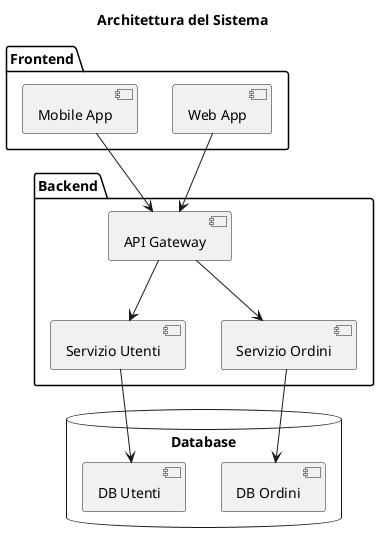

# Diagrammi dei Componenti

## Panoramica

Questa sezione documenta l'architettura a componenti del sistema, illustrando la decomposizione del sistema in moduli funzionali, le loro interfacce e le relazioni tra di essi.

## Diagramma Generale

[Inserire qui il diagramma generale dei componenti, che mostra una visione d'insieme di tutti i moduli e le loro interfacce.]

## Componenti Principali

Per una descrizione dettagliata di ogni componente e delle sue responsabilità, fare riferimento alla documentazione architetturale specifica.
