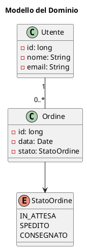

# Diagrammi delle Classi

## Panoramica

Questa sezione documenta la struttura statica del sistema attraverso i diagrammi delle classi, illustrando le classi, i loro attributi, metodi e le relazioni tra di esse.

## Modello del Dominio

[Inserire qui il diagramma delle classi che rappresenta il modello del dominio principale.]

## Dettagli dei Package

Per una visione più dettagliata delle classi all'interno di specifici package o moduli, fare riferimento ai diagrammi dedicati.
