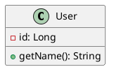

# Istruzioni per Diagrammi Strutturali

Questa cartella contiene template e linee guida per la creazione di diagrammi strutturali del sistema. I diagrammi strutturali rappresentano l'architettura statica, le relazioni tra componenti e la struttura generale del sistema.

## Organizzazione della Cartella

- `README.md`: Template introduttivo per la sezione sui diagrammi strutturali da compilare
- `INSTRUCTIONS.md`: Questo file, contenente le linee guida per l'agent/sviluppatore
- `template-system-architecture.puml`: Template per il diagramma dell'architettura generale
- `class-diagrams/`: Cartella per i diagrammi delle classi
- `component-diagrams/`: Cartella per i diagrammi dei componenti

## Strumenti da Utilizzare

### PlantUML (.puml)

Perfetto per diagrammi UML formali:
- Sintassi testuale precisa
- Supporto completo per UML standard
- Facile versionamento
- Generazione automatica

**Esempio d'uso**:

### Draw.io (.drawio)

Ideale per diagrammi di architettura e infrastruttura:

- Interfaccia drag-and-drop
- Librerie di icone predefinite
- Ottimo per diagrammi di deployment
- Collaborazione visuale

**Come aprire**: Fai doppio clic sul file `.drawio` per aprirlo nell'editor integrato di VS Code.

### Mermaid (.mmd)

Per diagrammi rapidi e semplici:

- Sintassi semplificata
- Rendering veloce
- Perfetto per documentazione

## Workflow Consigliato

### Architettura di Sistema (Draw.io)

- Inizia con il diagramma generale dell'architettura
- Mostra i layer principali
- Evidenzia i flussi di comunicazione

### Diagrammi dei Componenti (PlantUML)

- Dettaglio dei singoli componenti
- Interfacce e dipendenze
- Mapping con l'architettura generale

### Diagrammi delle Classi (PlantUML)

- Modello del dominio
- Design patterns implementati
- Struttura interna dei componenti

## Best Practices

### Diagrammi delle Classi

- Mostra solo attributi e metodi rilevanti
- Usa stereotipi per chiarire ruoli (`<<interface>>`, `<<abstract>>`)
- Raggruppa classi correlate in package
- Includi molteplicità nelle relazioni

### Diagrammi di Architettura

- Usa colori consistenti per raggruppare layer
- Mostra direzione dei flussi di comunicazione
- Includi tecnologie utilizzate
- Mantieni il diagramma ad alto livello

### Naming Conventions

- File: `[component-name]-[type].puml` o `[system-name]-architecture.drawio`
- Classi: PascalCase
- Attributi/Metodi: camelCase
- Package: lowercase

## Convenzioni per Diagrammi delle Classi

### Visibilità

- `+` public
- `-` private
- `#` protected
- `~` package

### Relazioni

- **Associazione**: linea semplice
- **Aggregazione**: diamante vuoto
- **Composizione**: diamante pieno
- **Ereditarietà**: triangolo vuoto
- **Implementazione**: triangolo vuoto + linea tratteggiata

### Stereotipi

- `<<interface>>`
- `<<abstract>>`
- `<<entity>>`
- `<<controller>>`
- `<<service>>`

## Visualizzazione

### PlantUML

- Apri il file `.puml`
- Usa `Ctrl+Shift+P` → `PlantUML: Preview Current Diagram`
- Per esportare: `PlantUML: Export Current Diagram`

## Integrazione con la Documentazione

- Aggiungi riferimenti ai diagrammi nella documentazione testuale
- Crea link tra diagrammi comportamentali e strutturali
- Assicura la tracciabilità con requisiti e user stories
