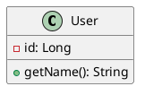

# Structural Diagrams

This section contains all the diagrams that describe the structure and architecture of the system.

## Structure

### class-diagrams/
UML class diagrams that show:
- Domain classes and business objects
- Attributes, methods, and visibility
- Relationships between classes (inheritance, composition, aggregation)
- Interfaces, abstract classes, and OOP patterns
- Design patterns and architectural patterns

### component-diagrams/
Component diagrams that describe:
- System architecture at the component level
- Interfaces and contracts between modules
- Dependencies and coupling between components
- Architectural layers and package organization
- Deployment and distribution of components

### template-system-architecture.puml
Template for the general system architecture diagram that includes:
- Application layers (Frontend, API Gateway, Services)
- Database Layer (Main database, Cache, File Storage)
- External services (third-party services)
- Infrastructure components (Load Balancer, Monitoring, Security, CI/CD)
- Communication flows between components

**How to use**: Customize the names of services, technologies, and connections according to your specific project.

## Available Tools

### PlantUML (.puml)
Perfect for formal UML diagrams:
- Precise textual syntax
- Full support for standard UML
- Easy versioning
- Automatic generation

**Example of use**:


### Draw.io (.drawio)
Ideal for architecture and infrastructure diagrams:
- Drag-and-drop interface
- Predefined icon libraries
- Great for deployment diagrams
- Visual collaboration

**How to open**: Double-click the `.drawio` file to open it in the integrated VS Code editor.

### Mermaid (.mmd)
For quick and simple diagrams:
- Simplified syntax
- Fast rendering
- Perfect for documentation

## Recommended Workflow

### 1. System Architecture (Draw.io)
- Start with the general architecture diagram
- Show the main layers
- Highlight communication flows

### 2. Component Diagrams (PlantUML)
- Detail of individual components
- Interfaces and dependencies
- Mapping with the general architecture

### 3. Class Diagrams (PlantUML)
- Domain model
- Implemented design patterns
- Internal structure of components

## Available Templates

### For PlantUML
- `template-class-diagram.puml` - Base structure for class diagrams
- Examples of relationships, stereotypes, and annotations

### For Draw.io
- `system-architecture.drawio` - System architecture template
- Predefined layout with colored layers
- Examples of connections and labels

## Best Practices

### Class Diagrams
- Show only relevant attributes and methods
- Use stereotypes to clarify roles (`<<interface>>`, `<<abstract>>`)
- Group related classes into packages
- Include multiplicity in relationships

### Architecture Diagrams
- Use consistent colors to group layers
- Show the direction of communication flows
- Include technologies used
- Keep the diagram at a high level

### Naming Conventions
- Files: `[component-name]-[type].puml` or `[system-name]-architecture.drawio`
- Classes: PascalCase
- Attributes/Methods: camelCase
- Packages: lowercase

## Visualization

### PlantUML
1. Open the `.puml` file
2. Use `Ctrl+Shift+P` → `PlantUML: Preview Current Diagram`
3. To export: `PlantUML: Export Current Diagram`

### Draw.io
1. Double-click the `.drawio` file
2. The integrated Draw.io editor will open
3. Edit with drag-and-drop
4. Save automatically in VS Code

### Mermaid
1. Insert the code into a Markdown file:
   ```markdown
   ```mermaid
   graph TD
     A --> B
   ```
2. Use the Markdown preview to view

## Integration with Documentation
- References to diagrams in textual documentation
- Links between behavioral and structural diagrams
- Traceability with requirements and user stories
- Relationships between classes (association, aggregation, composition, inheritance)
- Interfaces and abstract classes

### component-diagrams/
Component diagrams that describe:
- Component architecture
- Provided and required interfaces
- Dependencies between components
- System organization

## Conventions for Class Diagrams

### Visibility
- `+` public
- `-` private
- `#` protected
- `~` package

### Relationships
- **Association**: solid line
- **Aggregation**: empty diamond
- **Composition**: filled diamond
- **Inheritance**: empty triangle
- **Implementation**: empty triangle + dashed line

### Stereotypes
- `<<interface>>`
- `<<abstract>>`
- `<<entity>>`
- `<<controller>>`
- `<<service>>`

## Best Practices

### Organization
- Group related classes
- Keep diagrams readable (max 10-15 classes)
- Use packages to organize classes

### Detail
- Include main attributes and methods
- Specify important data types
- Show cardinality in associations

### Traceability
- Link to user stories
- Maintain consistency with behavioral diagrams
- Document design decisions
