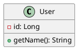

# Diagrammi Strutturali

Questa sezione contiene tutti i diagrammi che descrivono la struttura e l'architettura del sistema.

## Struttura

### class-diagrams/

Diagrammi delle classi UML che mostrano:
- Classi del dominio e business objects
- Attributi, metodi e visibilità
- Relazioni tra classi (ereditarietà, composizione, aggregazione)
- Interfacce, classi astratte e pattern OOP
- Design patterns e architectural patterns

### component-diagrams/

Diagrammi dei componenti che descrivono:
- Architettura del sistema a livello di componenti
- Interfacce e contratti tra moduli
- Dipendenze e accoppiamento tra componenti
- Layer architetturali e package organization
- Deployment e distribuzione dei componenti

### template-system-architecture.puml

Template per il diagramma dell'architettura generale del sistema che include:
- Layer dell'applicazione (Frontend, API Gateway, Services)
- Database Layer (Database principale, Cache, File Storage)
- Servizi esterni (servizi di terze parti)
- Componenti di infrastruttura (Load Balancer, Monitoring, Security, CI/CD)
- Flussi di comunicazione tra i componenti

**Come utilizzare**: Personalizza i nomi dei servizi, delle tecnologie e delle connessioni in base al tuo progetto specifico.

## Strumenti Disponibili

### PlantUML (.puml)

Perfetto per diagrammi UML formali:
- Sintassi testuale precisa
- Supporto completo per UML standard
- Facile versionamento
- Generazione automatica

**Esempio d'uso**:

### Draw.io (.drawio)

Ideale per diagrammi di architettura e infrastruttura:

- Interfaccia drag-and-drop
- Librerie di icone predefinite
- Ottimo per diagrammi di deployment
- Collaborazione visuale

**Come aprire**: Fai doppio clic sul file `.drawio` per aprirlo nell'editor integrato di VS Code.

### Mermaid (.mmd)

Per diagrammi rapidi e semplici:

- Sintassi semplificata
- Rendering veloce
- Perfetto per documentazione

## Workflow Consigliato

### Architettura di Sistema (Draw.io)

- Inizia con il diagramma generale dell'architettura
- Mostra i layer principali
- Evidenzia i flussi di comunicazione

### Diagrammi dei Componenti (PlantUML)

- Dettaglio dei singoli componenti
- Interfacce e dipendenze
- Mapping con l'architettura generale

### Diagrammi delle Classi (PlantUML)

- Modello del dominio
- Design patterns implementati
- Struttura interna dei componenti

## Template Disponibili

### Per PlantUML

- `template-class-diagram.puml` - Struttura base per diagrammi delle classi
- Esempi di relazioni, stereotipi e annotazioni

### Per Draw.io

- `system-architecture.drawio` - Template architettura sistema
- Layout predefinito con layer colorati
- Esempi di connessioni e etichette

## Best Practices

### Diagrammi delle Classi

- Mostra solo attributi e metodi rilevanti
- Usa stereotipi per chiarire ruoli (`<<interface>>`, `<<abstract>>`)
- Raggruppa classi correlate in package
- Includi molteplicità nelle relazioni

### Diagrammi di Architettura

- Usa colori consistenti per raggruppare layer
- Mostra direzione dei flussi di comunicazione
- Includi tecnologie utilizzate
- Mantieni il diagramma ad alto livello

### Naming Conventions

- File: `[component-name]-[type].puml` o `[system-name]-architecture.drawio`
- Classi: PascalCase
- Attributi/Metodi: camelCase
- Package: lowercase

## Visualizzazione

### PlantUML

- Apri il file `.puml`
- Usa `Ctrl+Shift+P` → `PlantUML: Preview Current Diagram`
- Per esportare: `PlantUML: Export Current Diagram`

## Integrazione con Documentazione

- Riferimenti ai diagrammi nella documentazione testuale
- Link tra diagrammi comportamentali e strutturali
- Tracciabilità con requisiti e user stories
- Relazioni tra classi (associazione, aggregazione, composizione, ereditarietà)
- Interfacce e classi astratte

### component-diagrams/

Diagrammi dei componenti che descrivono:
- Architettura a componenti
- Interfacce fornite e richieste
- Dipendenze tra componenti
- Organizzazione del sistema

## Convenzioni per Diagrammi delle Classi

### Visibilità

- `+` public
- `-` private
- `#` protected
- `~` package

### Relazioni

- **Associazione**: linea semplice
- **Aggregazione**: diamante vuoto
- **Composizione**: diamante pieno
- **Ereditarietà**: triangolo vuoto
- **Implementazione**: triangolo vuoto + linea tratteggiata

### Stereotipi

- `<<interface>>`
- `<<abstract>>`
- `<<entity>>`
- `<<controller>>`
- `<<service>>`

## Best Practices

### Organizzazione

- Raggruppa classi correlate
- Mantieni diagrammi leggibili (max 10-15 classi)
- Usa package per organizzare classi

### Dettaglio

- Includi attributi e metodi principali
- Specifica tipi di dati importanti
- Mostra cardinalità nelle associazioni

### Tracciabilità

- Collega alle user stories
- Mantieni consistenza con i diagrammi comportamentali
- Documenta le decisioni di design
