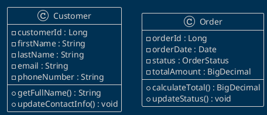
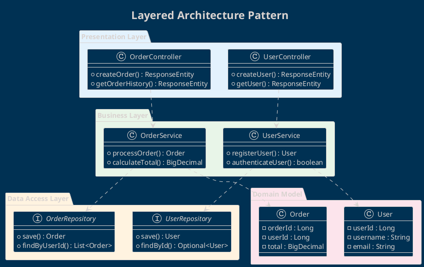
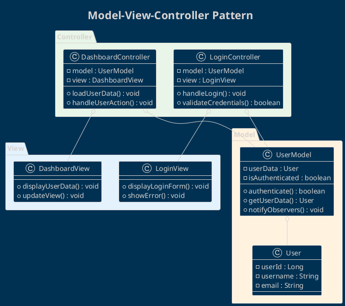
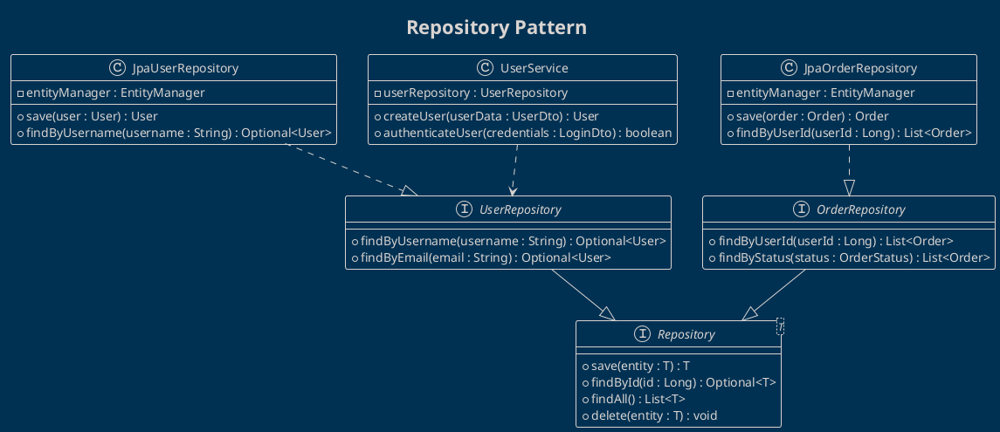
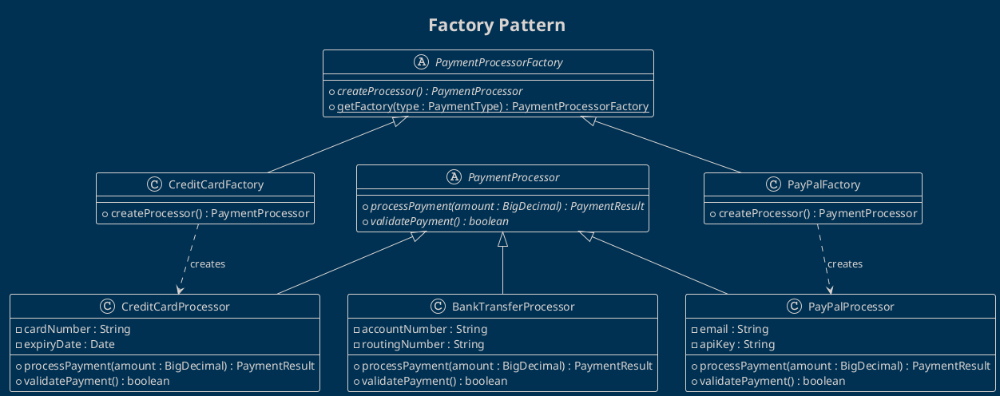

# Class Diagrams

Class diagrams show the static structure of the system, including classes, attributes, methods, and relationships.

## 🎯 Purpose of Class Diagrams

**Class Diagrams** are used to:
- Model the static structure of the system
- Define classes, attributes, and methods
- Show relationships between classes
- Document the object-oriented architecture

## 📋 Diagram Elements

### Classes

#### Basic Syntax
```plantuml
class "Class Name" {
  +public_attribute : type
  -private_attribute : type
  #protected_attribute : type
  ~package_attribute : type
  --
  +public_method() : return_type
  -private_method() : void
  {abstract} +abstract_method()
  {static} +static_method()
}
```

#### Stereotypes
```plantuml
class "<<interface>>" as Interface
class "<<abstract>>" as AbstractClass
class "<<entity>>" as Entity
class "<<service>>" as Service
class "<<repository>>" as Repository
```

### Visibility
```plantuml
class Example {
  + public_attribute : String
  - private_attribute : int
  # protected_attribute : Date
  ~ package_attribute : boolean
  __
  + public_method() : void
  - private_method() : String
  # protected_method() : int
  ~ package_method() : boolean
}
```

### Relationships

#### Association
```plantuml
ClassA -- ClassB
ClassA --> ClassB : "navigation"
ClassA -- ClassB : "role"
```

#### Aggregation
```plantuml
ClassA o-- ClassB
ClassA "1" o-- "0..*" ClassB : "contains"
```

#### Composition
```plantuml
ClassA *-- ClassB
ClassA "1" *-- "1..*" ClassB : "is composed of"
```

#### Inheritance
```plantuml
SubClass --|> SuperClass
ConcreteClass --|> AbstractClass
```

#### Implementation
```plantuml
ConcreteClass ..|> Interface
```

#### Dependency
```plantuml
ClassA ..> ClassB : "uses"
```

### Multiplicity
```plantuml
ClassA "1" -- "0..*" ClassB
ClassA "0..1" -- "1..n" ClassB
ClassA "1" -- "exactly 3" ClassB
```

## 📝 How to Use the Template

### 1. Identify Domain Classes


### 2. Define Relationships
```plantuml
Customer "1" -- "0..*" Order : "places"
Order "1" *-- "1..*" OrderItem : "contains"
OrderItem "0..*" -- "1" Product : "references"
```

### 3. Add Details and Constraints
```plantuml
class Order {
  -orderId : Long {id}
  -orderDate : Date {not null}
  -status : OrderStatus = PENDING
  -totalAmount : BigDecimal {>= 0}
  --
  +calculateTotal() : BigDecimal
  +updateStatus(newStatus : OrderStatus) : void
  +{query} findByCustomer(customerId : Long) : List<Order>
}

note right of Order : Constraints:\n- totalAmount >= 0\n- orderDate <= today
```

## 🏗️ Architectural Patterns

### Layered Architecture


### MVC Pattern


### Repository Pattern


### Factory Pattern


## 📊 Best Practices

### ✅ Class Design
```plantuml
' ✅ Well-structured class
class Customer {
  -customerId : Long
  -firstName : String
  -lastName : String
  -email : String
  --
  +getFullName() : String
  +updateEmail(newEmail : String) : void
  +isActive() : boolean
}

' ❌ Class with too many methods/attributes
class GodClass {
  -id, name, email, phone, address...
  -orders, payments, preferences...
  --
  +getAllData(), updateAll(), processEverything()...
}
```

### ✅ Naming Conventions
```plantuml
' ✅ Clear and descriptive names
class ShoppingCart {
  -items : List<CartItem>
  +addItem(item : CartItem) : void
  +removeItem(itemId : Long) : void
  +calculateTotal() : BigDecimal
}

' ❌ Ambiguous names
class Data {
  -info : List<Object>
  +process() : void
  +get() : Object
}
```

### ✅ Abstraction Levels
```plantuml
' ✅ Well-defined interfaces
interface PaymentGateway {
  +processPayment(amount : BigDecimal) : PaymentResult
  +refundPayment(transactionId : String) : RefundResult
}

class StripeGateway implements PaymentGateway
class PayPalGateway implements PaymentGateway

' ✅ Composition over inheritance
class Order {
  -payment : PaymentGateway
  -shipping : ShippingService
}
```

### ❌ Anti-Patterns to Avoid
```plantuml
' ❌ God Class
class EverythingManager {
  +handleUsers(), handleOrders(), handlePayments()
  +validateEverything(), processAll()
}

' ❌ Anemic Model
class User {
  +firstName : String
  +lastName : String
  +email : String
  ' No business logic
}

' ❌ Tight Coupling
class OrderService {
  -mysqlDatabase : MySQLOrderRepository
  ' Dependency on concrete implementation
}
```

## 🎨 Styling and Layout

### Package Colors
```plantuml
!define CONTROLLER_COLOR #E3F2FD
!define SERVICE_COLOR #E8F5E8
!define REPOSITORY_COLOR #FFF3E0
!define MODEL_COLOR #FCE4EC

package "Controllers" CONTROLLER_COLOR
package "Services" SERVICE_COLOR
package "Repositories" REPOSITORY_COLOR
package "Models" MODEL_COLOR
```

### Custom Stereotypes
```plantuml
class "<<Controller>>" as UserController #lightblue
class "<<Service>>" as UserService #lightgreen
class "<<Repository>>" as UserRepository #lightyellow
class "<<Entity>>" as User #lightpink
```

### Layout and Organization
```plantuml
' Horizontal layout
left to right direction

' Hide attributes/methods for overview
class User {
  {field} -userId : Long
  ..
  {method} +authenticate() : boolean
}

' Only class names for high-level view
hide members
class A
class B
class C
```

## 🧪 Examples by Domain

### E-commerce System
```plantuml
@startuml
!theme blueprint
title E-commerce Domain Model

class Customer {
  -customerId : Long
  -firstName : String
  -lastName : String
  -email : String
  -phoneNumber : String
  -dateRegistered : Date
  --
  +getFullName() : String
  +updateContactInfo() : void
  +isActive() : boolean
}

class Order {
  -orderId : Long
  -orderDate : Date
  -status : OrderStatus
  -totalAmount : BigDecimal
  -shippingAddress : Address
  --
  +calculateTotal() : BigDecimal
  +updateStatus(status : OrderStatus) : void
  +addItem(item : OrderItem) : void
}

class OrderItem {
  -orderItemId : Long
  -quantity : int
  -unitPrice : BigDecimal
  -discount : BigDecimal
  --
  +getSubtotal() : BigDecimal
  +applyDiscount(percentage : double) : void
}

class Product {
  -productId : Long
  -name : String
  -description : String
  -price : BigDecimal
  -stockQuantity : int
  -category : Category
  --
  +isInStock() : boolean
  +updateStock(quantity : int) : void
  +applyPriceChange(newPrice : BigDecimal) : void
}

class Category {
  -categoryId : Long
  -name : String
  -description : String
  -parentCategory : Category
  --
  +addSubcategory(category : Category) : void
  +getFullPath() : String
}

class ShoppingCart {
  -cartId : Long
  -customerId : Long
  -items : List<CartItem>
  -createdDate : Date
  --
  +addItem(product : Product, quantity : int) : void
  +removeItem(productId : Long) : void
  +calculateTotal() : BigDecimal
  +checkout() : Order
}

class CartItem {
  -cartItemId : Long
  -productId : Long
  -quantity : int
  -addedDate : Date
  --
  +updateQuantity(newQuantity : int) : void
  +getSubtotal() : BigDecimal
}

' Relationships
Customer "1" -- "0..*" Order : "places"
Customer "1" -- "0..1" ShoppingCart : "has"
Order "1" *-- "1..*" OrderItem : "contains"
OrderItem "0..*" -- "1" Product : "references"
Product "0..*" -- "1" Category : "belongs to"
Category "0..1" -- "0..*" Category : "parent/child"
ShoppingCart "1" *-- "0..*" CartItem : "contains"
CartItem "0..*" -- "1" Product : "references"

enum OrderStatus {
  PENDING
  CONFIRMED
  SHIPPED
  DELIVERED
  CANCELLED
}

Order -- OrderStatus
@enduml
```

### Banking System
```plantuml
@startuml
!theme blueprint
title Banking System Class Diagram

abstract class Account {
  #accountNumber : String
  #balance : BigDecimal
  #accountHolder : Customer
  #dateOpened : Date
  #status : AccountStatus
  --
  +{abstract} withdraw(amount : BigDecimal) : boolean
  +deposit(amount : BigDecimal) : void
  +getBalance() : BigDecimal
  +freeze() : void
  +unfreeze() : void
}

class SavingsAccount {
  -interestRate : double
  -minimumBalance : BigDecimal
  --
  +withdraw(amount : BigDecimal) : boolean
  +calculateInterest() : BigDecimal
  +applyInterest() : void
}

class CheckingAccount {
  -overdraftLimit : BigDecimal
  -monthlyFeeAmount : BigDecimal
  --
  +withdraw(amount : BigDecimal) : boolean
  +chargeMonthlyFee() : void
  +setOverdraftLimit(limit : BigDecimal) : void
}

class CreditAccount {
  -creditLimit : BigDecimal
  -interestRate : double
  -minimumPayment : BigDecimal
  --
  +withdraw(amount : BigDecimal) : boolean
  +makePayment(amount : BigDecimal) : void
  +calculateMinimumPayment() : BigDecimal
}

class Customer {
  -customerId : Long
  -firstName : String
  -lastName : String
  -ssn : String
  -dateOfBirth : Date
  -address : Address
  --
  +getFullName() : String
  +updateAddress(newAddress : Address) : void
  +getAge() : int
}

class Transaction {
  -transactionId : Long
  -fromAccount : Account
  -toAccount : Account
  -amount : BigDecimal
  -transactionDate : Date
  -type : TransactionType
  -description : String
  --
  +execute() : boolean
  +reverse() : boolean
  +getTransactionFee() : BigDecimal
}

class TransactionService {
  -transactionRepository : TransactionRepository
  --
  +transfer(from : Account, to : Account, amount : BigDecimal) : Transaction
  +validateTransaction(transaction : Transaction) : boolean
  +processTransaction(transaction : Transaction) : boolean
}

interface TransactionRepository {
  +save(transaction : Transaction) : Transaction
  +findByAccount(account : Account) : List<Transaction>
  +findByDateRange(start : Date, end : Date) : List<Transaction>
}

Account <|-- SavingsAccount
Account <|-- CheckingAccount
Account <|-- CreditAccount
Customer "1" -- "1..*" Account : "owns"
Transaction "0..*" -- "1" Account : "from"
Transaction "0..*" -- "1" Account : "to"
TransactionService ..> Transaction
TransactionService ..> TransactionRepository

enum AccountStatus {
  ACTIVE
  FROZEN
  CLOSED
}

enum TransactionType {
  DEPOSIT
  WITHDRAWAL
  TRANSFER
  FEE
}

Account -- AccountStatus
Transaction -- TransactionType
@enduml
```

### Hospital Management System
```plantuml
@startuml
!theme blueprint
title Hospital Management System

abstract class Person {
  #personId : Long
  #firstName : String
  #lastName : String
  #dateOfBirth : Date
  #phoneNumber : String
  #email : String
  #address : Address
  --
  +getFullName() : String
  +getAge() : int
  +updateContactInfo() : void
}

class Patient {
  -patientNumber : String
  -insuranceInfo : InsuranceInfo
  -emergencyContact : Person
  -medicalHistory : List<MedicalRecord>
  --
  +addMedicalRecord(record : MedicalRecord) : void
  +getMedicalHistory() : List<MedicalRecord>
  +updateInsurance(insurance : InsuranceInfo) : void
}

class Doctor {
  -licenseNumber : String
  -specialization : String
  -department : Department
  -schedule : Schedule
  --
  +addAppointment(appointment : Appointment) : void
  +prescribeMedication(patient : Patient, medication : Medication) : Prescription
  +updateSchedule(schedule : Schedule) : void
}

class Nurse {
  -nurseId : String
  -shift : Shift
  -department : Department
  --
  +administerMedication(patient : Patient, medication : Medication) : void
  +recordVitalSigns(patient : Patient, vitals : VitalSigns) : void
}

class Appointment {
  -appointmentId : Long
  -patient : Patient
  -doctor : Doctor
  -appointmentDate : DateTime
  -duration : Duration
  -status : AppointmentStatus
  -reason : String
  --
  +schedule() : void
  +cancel() : void
  +reschedule(newDate : DateTime) : void
  +complete() : void
}

class MedicalRecord {
  -recordId : Long
  -patient : Patient
  -doctor : Doctor
  -recordDate : Date
  -diagnosis : String
  -treatment : String
  -notes : String
  --
  +addPrescription(prescription : Prescription) : void
  +updateDiagnosis(diagnosis : String) : void
}

class Prescription {
  -prescriptionId : Long
  -medication : Medication
  -dosage : String
  -frequency : String
  -duration : String
  -instructions : String
  --
  +isActive() : boolean
  +renew(duration : String) : Prescription
}

class Medication {
  -medicationId : Long
  -name : String
  -genericName : String
  -manufacturer : String
  -dosageForm : String
  --
  +checkInteractions(medications : List<Medication>) : List<Interaction>
}

class Department {
  -departmentId : Long
  -name : String
  -head : Doctor
  -location : String
  --
  +addStaff(person : Person) : void
  +removeStaff(person : Person) : void
}

Person <|-- Patient
Person <|-- Doctor
Person <|-- Nurse

Patient "1" -- "0..*" Appointment : "has"
Doctor "1" -- "0..*" Appointment : "attends"
Patient "1" -- "0..*" MedicalRecord : "has"
Doctor "1" -- "0..*" MedicalRecord : "creates"
MedicalRecord "1" -- "0..*" Prescription : "includes"
Prescription "0..*" -- "1" Medication : "prescribes"
Doctor "0..*" -- "1" Department : "works in"
Nurse "0..*" -- "1" Department : "works in"

enum AppointmentStatus {
  SCHEDULED
  CONFIRMED
  COMPLETED
  CANCELLED
  NO_SHOW
}

Appointment -- AppointmentStatus
@enduml
```

## 🔍 Traceability and Design

### Mapping from Requirements
```yaml
Class: Customer
Requirements:
  - REQ-F-001: System must manage customers
  - REQ-F-002: Track order history
User Stories:
  - US-001: As a customer, I want to register
  - US-002: As a customer, I want to see my orders
```

### Design Patterns Integration
```plantuml
note top of OrderService : Implements Service Pattern\nTo centralize business logic

note right of PaymentGateway : Strategy Pattern\nFor multiple payment methods

note left of UserRepository : Repository Pattern\nFor data access abstraction
```

### Code Generation
```java
// Generated from Class Diagram
public class Customer {
    private Long customerId;
    private String firstName;
    private String lastName;
    private String email;

    public String getFullName() {
        return firstName + " " + lastName;
    }

    // ... other methods
}
```

## 🧪 Validation and Testing

### Class Design Validation
```yaml
Single Responsibility: ✓ Each class has one responsibility
Open/Closed Principle: ✓ Extensible without modification
Liskov Substitution: ✓ Subclasses are substitutable
Interface Segregation: ✓ Specific interfaces
Dependency Inversion: ✓ Dependencies on abstractions
```

### Unit Testing Structure
```plantuml
class CustomerTest {
  +testGetFullName() : void
  +testUpdateEmail() : void
  +testIsActive() : void
}

class OrderServiceTest {
  +testCreateOrder() : void
  +testCalculateTotal() : void
  +testCancelOrder() : void
}

CustomerTest ..> Customer : "tests"
OrderServiceTest ..> OrderService : "tests"
```

## 🔧 Tools and Integration

### Reverse Engineering
```bash
# Generate class diagram from Java code
plantuml -jar plantuml.jar -reverse *.java

# Generate from C# code
plantuml -jar plantuml.jar -reverse *.cs
```

### IDE Integration
- **IntelliJ IDEA**: PlantUML plugin + code generation
- **Visual Studio**: Class designer + PlantUML
- **Eclipse**: PlantUML plugin + reverse engineering
- **VS Code**: PlantUML extension + live preview

### ORM Mapping
```plantuml
class User {
  -id : Long <<PK>>
  -username : String <<unique>>
  -email : String <<not null>>
  -createdAt : DateTime <<default: now()>>
}

note right of User : JPA Entity\n@Table(name="users")\n@Column annotations
```

## 📚 Resources and Standards

### UML Class Diagram Standards
- **UML 2.5 Specification**: Class diagram notation
- **Object-Oriented Design Principles**: SOLID principles
- **Design Patterns**: GoF patterns implementation
- **Domain-Driven Design**: Aggregate, entity, value object

### Related Templates
- `../behavioral-diagrams/`: Behavior of objects
- `../../02-requirements/`: Requirements mapping
- `../../05-database-design/`: Data model correlation

## 📞 Support

For questions about Class Diagrams:

- **Software Architect**: [Responsible for architecture design]
- **Lead Developer**: [Responsible for OOP implementation]
- **Domain Expert**: [Responsible for domain modeling]
- **Database Designer**: [Responsible for data model]

---

*Class Diagrams are the heart of object-oriented design. Use them to translate the business domain into robust and maintainable software structures.*
