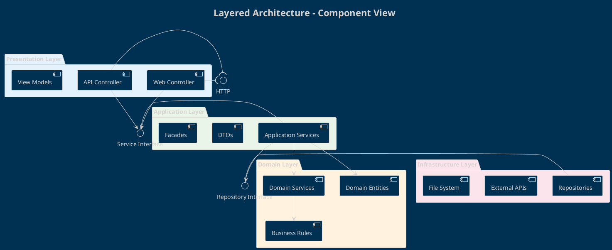
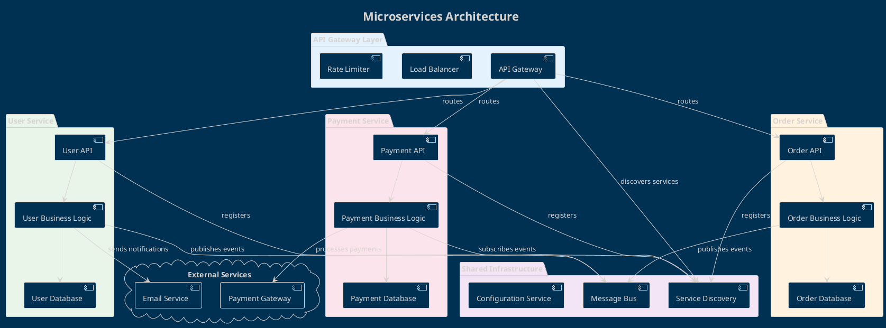
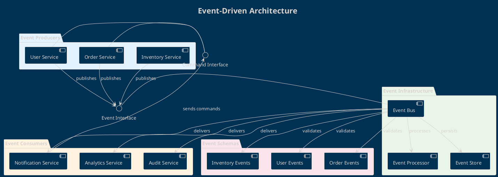
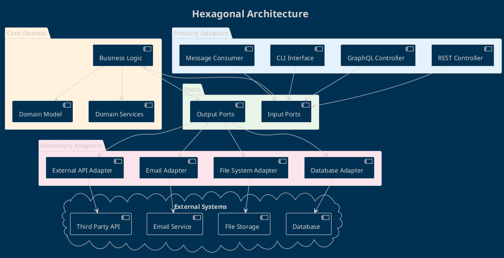

# Component Diagrams

I diagrammi dei componenti mostrano l'organizzazione e le dipendenze dell'architettura software a livello di componenti.

## Scopo dei Component Diagrams

I **Component Diagrams** servono per:
- Visualizzare l'architettura del sistema a livello di componenti
- Mostrare le dipendenze tra moduli software
- Documentare interfacce e contratti tra componenti
- Pianificare deployment e distribuzione

## Elementi del Diagramma

### Componenti

#### Sintassi Base
```plantuml
component "Nome Componente" as ComponentAlias
[Altro Componente]
```

#### Stereotipi
```plantuml
component "<<service>>" as Service
component "<<library>>" as Library  
component "<<database>>" as Database
component "<<external>>" as External
```

### Interfacce

#### Interface Declaration
```plantuml
interface "Nome Interface" as IInterface
() "Interface Symbol" as ISymbol
```

#### Provided/Required Interfaces
```plantuml
component Component1
interface "IService" as IService

Component1 -( IService : provides
Component1 --( IService : requires
```

### Packages e Raggruppamenti
```plantuml
package "Layer Name" {
  component "Component A"
  component "Component B"
}

folder "Module Name" {
  component "Component C"
}

cloud "External Systems" {
  component "External API"
}
```

### Relazioni

#### Basic Connections
```plantuml
ComponentA --> ComponentB
ComponentA -- ComponentB : "uses"
ComponentA ..> ComponentB : "depends on"
```

#### Interface Connections
```plantuml
ComponentA -( IInterface
ComponentB --( IInterface
IInterface - ComponentC
```

## Come Utilizzare il Template

### 1. Identifica i Layer Architetturali
```plantuml
package "Presentation Layer" {
  component "Web UI"
  component "Mobile App"
}

package "Business Layer" {
  component "Business Logic"
  component "Domain Services"
}

package "Data Layer" {
  component "Repository"
  component "Data Access"
}
```

### 2. Definisci i Componenti Principali
```plantuml
component "User Service" as UserSvc {
  portin "IUserService" as IUserSvc
  portout "INotification" as INotification
}

component "Order Service" as OrderSvc {
  portin "IOrderService" as IOrderSvc
  portout "IPayment" as IPayment
}
```

### 3. Specifica le Interfacce
```plantuml
interface "REST API" as REST
interface "Database Interface" as DB
interface "Message Queue" as MQ

UserSvc -( REST : exposes
UserSvc --( DB : uses
OrderSvc --( MQ : publishes to
```

## Pattern Architetturali

### Layered Architecture


### Microservices Architecture


### Event-Driven Architecture


### Hexagonal Architecture (Ports & Adapters)


## Best Practices

### Component Design
```plantuml
component "UserService" {
  interface "IUserRepository" as IUserRepo
  interface "IUserNotification" as IUserNotif
  
  component "UserBusinessLogic" as UserBL
}

UserBL -( IUserRepo : requires
UserBL --( IUserNotif : provides

package "Authentication" {
  component "Auth Service"
  component "Token Manager"
  component "User Validator"
}
```

### Interface Segregation
```plantuml
' Interfacce specifiche e focalizzate
interface "IUserReader" {
  +getUser(id)
  +findUsers(criteria)
}

interface "IUserWriter" {
  +createUser(user)
  +updateUser(user)
  +deleteUser(id)
}

' Interfaccia troppo grande
interface "IUserManager" {
  +getUser(), +createUser(), +updateUser()
  +sendEmail(), +validateData(), +generateReport()
}
```

### Dependency Direction
```plantuml
' Dipendenze verso il centro (Domain)
package "UI Layer" {
  component "Controller"
}

package "Business Layer" {
  component "Service"
  interface "IRepository"
}

package "Data Layer" {
  component "Repository"
}

Controller --> Service
Service --> IRepository
Repository ..|> IRepository
```

### Anti-Patterns da Evitare
```plantuml
' Circular Dependencies
component A --> B
component B --> C
component C --> A : "EVITARE!"

' God Component
component "EverythingManager" {
  note right : Gestisce tutto:\n- Users\n- Orders\n- Payments\n- Reports\n- Notifications
}

' Tight Coupling
component ServiceA --> ConcreteImplementationB : "Dipendenza da implementazione"
```

## Styling e Visualizzazione

### Colori per Layer
```plantuml
!define UI_COLOR #E3F2FD
!define BL_COLOR #E8F5E8
!define DATA_COLOR #FFF3E0
!define EXTERNAL_COLOR #FCE4EC

package "UI Layer" UI_COLOR
package "Business Layer" BL_COLOR  
package "Data Layer" DATA_COLOR
cloud "External" EXTERNAL_COLOR
```

### Stereotipi e Icons
```plantuml
component "<<service>>" as Service1
component "<<repository>>" as Repo1
component "<<controller>>" as Controller1
component "<<external>>" as External1

Service1 #lightgreen
Repo1 #lightyellow
Controller1 #lightblue
External1 #lightcoral
```

### Layout e Organizzazione
```plantuml
' Disposizione a livelli
top to bottom direction

' Evidenziare flusso principale
component A --> B #red;line.bold
component B --> C #blue;line.dashed

' Raggruppare componenti correlati
together {
  component "Service A"
  component "Service B"
}
```

## Esempi per Dominio

### E-commerce Platform
```plantuml
@startuml
!theme blueprint
title E-commerce Platform - Component Architecture

package "Frontend Applications" #E3F2FD {
  component "Customer Web App" as CustomerWeb
  component "Admin Dashboard" as AdminDash
  component "Mobile App" as MobileApp
  component "Seller Portal" as SellerPortal
}

package "API Gateway" #E8F5E8 {
  component "API Gateway" as Gateway
  component "Authentication Service" as AuthSvc
  component "Rate Limiting" as RateLimit
}

package "Core Services" #FFF3E0 {
  component "User Service" as UserSvc
  component "Product Service" as ProductSvc
  component "Order Service" as OrderSvc
  component "Cart Service" as CartSvc
  component "Payment Service" as PaymentSvc
  component "Inventory Service" as InventorySvc
  component "Notification Service" as NotificationSvc
}

package "Data Layer" #FCE4EC {
  component "User Database" as UserDB
  component "Product Database" as ProductDB
  component "Order Database" as OrderDB
  component "Payment Database" as PaymentDB
  component "Search Engine" as SearchEngine
  component "Cache Layer" as Cache
}

package "External Integrations" #F3E5F5 {
  component "Payment Gateway" as ExtPayment
  component "Email Service" as ExtEmail
  component "SMS Service" as ExtSMS
  component "Shipping API" as ExtShipping
  component "Analytics Service" as ExtAnalytics
}

package "Infrastructure" #E1F5FE {
  component "Message Queue" as MessageQueue
  component "File Storage" as FileStorage
  component "CDN" as CDN
  component "Monitoring" as Monitoring
}

' Frontend to Gateway
CustomerWeb --> Gateway
AdminDash --> Gateway
MobileApp --> Gateway
SellerPortal --> Gateway

' Gateway routing
Gateway --> AuthSvc
Gateway --> UserSvc
Gateway --> ProductSvc
Gateway --> OrderSvc
Gateway --> CartSvc

' Service interactions
OrderSvc --> PaymentSvc : "processes payment"
OrderSvc --> InventorySvc : "checks stock"
OrderSvc --> NotificationSvc : "sends confirmations"
CartSvc --> ProductSvc : "validates products"
PaymentSvc --> ExtPayment : "external processing"

' Data connections
UserSvc --> UserDB
ProductSvc --> ProductDB
ProductSvc --> SearchEngine
OrderSvc --> OrderDB
PaymentSvc --> PaymentDB
UserSvc --> Cache
ProductSvc --> Cache

' External integrations
NotificationSvc --> ExtEmail
NotificationSvc --> ExtSMS
OrderSvc --> ExtShipping
OrderSvc --> ExtAnalytics

' Infrastructure
NotificationSvc --> MessageQueue
OrderSvc --> MessageQueue
ProductSvc --> FileStorage
CustomerWeb --> CDN
AllServices --> Monitoring
@enduml
```

### Banking System
```plantuml
@startuml
!theme blueprint
title Banking System - Component Architecture

package "Customer Channels" #E3F2FD {
  component "Internet Banking" as WebBank
  component "Mobile Banking" as MobileBank
  component "ATM Interface" as ATM
  component "Call Center" as CallCenter
}

package "API Management" #E8F5E8 {
  component "API Gateway" as Gateway
  component "Security Service" as SecuritySvc
  component "Fraud Detection" as FraudDetection
}

package "Core Banking Services" #FFF3E0 {
  component "Account Service" as AccountSvc
  component "Transaction Service" as TransactionSvc
  component "Customer Service" as CustomerSvc
  component "Card Service" as CardSvc
  component "Loan Service" as LoanSvc
  component "Investment Service" as InvestmentSvc
}

package "Supporting Services" #FCE4EC {
  component "Notification Service" as NotificationSvc
  component "Document Service" as DocumentSvc
  component "Reporting Service" as ReportingSvc
  component "Audit Service" as AuditSvc
}

package "Data Management" #F3E5F5 {
  component "Core Database" as CoreDB
  component "Data Warehouse" as DataWarehouse
  component "Document Store" as DocumentStore
  component "Cache Cluster" as Cache
}

package "External Systems" #E1F5FE {
  component "Central Bank" as CentralBank
  component "Credit Bureau" as CreditBureau
  component "Payment Networks" as PaymentNetworks
  component "Regulatory Systems" as Regulatory
}

package "Infrastructure" #FFF8E1 {
  component "Message Bus" as MessageBus
  component "Backup System" as Backup
  component "Monitoring" as Monitoring
  component "Security Infrastructure" as SecInfra
}

' Channel connections
WebBank --> Gateway
MobileBank --> Gateway
ATM --> Gateway
CallCenter --> Gateway

' Security layer
Gateway --> SecuritySvc
Gateway --> FraudDetection
SecuritySvc --> SecInfra

' Core service routing
Gateway --> AccountSvc
Gateway --> TransactionSvc
Gateway --> CustomerSvc
Gateway --> CardSvc

' Service interactions
TransactionSvc --> AccountSvc : "validates accounts"
TransactionSvc --> FraudDetection : "fraud check"
LoanSvc --> CustomerSvc : "customer validation"
CardSvc --> AccountSvc : "links to accounts"

' Supporting services
TransactionSvc --> NotificationSvc : "transaction alerts"
TransactionSvc --> AuditSvc : "audit trail"
LoanSvc --> DocumentSvc : "loan documents"
AccountSvc --> ReportingSvc : "statement generation"

' Data layer
AccountSvc --> CoreDB
TransactionSvc --> CoreDB
CustomerSvc --> CoreDB
ReportingSvc --> DataWarehouse
DocumentSvc --> DocumentStore
AccountSvc --> Cache

' External integrations
TransactionSvc --> CentralBank : "clearing"
LoanSvc --> CreditBureau : "credit check"
CardSvc --> PaymentNetworks : "card processing"
AuditSvc --> Regulatory : "compliance reporting"

' Infrastructure
NotificationSvc --> MessageBus
AuditSvc --> MessageBus
CoreDB --> Backup
AllServices --> Monitoring
@enduml
```

### Healthcare Management System
```plantuml
@startuml
!theme blueprint
title Healthcare Management System

package "Patient Portals" #E3F2FD {
  component "Patient Web Portal" as PatientPortal
  component "Patient Mobile App" as PatientApp
  component "Doctor Portal" as DoctorPortal
  component "Admin Dashboard" as AdminDash
}

package "Clinical Applications" #E8F5E8 {
  component "Electronic Health Records" as EHR
  component "Practice Management" as PracticeMgmt
  component "Clinical Decision Support" as ClinicalDS
  component "Telemedicine Platform" as Telemedicine
}

package "Core Services" #FFF3E0 {
  component "Patient Service" as PatientSvc
  component "Appointment Service" as AppointmentSvc
  component "Medical Records Service" as RecordsSvc
  component "Billing Service" as BillingSvc
  component "Prescription Service" as PrescriptionSvc
  component "Lab Service" as LabSvc
}

package "Integration Services" #FCE4EC {
  component "HL7 Interface" as HL7Interface
  component "FHIR API" as FHIRAPI
  component "Insurance Interface" as InsuranceInterface
  component "Pharmacy Interface" as PharmacyInterface
}

package "Data & Analytics" #F3E5F5 {
  component "Clinical Database" as ClinicalDB
  component "Billing Database" as BillingDB
  component "Document Repository" as DocRepo
  component "Analytics Engine" as Analytics
  component "Data Lake" as DataLake
}

package "External Systems" #E1F5FE {
  component "Insurance Systems" as Insurance
  component "Pharmacy Systems" as Pharmacy
  component "Lab Systems" as LabSystems
  component "Imaging Systems" as Imaging
  component "Government Registries" as GovRegistries
}

package "Infrastructure" #FFF8E1 {
  component "Message Queue" as MessageQueue
  component "Security Service" as SecuritySvc
  component "Audit Service" as AuditSvc
  component "Backup Service" as BackupSvc
}

' Portal connections
PatientPortal --> PatientSvc
PatientApp --> PatientSvc
DoctorPortal --> EHR
AdminDash --> PracticeMgmt

' Clinical application connections
EHR --> RecordsSvc
EHR --> PrescriptionSvc
PracticeMgmt --> AppointmentSvc
PracticeMgmt --> BillingSvc
ClinicalDS --> RecordsSvc
Telemedicine --> AppointmentSvc

' Service interactions
AppointmentSvc --> PatientSvc : "patient lookup"
RecordsSvc --> LabSvc : "lab results"
PrescriptionSvc --> PharmacyInterface : "e-prescribing"
BillingSvc --> InsuranceInterface : "claims processing"

' Integration layer
RecordsSvc --> HL7Interface : "clinical data exchange"
PatientSvc --> FHIRAPI : "FHIR compliance"
BillingSvc --> InsuranceInterface
PrescriptionSvc --> PharmacyInterface

' Data layer
PatientSvc --> ClinicalDB
RecordsSvc --> ClinicalDB
BillingSvc --> BillingDB
RecordsSvc --> DocRepo
Analytics --> DataLake

' External integrations
InsuranceInterface --> Insurance
PharmacyInterface --> Pharmacy
LabSvc --> LabSystems
RecordsSvc --> Imaging
PatientSvc --> GovRegistries

' Infrastructure
RecordsSvc --> MessageQueue
BillingSvc --> MessageQueue
AllServices --> SecuritySvc
AllServices --> AuditSvc
ClinicalDB --> BackupSvc
@enduml
```

## Tracciabilità e Design

### Mapping da Architettura
```yaml
Component: "Order Service"
Architectural Requirements:
  - AR-001: Microservices architecture
  - AR-002: Event-driven communication
Use Cases: 
  - UC-005: Process customer order
  - UC-006: Track order status
Quality Attributes:
  - Scalability: Horizontal scaling support
  - Availability: 99.9% uptime requirement
```

### Interface Contracts
```plantuml
interface "IOrderService" {
  +createOrder(orderData : OrderDto) : OrderResult
  +getOrderStatus(orderId : String) : OrderStatus
  +cancelOrder(orderId : String) : CancelResult
}

note right of IOrderService : Contract definisce:\n- Input/Output types\n- Error conditions\n- SLA requirements
```

### Deployment Mapping
```plantuml
node "Web Server Cluster" {
  component "Load Balancer"
  component "Web Applications"
}

node "Application Server Cluster" {
  component "Business Services"
  component "API Gateway"
}

node "Database Cluster" {
  component "Primary DB"
  component "Read Replicas"
}

cloud "Cloud Services" {
  component "File Storage"
  component "Message Queue"
}
```

## Component Testing Strategy

### Unit Testing per Component
```yaml
Component: UserService
Test Types:
  - Unit Tests: Business logic validation
  - Integration Tests: Database interactions
  - Contract Tests: Interface compliance
  - Performance Tests: Response time SLA
```

### Mock Dependencies
```plantuml
component "UserService" as UserSvc
component "Mock Database" as MockDB
component "Mock Email Service" as MockEmail

UserSvc --> MockDB : "test data"
UserSvc --> MockEmail : "test notifications"

note right of MockDB : Provides predictable\ntest data responses
note right of MockEmail : Verifies email\ncalls without sending
```

## Tools e Methodology

### Architecture Documentation
- **C4 Model**: Context, Containers, Components, Code
- **Arc42**: Structured architecture documentation
- **Architecture Decision Records**: Document design decisions
- **Component Catalogs**: Reusable component library

### Analysis Tools
```bash
# Dependency analysis
gradle dependencyInsight --dependency package

# Component coupling metrics
mvn dependency:analyze

# Architecture validation
archunit verify-architecture-rules
```

### Continuous Architecture
```yaml
CI/CD Pipeline:
  - Architecture Tests: Validate dependency rules
  - Component Tests: Test component interfaces
  - Integration Tests: Test component interactions
  - Deployment Tests: Validate component deployment
```

## Resources e Standards

### Architecture Patterns
- **Microservices**: Independent deployable components
- **Event Sourcing**: Component state via events
- **CQRS**: Separate read/write components
- **Hexagonal**: Ports and adapters pattern

### Template Correlati
- `../class-diagrams/`: Detailed component internals
- `../../03-behavioral-diagrams/`: Component interactions
- `../../05-database-design/`: Data component design

## Supporto

Per domande sui Component Diagrams:

- **Solution Architect**: [Responsabile architettura sistema]
- **Technical Lead**: [Responsabile design componenti]
- **DevOps Engineer**: [Responsabile deployment architettura]
- **Software Architect**: [Responsabile standard architetturali]

---

*I Component Diagrams sono la blueprint dell'architettura software. Usali per comunicare la struttura del sistema e guidare l'implementazione distribuita.*
