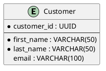

# Database Design - Istruzioni per l'Agente

Questa cartella contiene i template per la documentazione del database design. Seguire queste istruzioni per una corretta compilazione dei template.

## Ruolo di Questa Sezione

Questa sezione deve documentare la struttura del database esclusivamente attraverso diagrammi visivi e documentazione descrittiva. Non deve contenere codice SQL, DDL o script di implementazione.

## File Principali

- **README.md**: Template introduttivo per questa sezione della documentazione
- **data-dictionary.md**: Template per il dizionario dei dati
- **er-diagram/**: Cartella contenente template per diagrammi ER

## Convenzioni ER da Seguire

### Entità

- Nomi al singolare e in PascalCase (es. `Customer`, `Product`, `Order`)
- Attributi in camelCase (es. `firstName`, `productId`, `orderDate`)
- Chiavi primarie sottolineate o evidenziate nei diagrammi

### Relazioni

- Nomi descrittivi del tipo di relazione (es. "places" per Customer→Order)
- Cardinalità chiaramente specificata (1:1, 1:N, N:M)
- Ruoli quando necessario per chiarire la semantica della relazione

### Attributi

- Tipi di dati specificati (es. VARCHAR(50), INTEGER, TIMESTAMP)
- Vincoli di dominio documentati (es. "non-negative", "email format")
- Valori di default indicati dove applicabili

## Processo di Design

- **Analisi dei Requisiti**: Estrai entità dai documenti dei requisiti e user stories
- **Modello Concettuale**: Crea un diagramma ER ad alto livello con le entità principali
- **Modello Logico**: Raffina con normalizzazione e vincoli
- **Documentazione**: Completa il dizionario dati e le descrizioni dettagliate

## Livelli di Normalizzazione da Considerare

- **1NF**: Eliminazione gruppi ripetuti e valori multipli
- **2NF**: Eliminazione dipendenze parziali dalle chiavi
- **3NF**: Eliminazione dipendenze transitive
- **BCNF**: Forma normale Boyce-Codd per casi complessi

## Best Practices per Diagrammi ER

### Design Concettuale

- **Entità chiare**: Usa nomi significativi che riflettono il dominio business
- **Attributi essenziali**: Includi solo attributi rilevanti per il modello
- **Relazioni semantiche**: Usa nomi che esprimono il significato business
- **Cardinalità accurate**: Rifletti le regole business reali

### Standard di Notazione

- **Entità**: Rettangoli con nomi al singolare (Customer, Order, Product)
- **Attributi**: Ovali collegati alle entità con linee
- **Chiavi primarie**: Attributi sottolineati o evidenziati
- **Relazioni**: Rombi con verbi che descrivono l'associazione

### Organizzazione Visiva

- **Layout pulito**: Evita sovrapposizioni di linee
- **Raggruppamento logico**: Posiziona entità correlate vicine
- **Colori consistenti**: Usa colori per categorizzare entità
- **Leggibilità**: Utilizza font e dimensioni appropriate

### Documentazione

- **Tracciabilità**: Includi collegamenti con requirements e user stories
- **Glossario**: Fornisci definizioni chiare per i termini di dominio
- **Vincoli**: Documenta regole business non esprimibili graficamente
- **Versioning**: Mantieni la storia delle modifiche al modello

## PlantUML per ER Diagrams

Usa la sintassi PlantUML per creare diagrammi versionabili, ad esempio:



## Collegamento con Altri Diagrammi

- **Class Diagrams**: Assicura la mappatura entità → classi domain
- **Component Diagrams**: Collegamento con l'architettura data layer
- **Use Cases**: Riferimento alle operazioni CRUD per ogni entità

## Per i Placeholder nei Template

- Utilizza `[Placeholder]` per indicare dove l'informazione deve essere inserita
- Per i placeholder opzionali, usa `[Placeholder opzionale]`
- Per esempi multi-dominio, usa `[Esempio: E-commerce]`, `[Esempio: Banking]`, ecc.

---
# Istruzioni per il Dizionario dei Dati

Questo file contiene le istruzioni per la creazione e la gestione del dizionario dei dati del database.

## Scopo del Dizionario dei Dati

Il dizionario dei dati fornisce una documentazione dettagliata di tutte le entità del database, includendo:

- Definizione di tabelle e viste
- Specifiche degli attributi (campi)
- Vincoli e regole di integrità
- Relazioni tra entità
- Indici e chiavi
- Regole di business applicate ai dati

## Formato del Template

Il template del dizionario dei dati è strutturato come segue:

### Intestazione Tabella

Per ogni entità, iniziare con:

```markdown
## Tabella: [nome_tabella]

**Descrizione**: [breve descrizione dello scopo della tabella]
```

### Specifica dei Campi

Utilizzare una tabella Markdown per documentare i campi:

```markdown
| Campo | Tipo | Null | Default | Descrizione |
|-------|------|------|---------|-------------|
| campo_1 | TIPO_DATO | [SI/NO] | [valore default] | [descrizione] |
| campo_2 | TIPO_DATO | [SI/NO] | [valore default] | [descrizione] |
```

### Indici e Chiavi

Documentare indici e chiavi:

```markdown
**Indici**:

- PRIMARY KEY (campo_1)
- UNIQUE KEY uk_nome (campo_2)
- KEY idx_nome (campo_3)
```

### Relazioni

Documentare le relazioni con altre entità:

```markdown
**Relazioni**:

- campo_1 → altra_tabella(campo_riferito)
```

### Vincoli

Documentare i vincoli di business e di dominio:

```markdown
**Vincoli**:

- [descrizione vincolo 1]
- [descrizione vincolo 2]
```

## Convenzioni di Nomenclatura

### Tabelle

- Nomi al plurale in minuscolo (es. `users`, `products`)
- Usare underscore per separare parole (es. `order_items`, `user_profiles`)

### Campi

- Nomi in minuscolo con underscore (es. `first_name`, `created_at`)
- Chiavi primarie: nome tabella al singolare + `_id` (es. `user_id`)
- Chiavi esterne: stesso nome del campo riferito (es. `category_id`)

### Indici e Vincoli

- Chiavi primarie: `pk_nome_tabella`
- Chiavi uniche: `uk_nome_tabella_campo`
- Indici normali: `idx_nome_tabella_campo`
- Foreign keys: `fk_tabella_riferimento`

## Tipi di Dati Comuni

- **Stringhe**: VARCHAR, TEXT, CHAR
- **Numerici**: INTEGER, DECIMAL, FLOAT
- **Date/Tempo**: DATE, TIMESTAMP, TIME
- **Booleani**: BOOLEAN
- **Binari**: BLOB, BINARY
- **Enumerazioni**: ENUM('valore1', 'valore2')

## Multi-dominio

Per ogni dominio applicativo (E-commerce, Banking, Healthcare), utilizzare esempi specifici che riflettano le entità tipiche del dominio:

- **E-commerce**: users, products, orders, reviews
- **Banking**: accounts, customers, transactions, cards
- **Healthcare**: patients, practitioners, appointments, medical_records

## Esempi di Implementazione

### E-commerce

In un contesto E-commerce, le entità principali includono:
- **Customer**: Gestione degli utenti registrati
- **Product**: Catalogo prodotti con attributi e categorie
- **Order**: Ordini con stato, data, e riferimenti cliente
- **OrderItem**: Dettaglio prodotti in un ordine

### Banking

In un contesto Banking, le entità principali includono:
- **Account**: Conti correnti/deposito con saldo e stato
- **Customer**: Anagrafica clienti con documenti di identità
- **Transaction**: Movimenti con importo, data, tipo operazione
- **Card**: Carte di pagamento associate ai conti

### Healthcare

In un contesto Healthcare, le entità principali includono:
- **Patient**: Anagrafica pazienti con storia medica
- **Practitioner**: Medici e specialisti con qualifiche
- **Appointment**: Appuntamenti con data, durata, stato
- **MedicalRecord**: Cartelle cliniche con diagnosi e trattamenti

## Tracciabilità ai Requisiti

Per ogni entità, associare i requisiti che hanno portato alla sua definizione:

```markdown
**Requisiti correlati**:

- REQ-F-001: [breve descrizione]
- REQ-NF-003: [breve descrizione]
```

## Best Practices

- Includere solo informazioni a livello di struttura dati, non implementazione
- Documentare tutti i vincoli di business, anche se non implementati direttamente nel DB
- Mantenere sincronizzato il dizionario con i diagrammi ER
- Usare linguaggio chiaro e conciso
- Fornire esempi di valori validi per campi complessi