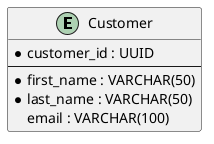

# Database Design

This section contains the database design using **VISUAL DIAGRAMS ONLY**.

> ⚠️ **IMPORTANT**: This section exclusively contains diagrams and design documentation.
> It does not include SQL code, DDL, or implementation scripts.

## 🎯 Objective

To document the data structure through:
- **ER (Entity-Relationship) Diagrams** for the conceptual model
- **Data Dictionary** for entity documentation
- **Data Architecture Diagrams** for the overall view

## Structure

### er-diagram/
Entity-Relationship diagrams that show:
- Domain entities and their attributes
- Relationships between entities with cardinality
- Primary and foreign keys
- Referential integrity constraints
- Conceptual and logical data model

### data-dictionary.md
A complete data dictionary that documents:
- Definition of all entities
- Detailed description of attributes
- Data types and domain constraints
- Relationships and business rules
- Glossary of domain terms

## ER Conventions

### Entities
- Singular names in PascalCase
- Attributes in camelCase
- Primary keys underlined

### Relationships
- Descriptive names of the relationship type
- Clearly specified cardinality
- Roles when necessary

### Attributes
- Specified data types
- Domain constraints
- Default values

## Conceptual Design Process

1. **Requirements Analysis**: Extracting entities from requirements and user stories
2. **Conceptual Model**: High-level ER diagram with main entities
3. **Logical Model**: Refinement with normalization and constraints
4. **Documentation**: Data dictionary and detailed descriptions

> 📝 **Note**: The physical implementation (DDL, SQL) is not included in this section.

## Normalization Levels

- **1NF**: Elimination of repeating groups and multiple values
- **2NF**: Elimination of partial dependencies on keys
- **3NF**: Elimination of transitive dependencies
- **BCNF**: Boyce-Codd normal form for complex cases

## Best Practices for ER Diagrams

### Conceptual Design
- **Clear Entities**: Meaningful names that reflect the business domain
- **Essential Attributes**: Include only relevant attributes for the model
- **Semantic Relationships**: Names that express business meaning
- **Accurate Cardinality**: Reflect real business rules

### Notation Standards
- **Entities**: Rectangles with singular names (Customer, Order, Product)
- **Attributes**: Ovals connected to entities with lines
- **Primary Keys**: Underlined or highlighted attributes
- **Relationships**: Diamonds with verbs describing the association

### Visual Organization
- **Clean Layout**: Avoid overlapping lines
- **Logical Grouping**: Related entities close together
- **Consistent Colors**: Use colors to categorize entities
- **Readability**: Appropriate fonts and sizes

### Documentation
- **Traceability**: Links to requirements and user stories
- **Glossary**: Clear definitions for domain terms
- **Constraints**: Document business rules not expressible graphically
- **Versioning**: Maintain a history of model changes

## Templates and Tools

### PlantUML for ER Diagrams
Use PlantUML syntax for versionable diagrams:

### Link with Other Diagrams
- **Class Diagrams**: Mapping entities → domain classes
- **Component Diagrams**: Data layer architecture
- **Use Cases**: CRUD operations for each entity
- Plan for scalability
- Document denormalization decisions
