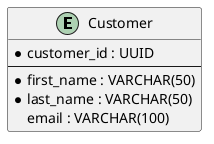

# Database Design

Questa sezione contiene la progettazione del database tramite **DIAGRAMMI VISIVI SOLAMENTE**.

> ⚠️ **IMPORTANTE**: Questa sezione contiene esclusivamente diagrammi e documentazione del design. 
> Non include codice SQL, DDL o script di implementazione.

## 🎯 Obiettivo

Documentare la struttura dei dati tramite:
- **Diagrammi ER (Entity-Relationship)** per il modello concettuale
- **Dizionario dei dati** per la documentazione delle entità
- **Diagrammi di architettura dati** per la visione complessiva

## Struttura

### er-diagram/
Diagrammi Entità-Relazione che mostrano:
- Entità del dominio e loro attributi
- Relazioni tra entità con cardinalità
- Chiavi primarie e foreign keys
- Vincoli di integrità referenziale
- Modello concettuale e logico dei dati

### data-dictionary.md
Dizionario dei dati completo che documenta:
- Definizione di tutte le entità
- Descrizione dettagliata degli attributi
- Tipi di dati e vincoli di dominio
- Relazioni e regole di business
- Glossario dei termini del dominio

## Convenzioni ER

### Entità
- Nomi al singolare e in PascalCase
- Attributi in camelCase
- Chiavi primarie sottolineate

### Relazioni
- Nomi descrittivi del tipo di relazione
- Cardinalità chiaramente specificata
- Ruoli quando necessario

### Attributi
- Tipi di dati specificati
- Vincoli di dominio
- Valori di default

## Processo di Design Concettuale

1. **Analisi dei Requisiti**: Estrazione entità dai requirements e user stories
2. **Modello Concettuale**: Diagramma ER ad alto livello con entità principali
3. **Modello Logico**: Raffinamento con normalizzazione e vincoli
4. **Documentazione**: Dizionario dati e descrizioni dettagliate

> 📝 **Nota**: L'implementazione fisica (DDL, SQL) non è inclusa in questa sezione.

## Livelli di Normalizzazione

- **1NF**: Eliminazione gruppi ripetuti e valori multipli
- **2NF**: Eliminazione dipendenze parziali dalle chiavi
- **3NF**: Eliminazione dipendenze transitive
- **BCNF**: Forma normale Boyce-Codd per casi complessi

## Best Practices per Diagrammi ER

### Design Concettuale
- **Entità chiare**: Nomi significativi che riflettono il dominio business
- **Attributi essenziali**: Include solo attributi rilevanti per il modello
- **Relazioni semantiche**: Nomi che esprimono il significato business
- **Cardinalità accurate**: Rifletti le regole business reali

### Notation Standards
- **Entità**: Rettangoli con nomi al singolare (Customer, Order, Product)
- **Attributi**: Ovali collegati alle entità con linee
- **Chiavi primarie**: Attributi sottolineati o evidenziati
- **Relazioni**: Rombi con verbi che descrivono l'associazione

### Visual Organization
- **Layout pulito**: Evita sovrapposizioni di linee
- **Raggruppamento logico**: Entità correlate vicine
- **Colori consistenti**: Usa colori per categorizzare entità
- **Leggibilità**: Font e dimensioni appropriate

### Documentazione
- **Tracciabilità**: Collegamenti con requirements e user stories
- **Glossario**: Definizioni chiare per termini di dominio
- **Vincoli**: Documenta regole business non esprimibili graficamente
- **Versioning**: Mantieni storia delle modifiche al modello

## Template e Strumenti

### PlantUML per ER Diagrams
Usa la sintassi PlantUML per diagrammi versionabili:

### Collegamento con Altri Diagrammi
- **Class Diagrams**: Mappatura entità → classi domain
- **Component Diagrams**: Architettura data layer
- **Use Cases**: Operazioni CRUD per ogni entità
- Pianifica per la scalabilità
- Documenta decisioni di denormalizzazione
