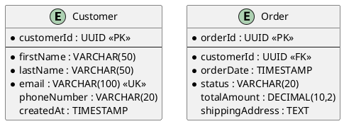
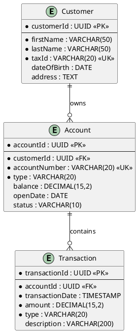
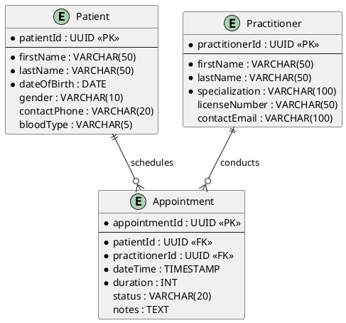

# Istruzioni per i Diagrammi Entity-Relationship (ER)

Questa cartella contiene i template per i diagrammi Entity-Relationship del progetto. Questi diagrammi rappresentano il modello concettuale e logico dei dati del sistema.

## Uso dei Template

- Utilizzare il file `template-er-diagram.puml` come base per i diagrammi ER
- Seguire la sintassi PlantUML per definire entità, attributi e relazioni
- Creare diagrammi separati per diversi domini o sottosistemi se necessario

## Convenzioni di Nomenclatura

### File

- Nominare i file secondo il pattern: `er-[domain]-[context].puml`
- Esempi:
  - `er-ecommerce-order-management.puml`
  - `er-banking-account-system.puml`
  - `er-healthcare-patient-records.puml`

### Entità

- Usare nomi al singolare in PascalCase (es. `Customer`, `Product`, `Order`)
- Aggiungere suffissi significativi quando necessario (es. `PaymentMethod`, `UserProfile`)
- Evitare abbreviazioni ambigue

### Attributi

- Usare camelCase per tutti gli attributi (es. `firstName`, `productId`, `orderDate`)
- Prefissare gli ID con il nome dell'entità (es. `customerId`, `productId`)
- Usare nomi completi anziché abbreviazioni

### Relazioni

- Usare verbi o frasi verbali che descrivono la relazione (es. "places", "belongs to")
- Specificare la direzione della relazione quando non ovvia
- Includere ruoli quando necessario per chiarire la semantica

## Sintassi PlantUML per Diagrammi ER

### Definizione Entità

```plantuml
entity "Nome Entità" as EntityAlias {
  * primary_key : TYPE
  --
  * required_attribute : TYPE
  optional_attribute : TYPE
  calculated_attribute : TYPE <<computed>>
}
```

### Marcatura degli Attributi

- `*` = Attributo obbligatorio (NOT NULL)
- `<<FK>>` = Foreign Key
- `<<PK>>` = Primary Key
- `<<UK>>` = Unique Key
- `<<computed>>` = Attributo calcolato
- `<<derived>>` = Attributo derivato

### Definizione Relazioni

```plantuml
' One-to-One (1:1)
EntityA ||--|| EntityB : "relationship"

' One-to-Many (1:N)
EntityA ||--o{ EntityB : "relationship"

' Many-to-Many (N:M)
EntityA }o--o{ EntityB : "relationship"

' Optional relationships
EntityA |o--o{ EntityB : "relationship"
```

## Best Practices

- Dividere i diagrammi complessi in più diagrammi più piccoli e focalizzati
- Usare colori e stili coerenti per migliorare la leggibilità
- Aggiungere commenti esplicativi per chiarire scelte di design
- Includere leggende per notazioni personalizzate
- Organizzare visivamente il layout per ridurre l'incrocio di linee

## Livelli di Dettaglio

### Diagramma ER Concettuale

- Focus su entità e relazioni principali
- Attributi limitati a quelli essenziali
- Utilizzare per la comunicazione con stakeholder non tecnici

### Diagramma ER Logico

- Include tutti gli attributi
- Specifica tipi di dati
- Definisce chiavi primarie e foreign keys
- Mostra vincoli di integrità

## Collegamento con Altri Artefatti

- Referenziare i requisiti che hanno portato alla creazione delle entità
- Collegare le entità con le classi del domain model quando applicabile
- Documentare le operazioni CRUD associate alle entità nei casi d'uso

---

## Esempi per Dominio

### E-commerce



### Banking



### Healthcare


