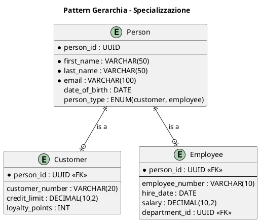
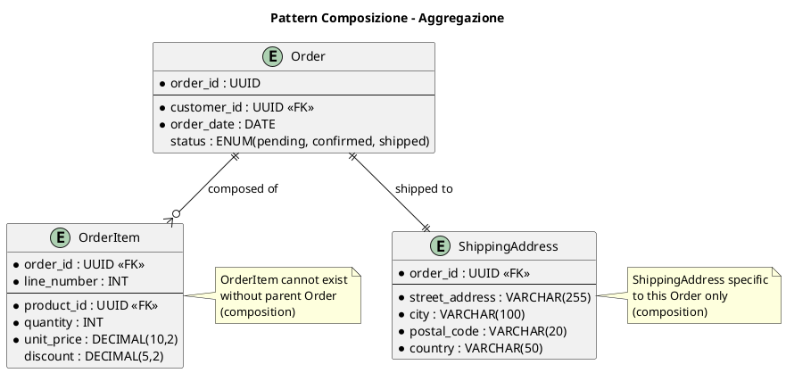
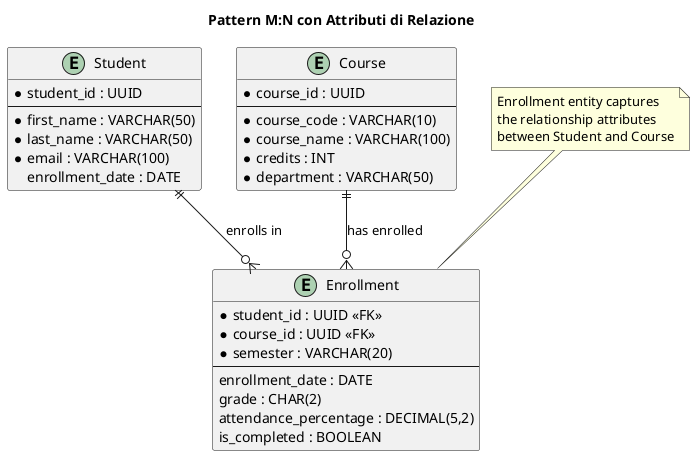
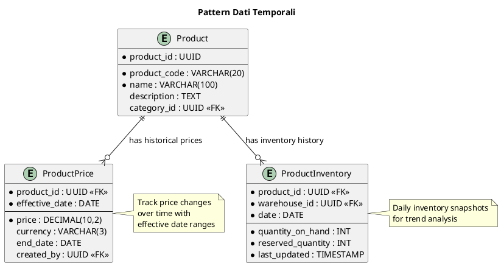

# Entity-Relationship Diagrams

I diagrammi Entità-Relazione (ER) rappresentano il modello concettuale e logico dei dati del sistema.

## Scopo dei Diagrammi ER

I **Diagrammi ER** servono per:

- Modellare la struttura dei dati a livello concettuale
- Definire entità, attributi e relazioni del dominio
- Documentare vincoli di integrità e regole business
- Fornire base per il design del database fisico

## Elementi del Diagramma ER

### Entità

#### Sintassi PlantUML

```plantuml
entity "Nome Entità" as EntityAlias {
  * primary_key : TYPE
  --
  * required_attribute : TYPE
  optional_attribute : TYPE
  calculated_attribute : TYPE <<computed>>
}
```

#### Tipi di Entità

```plantuml
' Entità forte
entity Customer {
  * customer_id : UUID
  --
  * first_name : VARCHAR(50)
  * last_name : VARCHAR(50)
}

' Entità debole
entity OrderItem {
  * order_id : UUID <<FK>>
  * product_id : UUID <<FK>>
  * line_number : INT
  --
  quantity : INT
  unit_price : DECIMAL(10,2)
}
```

### Attributi

#### Classificazione Attributi

```plantuml
entity Product {
  * product_id : UUID
  --
  * name : VARCHAR(100) <<required>>
  description : TEXT <<optional>>
  price : DECIMAL(10,2) <<derived>>
  created_at : TIMESTAMP <<system>>
  category_path : VARCHAR(255) <<composite>>
}
```

#### Notation Symbols

- `*` = Attributo obbligatorio (NOT NULL)
- `<<FK>>` = Foreign Key
- `<<PK>>` = Primary Key
- `<<UK>>` = Unique Key
- `<<computed>>` = Attributo calcolato
- `<<derived>>` = Attributo derivato

### Relazioni

#### Cardinalità

```plantuml
Customer ||--o{ Order : "places"
Order ||--o{ OrderItem : "contains"
Product ||--o{ OrderItem : "includes"
Category ||--o{ Product : "categorizes"
```

#### Tipi di Relazioni

```plantuml
' One-to-One (1:1)
Customer ||--|| CustomerProfile : "has"

' One-to-Many (1:N)
Customer ||--o{ Order : "places"

' Many-to-Many (M:N)
Product }o--o{ Category : "belongs to"

' Self-Referencing
Category ||--o{ Category : "parent/child"
```

### Vincoli e Business Rules

#### Vincoli di Integrità

```plantuml
entity Order {
  * order_id : UUID
  * customer_id : UUID <<FK>>
  --
  * order_date : DATE
  * status : ENUM(pending, confirmed, shipped, delivered)
  total_amount : DECIMAL(10,2) <<check: >= 0>>
  shipping_date : DATE <<check: >= order_date>>
}

note right of Order : Business Rules:\n- total_amount >= 0\n- shipping_date >= order_date\n- status transitions controlled
```

## Come Utilizzare il Template

### Identifica le Entità del Dominio

```plantuml
' Entità principali del business
entity Customer
entity Order
entity Product
entity Category
entity Payment

' Entità di supporto
entity Address
entity ContactInfo
entity AuditLog
```

### Definisci gli Attributi

```plantuml
entity Customer {
  * customer_id : UUID
  --
  * first_name : VARCHAR(50)
  * last_name : VARCHAR(50)
  * email : VARCHAR(100) <<UK>>
  phone : VARCHAR(20)
  date_of_birth : DATE
  created_at : TIMESTAMP
  updated_at : TIMESTAMP
  is_active : BOOLEAN
}
```

### Modella le Relazioni

```plantuml
Customer ||--o{ Order : "places"
Customer ||--o{ Address : "has"
Order ||--o{ OrderItem : "contains"
Order ||--|| Payment : "paid by"
Product ||--o{ OrderItem : "ordered as"
Category ||--o{ Product : "contains"
```

### Aggiungi Vincoli e Note

```plantuml
note right of Customer : Customer must have\nat least one contact method\n(email or phone)

note right of Order : Order total calculated\nfrom OrderItem.quantity * unit_price

note right of Payment : Payment amount must\nmatch Order.total_amount
```

## Pattern di Modellazione

### Pattern Gerarchia (Inheritance)



### Pattern Aggregazione/Composizione



### Pattern Many-to-Many con Attributi



### Pattern Temporal/Historical Data



## Best Practices per ER Design

### Entità ben definite

```plantuml
' Entità con responsabilità chiara
entity Customer {
  * customer_id : UUID
  --
  * first_name : VARCHAR(50)
  * last_name : VARCHAR(50)
  * email : VARCHAR(100)
}

entity CustomerAddress {
  * address_id : UUID
  * customer_id : UUID <<FK>>
  --
  * street_address : VARCHAR(255)
  * city : VARCHAR(100)
  address_type : ENUM(billing, shipping)
}

' Entità con troppi attributi eterogenei
entity CustomerEverything {
  customer_id, name, email, phone,
  address1, address2, city, country,
  order_count, last_order_date,
  payment_method, credit_card_number...
}
```

### Relazioni semantiche

```plantuml
' Relazioni con nomi significativi
Customer ||--o{ Order : "places"
Order ||--o{ OrderItem : "contains"
Product ||--o{ OrderItem : "appears in"

' Relazioni generiche
Customer ||--o{ Order : "has"
Order ||--o{ OrderItem : "links to"
```

### Normalizzazione appropriata

```plantuml
' 3NF - Entità separate per concetti distinti
entity Customer {
  * customer_id : UUID
  --
  * first_name : VARCHAR(50)
  * email : VARCHAR(100)
}

entity Country {
  * country_code : VARCHAR(2)
  --
  * country_name : VARCHAR(100)
  * currency_code : VARCHAR(3)
}

entity CustomerAddress {
  * address_id : UUID
  --
  * customer_id : UUID <<FK>>
  * country_code : VARCHAR(2) <<FK>>
  * city : VARCHAR(100)
}

' Denormalizzato con ripetizioni
entity CustomerDenorm {
  customer_id, name, email,
  country_code, country_name, currency_code,
  address1, address2, city
}
```

### Anti-Patterns da Evitare

```plantuml
' Entità "God Table"
entity SystemData {
  note right : Contiene tutto:\n- User data\n- Order data\n- Product data\n- Configuration\n- Logs
}

' Attributi multivalore
entity Product {
  * product_id : UUID
  --
  colors : VARCHAR(255) "red,blue,green"
  sizes : VARCHAR(255) "S,M,L,XL"
}

' Chiavi naturali instabili
entity Customer {
  * email : VARCHAR(100) <<PK>>
  note right : Email può cambiare!\nUsa UUID invece
}
```

## Styling e Presentazione

### Colori per Categorizzazione

```plantuml
!define CORE_ENTITY_COLOR #E3F2FD
!define LOOKUP_COLOR #E8F5E8
!define JUNCTION_COLOR #FFF3E0
!define AUDIT_COLOR #FCE4EC

entity Customer CORE_ENTITY_COLOR
entity Country LOOKUP_COLOR
entity CustomerAddress JUNCTION_COLOR
entity AuditLog AUDIT_COLOR
```

### Raggruppamento Logico

```plantuml
package "Customer Domain" {
  entity Customer
  entity CustomerAddress
  entity CustomerPreferences
}

package "Order Domain" {
  entity Order
  entity OrderItem
  entity OrderStatus
}

package "Product Domain" {
  entity Product
  entity Category
  entity ProductPrice
}
```

### Layout Ottimizzato

```plantuml
' Entità centrali al centro
' Entità di lookup ai margini
' Flusso logico da sinistra a destra

left to right direction

entity Customer
entity Order
entity Product

Customer ||--o{ Order
Order }o--o{ Product
```

## Esempi per Dominio

### E-commerce Database Model

```plantuml
@startuml
title E-commerce - Entity Relationship Diagram

!define CUSTOMER_COLOR #E3F2FD
!define ORDER_COLOR #E8F5E8
!define PRODUCT_COLOR #FFF3E0
!define PAYMENT_COLOR #FCE4EC

package "Customer Management" {
  entity Customer CUSTOMER_COLOR {
    * customer_id : UUID
    --
    * first_name : VARCHAR(50)
    * last_name : VARCHAR(50)
    * email : VARCHAR(100) <<UK>>
    phone : VARCHAR(20)
    date_of_birth : DATE
    created_at : TIMESTAMP
    is_active : BOOLEAN
  }

  entity CustomerAddress CUSTOMER_COLOR {
    * address_id : UUID
    * customer_id : UUID <<FK>>
    --
    * street_address : VARCHAR(255)
    * city : VARCHAR(100)
    * postal_code : VARCHAR(20)
    * country_code : VARCHAR(2) <<FK>>
    address_type : ENUM(billing, shipping)
    is_default : BOOLEAN
  }
}

package "Order Management" {
  entity Order ORDER_COLOR {
    * order_id : UUID
    * customer_id : UUID <<FK>>
    --
    * order_date : TIMESTAMP
    * status : ENUM(pending, confirmed, shipped, delivered, cancelled)
    subtotal : DECIMAL(10,2)
    tax_amount : DECIMAL(10,2)
    shipping_cost : DECIMAL(10,2)
    total_amount : DECIMAL(10,2)
    shipping_address_id : UUID <<FK>>
  }

  entity OrderItem ORDER_COLOR {
    * order_id : UUID <<FK>>
    * line_number : INT
    --
    * product_id : UUID <<FK>>
    * quantity : INT
    * unit_price : DECIMAL(10,2)
    discount_amount : DECIMAL(10,2)
    line_total : DECIMAL(10,2) <<computed>>
  }
}

package "Product Catalog" {
  entity Product PRODUCT_COLOR {
    * product_id : UUID
    --
    * sku : VARCHAR(50) <<UK>>
    * name : VARCHAR(100)
    description : TEXT
    * category_id : UUID <<FK>>
    base_price : DECIMAL(10,2)
    weight : DECIMAL(8,3)
    is_active : BOOLEAN
    created_at : TIMESTAMP
  }

  entity Category PRODUCT_COLOR {
    * category_id : UUID
    --
    * name : VARCHAR(100)
    description : TEXT
    parent_category_id : UUID <<FK>>
    sort_order : INT
    is_active : BOOLEAN
  }

  entity ProductInventory PRODUCT_COLOR {
    * product_id : UUID <<FK>>
    * warehouse_id : UUID <<FK>>
    --
    * quantity_on_hand : INT
    reserved_quantity : INT
    reorder_level : INT
    last_updated : TIMESTAMP
  }
}

package "Payment Processing" {
  entity Payment PAYMENT_COLOR {
    * payment_id : UUID
    * order_id : UUID <<FK>>
    --
    * payment_method : ENUM(credit_card, paypal, bank_transfer)
    * amount : DECIMAL(10,2)
    * currency : VARCHAR(3)
    * status : ENUM(pending, completed, failed, refunded)
    transaction_id : VARCHAR(100)
    processed_at : TIMESTAMP
  }
}

package "Reference Data" {
  entity Country {
    * country_code : VARCHAR(2)
    --
    * name : VARCHAR(100)
    * currency_code : VARCHAR(3)
  }

  entity Warehouse {
    * warehouse_id : UUID
    --
    * name : VARCHAR(100)
    * address : VARCHAR(255)
    * city : VARCHAR(100)
    * country_code : VARCHAR(2) <<FK>>
  }
}

' Relationships
Customer ||--o{ CustomerAddress : "has"
Customer ||--o{ Order : "places"
Order ||--o{ OrderItem : "contains"
Order ||--|| Payment : "paid by"
Product ||--o{ OrderItem : "ordered as"
Product ||--o{ ProductInventory : "stocked in"
Category ||--o{ Product : "categorizes"
Category ||--o{ Category : "parent/child"
Country ||--o{ CustomerAddress : "located in"
Country ||--o{ Warehouse : "located in"
Warehouse ||--o{ ProductInventory : "stores"
CustomerAddress ||--o{ Order : "shipped to"

' Business Rules Notes
note right of Order : Order total = sum of OrderItem.line_total\n+ tax_amount + shipping_cost

note bottom of OrderItem : line_total = (quantity * unit_price)\n- discount_amount

note top of Payment : Payment.amount must equal\nOrder.total_amount

note left of ProductInventory : quantity_on_hand >= 0\nreserved_quantity <= quantity_on_hand
@enduml
```

### Banking System Data Model

```plantuml
@startuml
title Banking System - Entity Relationship Diagram

package "Customer Management" #E3F2FD {
  entity Customer {
    * customer_id : UUID
    --
    * ssn : VARCHAR(11) <<UK, encrypted>>
    * first_name : VARCHAR(50)
    * last_name : VARCHAR(50)
    * date_of_birth : DATE
    * phone : VARCHAR(20)
    * email : VARCHAR(100)
    customer_since : DATE
    risk_profile : ENUM(low, medium, high)
    is_active : BOOLEAN
  }

  entity CustomerAddress {
    * address_id : UUID
    * customer_id : UUID <<FK>>
    --
    * address_type : ENUM(home, work, mailing)
    * street_address : VARCHAR(255)
    * city : VARCHAR(100)
    * state : VARCHAR(50)
    * postal_code : VARCHAR(20)
    * country : VARCHAR(50)
    effective_date : DATE
    end_date : DATE
  }
}

package "Account Management" #E8F5E8 {
  entity Account {
    * account_id : UUID
    --
    * account_number : VARCHAR(20) <<UK>>
    * customer_id : UUID <<FK>>
    * account_type : ENUM(checking, savings, credit, loan)
    * status : ENUM(active, frozen, closed)
    balance : DECIMAL(15,2)
    interest_rate : DECIMAL(5,4)
    credit_limit : DECIMAL(15,2)
    opened_date : DATE
    closed_date : DATE
  }

  entity AccountHolder {
    * account_id : UUID <<FK>>
    * customer_id : UUID <<FK>>
    --
    * relationship_type : ENUM(primary, joint, authorized)
    added_date : DATE
    permissions : JSON
  }
}

package "Transaction Processing" #FFF3E0 {
  entity Transaction {
    * transaction_id : UUID
    --
    * from_account_id : UUID <<FK>>
    * to_account_id : UUID <<FK>>
    * transaction_type : ENUM(deposit, withdrawal, transfer, fee)
    * amount : DECIMAL(15,2)
    * currency : VARCHAR(3)
    * transaction_date : TIMESTAMP
    * status : ENUM(pending, completed, failed, reversed)
    reference_number : VARCHAR(50)
    description : VARCHAR(255)
    channel : ENUM(atm, online, branch, mobile)
  }

  entity TransactionLeg {
    * transaction_id : UUID <<FK>>
    * leg_sequence : INT
    --
    * account_id : UUID <<FK>>
    * amount : DECIMAL(15,2)
    * leg_type : ENUM(debit, credit)
    * balance_after : DECIMAL(15,2)
    processed_at : TIMESTAMP
  }
}

package "Card Management" #FCE4EC {
  entity Card {
    * card_id : UUID
    --
    * card_number : VARCHAR(16) <<UK, encrypted>>
    * account_id : UUID <<FK>>
    * card_type : ENUM(debit, credit, prepaid)
    * status : ENUM(active, blocked, expired, cancelled)
    issue_date : DATE
    expiry_date : DATE
    cvv : VARCHAR(3) <<encrypted>>
    daily_limit : DECIMAL(10,2)
  }

  entity CardTransaction {
    * card_transaction_id : UUID
    --
    * card_id : UUID <<FK>>
    * transaction_id : UUID <<FK>>
    * merchant_name : VARCHAR(100)
    * merchant_category : VARCHAR(50)
    * pos_terminal_id : VARCHAR(20)
    authorization_code : VARCHAR(10)
    is_chip_transaction : BOOLEAN
  }
}

package "Loan Management" #F3E5F5 {
  entity Loan {
    * loan_id : UUID
    --
    * account_id : UUID <<FK>>
    * loan_type : ENUM(personal, mortgage, auto, business)
    * principal_amount : DECIMAL(15,2)
    * interest_rate : DECIMAL(5,4)
    * term_months : INT
    * monthly_payment : DECIMAL(10,2)
    * start_date : DATE
    * maturity_date : DATE
    * status : ENUM(active, paid_off, defaulted)
  }

  entity LoanPayment {
    * payment_id : UUID
    --
    * loan_id : UUID <<FK>>
    * transaction_id : UUID <<FK>>
    * payment_date : DATE
    * principal_amount : DECIMAL(10,2)
    * interest_amount : DECIMAL(10,2)
    * fees : DECIMAL(10,2)
    * remaining_balance : DECIMAL(15,2)
    payment_number : INT
  }
}

' Relationships
Customer ||--o{ CustomerAddress : "lives at"
Customer ||--o{ AccountHolder : "holds"
Account ||--o{ AccountHolder : "owned by"
Account ||--o{ TransactionLeg : "involved in"
Account ||--o{ Card : "linked to"
Account ||--o| Loan : "backed by"
Transaction ||--o{ TransactionLeg : "composed of"
Card ||--o{ CardTransaction : "used in"
CardTransaction ||--|| Transaction : "records"
Loan ||--o{ LoanPayment : "receives"
LoanPayment ||--|| Transaction : "processed as"

' Constraints and Business Rules
note right of Account : balance >= -credit_limit\nfor credit accounts

note top of Transaction : Sum of TransactionLeg amounts\nmust equal zero (double entry)

note bottom of Card : daily_limit enforced\nper calendar day

note left of Loan : monthly_payment calculated based on\nprincipal, rate, and term
@enduml
```

### Healthcare Data Model

```plantuml
@startuml
title Healthcare Management - Entity Relationship Diagram

package "Patient Management" #E3F2FD {
  entity Patient {
    * patient_id : UUID
    --
    * medical_record_number : VARCHAR(20) <<UK>>
    * ssn : VARCHAR(11) <<UK, encrypted>>
    * first_name : VARCHAR(50)
    * last_name : VARCHAR(50)
    * date_of_birth : DATE
    * gender : ENUM(male, female, other)
    * phone : VARCHAR(20)
    * email : VARCHAR(100)
    emergency_contact_name : VARCHAR(100)
    emergency_contact_phone : VARCHAR(20)
    registration_date : DATE
    is_active : BOOLEAN
  }

  entity PatientAddress {
    * address_id : UUID
    * patient_id : UUID <<FK>>
    --
    * street_address : VARCHAR(255)
    * city : VARCHAR(100)
    * state : VARCHAR(50)
    * postal_code : VARCHAR(20)
    * country : VARCHAR(50)
    address_type : ENUM(home, work)
    is_primary : BOOLEAN
  }

  entity InsuranceInfo {
    * insurance_id : UUID
    * patient_id : UUID <<FK>>
    --
    * provider_name : VARCHAR(100)
    * policy_number : VARCHAR(50)
    * group_number : VARCHAR(50)
    effective_date : DATE
    expiry_date : DATE
    copay_amount : DECIMAL(8,2)
    deductible : DECIMAL(10,2)
    is_primary : BOOLEAN
  }
}

package "Provider Management" #E8F5E8 {
  entity Provider {
    * provider_id : UUID
    --
    * license_number : VARCHAR(20) <<UK>>
    * npi_number : VARCHAR(10) <<UK>>
    * first_name : VARCHAR(50)
    * last_name : VARCHAR(50)
    * specialization : VARCHAR(100)
    * department_id : UUID <<FK>>
    phone : VARCHAR(20)
    email : VARCHAR(100)
    hire_date : DATE
    is_active : BOOLEAN
  }

  entity Department {
    * department_id : UUID
    --
    * name : VARCHAR(100)
    * description : TEXT
    * head_provider_id : UUID <<FK>>
    location : VARCHAR(100)
    phone : VARCHAR(20)
  }
}

package "Appointment Management" #FFF3E0 {
  entity Appointment {
    * appointment_id : UUID
    --
    * patient_id : UUID <<FK>>
    * provider_id : UUID <<FK>>
    * appointment_date : DATETIME
    * duration_minutes : INT
    * appointment_type : ENUM(consultation, follow_up, procedure, emergency)
    * status : ENUM(scheduled, confirmed, completed, cancelled, no_show)
    reason : VARCHAR(255)
    notes : TEXT
    created_at : TIMESTAMP
  }

  entity AppointmentSlot {
    * slot_id : UUID
    --
    * provider_id : UUID <<FK>>
    * slot_date : DATE
    * start_time : TIME
    * end_time : TIME
    * is_available : BOOLEAN
    slot_type : ENUM(regular, emergency, blocked)
  }
}

package "Medical Records" #FCE4EC {
  entity MedicalRecord {
    * record_id : UUID
    --
    * patient_id : UUID <<FK>>
    * provider_id : UUID <<FK>>
    * appointment_id : UUID <<FK>>
    * record_date : DATE
    * record_type : ENUM(consultation, diagnosis, treatment, procedure)
    chief_complaint : TEXT
    diagnosis : TEXT
    treatment_plan : TEXT
    notes : TEXT
    is_confidential : BOOLEAN
  }

  entity Prescription {
    * prescription_id : UUID
    --
    * record_id : UUID <<FK>>
    * medication_name : VARCHAR(100)
    * dosage : VARCHAR(50)
    * frequency : VARCHAR(50)
    * duration : VARCHAR(50)
    * instructions : TEXT
    * start_date : DATE
    * end_date : DATE
    * refills_remaining : INT
    is_active : BOOLEAN
  }

  entity LabOrder {
    * lab_order_id : UUID
    --
    * record_id : UUID <<FK>>
    * test_type : VARCHAR(100)
    * urgency : ENUM(routine, urgent, stat)
    * ordered_date : DATE
    * scheduled_date : DATE
    * completed_date : DATE
    * status : ENUM(ordered, collected, processing, completed, cancelled)
    instructions : TEXT
  }

  entity LabResult {
    * result_id : UUID
    --
    * lab_order_id : UUID <<FK>>
    * test_name : VARCHAR(100)
    * result_value : VARCHAR(100)
    * reference_range : VARCHAR(100)
    * unit : VARCHAR(20)
    * is_abnormal : BOOLEAN
    * result_date : DATE
    notes : TEXT
  }
}

package "Billing Management" #F3E5F5 {
  entity Bill {
    * bill_id : UUID
    --
    * patient_id : UUID <<FK>>
    * appointment_id : UUID <<FK>>
    * bill_date : DATE
    * due_date : DATE
    * total_amount : DECIMAL(10,2)
    * insurance_amount : DECIMAL(10,2)
    * patient_amount : DECIMAL(10,2)
    * status : ENUM(draft, sent, paid, overdue, cancelled)
    notes : TEXT
  }

  entity BillItem {
    * item_id : UUID
    --
    * bill_id : UUID <<FK>>
    * service_code : VARCHAR(20)
    * description : VARCHAR(255)
    * quantity : INT
    * unit_price : DECIMAL(8,2)
    * total_price : DECIMAL(10,2)
    * is_covered_by_insurance : BOOLEAN
  }
}

' Relationships
Patient ||--o{ PatientAddress : "lives at"
Patient ||--o{ InsuranceInfo : "covered by"
Patient ||--o{ Appointment : "schedules"
Patient ||--o{ MedicalRecord : "has"
Patient ||--o{ Bill : "billed to"

Provider ||--o{ Appointment : "sees"
Provider ||--o{ MedicalRecord : "creates"
Provider ||--o{ AppointmentSlot : "available for"
Department ||--o{ Provider : "employs"
Department ||--|| Provider : "headed by"

Appointment ||--o| MedicalRecord : "documented in"
Appointment ||--o| Bill : "generates"
Appointment ||--|| AppointmentSlot : "occupies"

MedicalRecord ||--o{ Prescription : "prescribes"
MedicalRecord ||--o{ LabOrder : "orders"
LabOrder ||--o{ LabResult : "produces"

Bill ||--o{ BillItem : "itemizes"

' Business Rules and Constraints
note right of Appointment : appointment_date must be\nin the future when scheduling

note top of MedicalRecord : confidential records require\nspecial access permissions

note bottom of Prescription : end_date >= start_date\nrefills_remaining >= 0

note left of Bill : patient_amount + insurance_amount\n= total_amount
@enduml
```

## Validation e Quality Checks

### Data Model Quality Metrics

```yaml
Entity Design Quality:
  - Single Responsibility: Each entity has one clear purpose
  - Proper Normalization: 3NF achieved, no redundancy
  - Complete Attributes: All necessary attributes present
  - Appropriate Data Types: Types match business rules

Relationship Quality:
  - Correct Cardinality: Reflects real business rules
  - Meaningful Names: Relationship names are descriptive
  - Referential Integrity: All FKs properly defined
  - No Missing Relationships: All associations captured
```

### Business Rule Validation

```plantuml
entity Order {
  * order_id : UUID
  * customer_id : UUID <<FK>>
  --
  * order_date : DATE
  total_amount : DECIMAL(10,2) <<check: >= 0>>
  status : ENUM(pending, confirmed, shipped, delivered)
}

note right of Order : Validation Rules:\n- total_amount >= 0\n- order_date <= today\n- status transitions controlled\n- customer must be active
```

### Referential Integrity Checks

```yaml
Foreign Key Constraints:
  - All FK columns reference valid PK
  - ON DELETE/UPDATE actions defined
  - Circular references avoided
  - Orphaned records prevented

Data Consistency:
  - Enumerated values validated
  - Date range constraints enforced
  - Calculated fields consistent
  - Business rule constraints applied
```

## Tools e Integration

### ER to Implementation Mapping

```yaml
ER Design → Database Schema:
  - Entity → Table
  - Attribute → Column
  - Relationship → Foreign Key
  - Constraint → Check/Trigger

ER Design → ORM Mapping:
  - Entity → Class/Entity
  - Attribute → Property/Field
  - Relationship → Navigation Property
  - Inheritance → Table Strategy
```

### Integration con Development

```bash
# Generate JPA entities from ER
er-to-jpa --input model.puml --output src/main/java/entities/

# Generate database migration scripts
er-to-sql --input model.puml --output migrations/ --database postgresql

# Validate ER model consistency
plantuml-validator --check-constraints --check-naming model.puml
```

## Resources e Standards

### Data Modeling Standards

- **IDEF1X**: Integration Definition for Information Modeling
- **Chen Notation**: Original ER notation by Peter Chen
- **Crow's Foot**: Popular industry-standard notation
- **Martin Notation**: Information Engineering notation

### Template Correlati

- `../class-diagrams/`: OOP mapping from ER entities
- `../../02-requirements/`: Business rules and constraints
- `../data-dictionary.md`: Detailed attribute descriptions

## Supporto

Per domande sui Diagrammi ER:

- **Data Architect**: [Responsabile design dati]
- **Database Designer**: [Responsabile schema fisico]
- **Business Analyst**: [Responsabile regole business]
- **Domain Expert**: [Responsabile knowledge dominio]

---

*I Diagrammi ER sono la foundation del data design. Usali per catturare la semantica del dominio business prima di procedere con l'implementazione fisica.*
