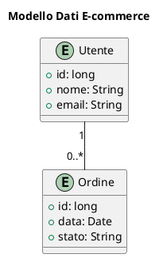

# Diagrammi Entità-Relazione

## Panoramica

Questa sezione contiene i diagrammi Entity-Relationship (ER) che rappresentano il modello dei dati del sistema.

## Diagramma ER Generale

[Inserire qui il diagramma ER principale, che mostra una visione d'insieme di tutte le entità e le loro relazioni.]

## Diagrammi di Dettaglio

Per una visione più dettagliata di specifiche aree del dominio, fare riferimento ai diagrammi dedicati.
