# Esempio di Diagramma con Mermaid

Questo file mostra come utilizzare la sintassi Mermaid per creare diagrammi rapidi direttamente nei file Markdown.

## Diagramma di Flusso del Processo di Ordine

```mermaid
graph TD
    A[Utente visita sito] --> B{Utente loggato?}
    B -->|No| C[Pagina Login/Registrazione]
    B -->|Sì| D[Naviga catalogo]
    C --> D
    D --> E[Seleziona prodotto]
    E --> F[Aggiungi al carrello]
    F --> G{Continue shopping?}
    G -->|Sì| D
    G -->|No| H[Vai al checkout]
    H --> I[Inserisci dati spedizione]
    I --> J[Seleziona metodo pagamento]
    J --> K[Conferma ordine]
    K --> L{Pagamento ok?}
    L -->|Sì| M[Ordine confermato]
    L -->|No| N[Errore pagamento]
    N --> J
    M --> O[Invio email conferma]
    O --> P[Fine processo]
```



## Diagramma di Stato dell'Ordine


## Diagramma di Sequenza Semplificato


## Entity Relationship Diagram


## Vantaggi di Mermaid

### 🚀 Velocità
- Sintassi semplice e intuitiva
- Rendering automatico nei Markdown
- Modifiche rapide al codice

### 📝 Integrazione
- Perfetto per documentazione in README
- Versionabile con Git
- Compatibile con GitHub, GitLab, etc.

### 🎨 Versatilità
- Flowchart, sequence, state diagrams
- ER diagrams per database
- Gantt charts per timeline

## Quando Usare Mermaid vs PlantUML

### Usa Mermaid per:
- Diagrammi semplici e veloci
- Documentazione embedded nei Markdown
- Flowchart e diagrammi di processo
- Quando la semplicità è prioritaria

### Usa PlantUML per:
- Diagrammi UML formali e complessi
- Documentazione tecnica dettagliata
- Quando serve precision semantica UML
- Diagrammi che richiedono personalizzazione avanzata

## Come Visualizzare

### 📋 File Markdown con Mermaid (come questo)
1. **Anteprima side-by-side**: `Ctrl+K V`
2. **Anteprima nuova tab**: `Ctrl+Shift+V`
3. **I diagrammi si renderizzano automaticamente**

### 📄 File .mmd standalone
1. **Con Mermaid Preview Extension** (installata):
   - Apri il file `.mmd`
   - `Ctrl+Shift+P` → `Mermaid: Preview`
   - Oppure clicca l'icona preview nell'editor

2. **Wrapping temporaneo in Markdown**:
   - Crea un file `.md` temporaneo
   - Incolla il contenuto dentro:
     ```markdown
     ```mermaid
     [tuo codice mermaid]
     ```
   - Usa `Ctrl+K V` per l'anteprima

### 🌐 Online
- **Mermaid Live**: [mermaid.live](https://mermaid.live)
- Copia/incolla il codice per visualizzazione + export PNG/SVG

### 💡 Tip
Per testare subito, apri `templates/flowchart-template.mmd` e usa `Ctrl+Shift+P` → `Mermaid: Preview`

---
*I diagrammi Mermaid sopra sono esempi che puoi copiare e personalizzare per il tuo progetto*
